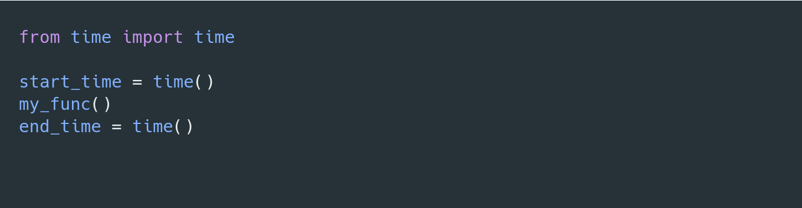
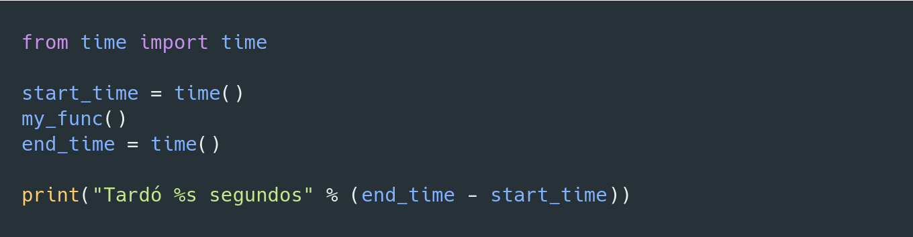
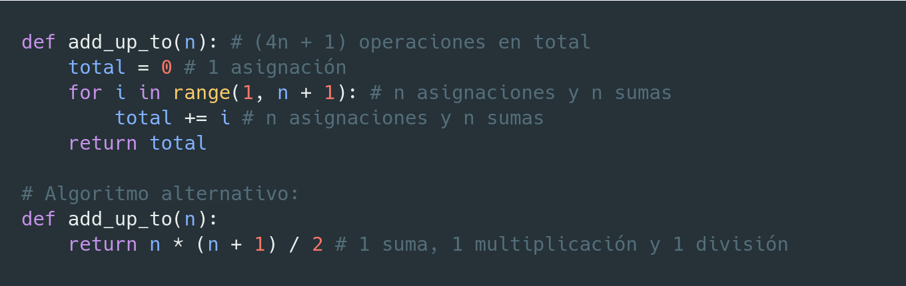
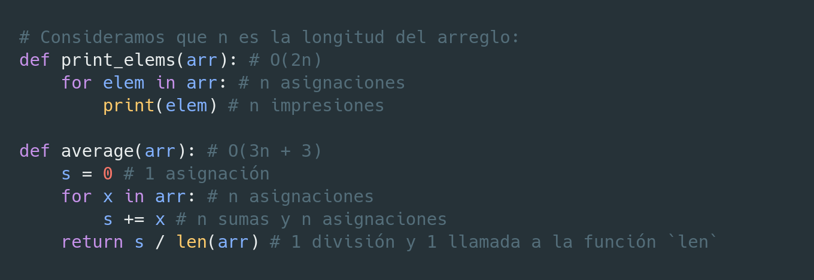

<style>
  section[id="1"],
  section[id="116"] {
    align-items: center;
    justify-content: center;
  }

  section[id="46"],
  section[id="47"],
  section[id="48"],
  section[id="114"],
  section[id="115"] {
    align-items: center;
  }

  section {
    justify-content: flex-start;
  }
</style>

# Big O Notation

---

# Big O Notation - ¿De qué se trata?

---

# Big O Notation - ¿De qué se trata?

Imaginen que tenemos varias implementaciones de la misma función...

---

# Big O Notation - ¿De qué se trata?

Imaginen que tenemos varias implementaciones de la misma función...

¿Cómo saben cuál de ellas es mejor?

---

# Big O Notation - ¿De qué se trata?

Imaginen que tenemos varias implementaciones de la misma función...

¿Cómo saben cuál de ellas es mejor?

¿Qué significa **"mejor"**?

---

# Big O Notation - ¿De qué se trata?

Imaginen que tenemos varias implementaciones de la misma función...

¿Cómo saben cuál de ellas es mejor?

¿Qué significa **"mejor"**?

¿Que sea más **rápida**?

---

# Big O Notation - ¿De qué se trata?

Imaginen que tenemos varias implementaciones de la misma función...

¿Cómo saben cuál de ellas es mejor?

¿Qué significa **"mejor"**?

¿Que sea más **rápida**?

¿Que use menos **memoria**?

---

# Big O Notation - ¿De qué se trata?

Imaginen que tenemos varias implementaciones de la misma función...

¿Cómo saben cuál de ellas es mejor?

¿Qué significa **"mejor"**?

¿Que sea más **rápida**?

¿Que use menos **memoria**?

¿Que sea más **legible**?

---

# Big O Notation - ¿De qué se trata?

Imaginen que tenemos varias implementaciones de la misma función...

¿Cómo saben cuál de ellas es mejor?

¿Qué significa **"mejor"**?

¿Que sea más **rápida**?

¿Que use menos **memoria**?

¿Que sea más **legible**?

¿Que sea más **corta**?

---

# Big O Notation - ¿De qué se trata?

Imaginen que tenemos varias implementaciones de la misma función...

¿Cómo saben cuál de ellas es mejor?

¿Qué significa **"mejor"**?

¿Que sea más **rápida**? <b style="color: #00d">← Complejidad de tiempo (Time Complexity)</b>

¿Que use menos **memoria**?

¿Que sea más **legible**?

¿Que sea más **corta**?

---

# Big O Notation - ¿De qué se trata?

Imaginen que tenemos varias implementaciones de la misma función...

¿Cómo saben cuál de ellas es mejor?

¿Qué significa **"mejor"**?

¿Que sea más **rápida**? <b style="color: #00d">← Complejidad de tiempo (Time Complexity)</b>

¿Que use menos **memoria**? <b style="color: #00d">← Complejidad de espacio (Space Complexity)</b>

¿Que sea más **legible**?

¿Que sea más **corta**?

---

# Big O Notation - ¿Por qué nos importa?

---

# Big O Notation - ¿Por qué nos importa?

- Es importante tener un vocabulario preciso para hablar del desempeño de nuestro código

---

# Big O Notation - ¿Por qué nos importa?

- Es importante tener un vocabulario preciso para hablar del desempeño de nuestro código
- Es útil para analizar ventajas y desventajas entre distintos enfoques

---

# Big O Notation - ¿Por qué nos importa?

- Es importante tener un vocabulario preciso para hablar del desempeño de nuestro código
- Es útil para analizar ventajas y desventajas entre distintos enfoques
- Si tenemos un programa lento nos ayuda a identificar las partes ineficientes que podemos mejorar

---

# Big O Notation - ¿Por qué nos importa?

- Es importante tener un vocabulario preciso para hablar del desempeño de nuestro código
- Es útil para analizar ventajas y desventajas entre distintos enfoques
- Si tenemos un programa lento nos ayuda a identificar las partes ineficientes que podemos mejorar
- **Es un tema común en entrevistas de trabajo** 😱

---

# ¿Por qué no usamos *timers* para medir rapidez?

---

# ¿Por qué no usamos *timers* para medir rapidez?


---

# ¿Por qué no usamos *timers* para medir rapidez?


---

# ¿Por qué no usamos *timers* para medir rapidez?



---

# ¿Por qué no usamos *timers* para medir rapidez?



---

# ¿Por qué no usamos *timers* para medir rapidez?


¿Cuál es el problema? 🤷

---

# ¿Por qué no usamos *timers* para medir rapidez?


¿Cuál es el problema? 🤷

Diferentes computadoras registrarán diferentes tiempos

---

# ¿Por qué no usamos *timers* para medir rapidez?


¿Cuál es el problema? 🤷

~~Diferentes computadoras registrarán diferentes tiempos~~

**La misma computadora registrará distintos tiempos** 😩

---

# ¿Por qué no usamos *timers* para medir rapidez?


¿Cuál es el problema? 🤷

~~Diferentes computadoras registrarán diferentes tiempos~~

**La misma computadora registrará distintos tiempos** 😩

Esto sin contar que para algoritmos muy rápidos tendremos un problema de precisión

---

# ¿Entonces qué medimos?

---

# ¿Entonces qué medimos?

El número de operaciones que realiza la computadora al ejecutar nuestro algoritmo

---

# ¿Entonces qué medimos?

El número de operaciones que realiza la computadora al ejecutar nuestro algoritmo

e.g. una función que sume todos los números enteros de 1 a *n*

---

# ¿Entonces qué medimos?

El número de operaciones que realiza la computadora al ejecutar nuestro algoritmo

e.g. una función que sume todos los números enteros de 1 a *n*


---

# ¿Entonces qué medimos?

El número de operaciones que realiza la computadora al ejecutar nuestro algoritmo

e.g. una función que sume todos los números enteros de 1 a *n*


---

# ¿Entonces qué medimos?

El número de operaciones que realiza la computadora al ejecutar nuestro algoritmo

e.g. una función que sume todos los números enteros de 1 a *n*


---

# ¿Entonces qué medimos?

El número de operaciones que realiza la computadora al ejecutar nuestro algoritmo

e.g. una función que sume todos los números enteros de 1 a *n*


---

# ¿Entonces qué medimos?

El número de operaciones que realiza la computadora al ejecutar nuestro algoritmo

e.g. una función que sume todos los números enteros de 1 a *n*


---

# ¿Entonces qué medimos?

El número de operaciones que realiza la computadora al ejecutar nuestro algoritmo

e.g. una función que sume todos los números enteros de 1 a *n*


---

# ¿Entonces qué medimos?

El número de operaciones que realiza la computadora al ejecutar nuestro algoritmo

e.g. una función que sume todos los números enteros de 1 a *n*


---

# ¿Entonces qué medimos?

El número de operaciones que realiza la computadora al ejecutar nuestro algoritmo

e.g. una función que sume todos los números enteros de 1 a *n*


---

# ¿Entonces qué medimos?

El número de operaciones que realiza la computadora al ejecutar nuestro algoritmo

e.g. una función que sume todos los números enteros de 1 a *n*



---

# ¿Entonces qué medimos?

El número de operaciones que realiza la computadora al ejecutar nuestro algoritmo

e.g. una función que sume todos los números enteros de 1 a *n*


---

# Contar operaciones es difícil

---

# Contar operaciones es difícil

Dependiendo del criterio podríamos sólo querer contar cierto tipo de operaciones

---

# Contar operaciones es difícil

Dependiendo del criterio podríamos sólo querer contar cierto tipo de operaciones
- ¿Deberíamos contar el `return`?

---

# Contar operaciones es difícil

Dependiendo del criterio podríamos sólo querer contar cierto tipo de operaciones
- ¿Deberíamos contar el `return`?
- ¿Por qué no contamos el hecho de usar un *for loop* como una operación?

---

# Contar operaciones es difícil

Dependiendo del criterio podríamos sólo querer contar cierto tipo de operaciones
- ¿Deberíamos contar el `return`?
- ¿Por qué no contamos el hecho de usar un *for loop* como una operación?
- Si la asignación y la suma se hacen en la misma instrucción ¿no deberían contar como 1 sóla operación?

---

# Contar operaciones es difícil

Dependiendo del criterio podríamos sólo querer contar cierto tipo de operaciones
- ¿Deberíamos contar el `return`?
- ¿Por qué no contamos el hecho de usar un *for loop* como una operación?
- Si la asignación y la suma se hacen en la misma instrucción ¿no deberían contar como 1 sóla operación?
- El resultado de analizar el primer ejemplo podría variar desde `2n + 1` hasta `4n + 1`

---

# Contar operaciones es difícil

Dependiendo del criterio podríamos sólo querer contar cierto tipo de operaciones
- ¿Deberíamos contar el `return`?
- ¿Por qué no contamos el hecho de usar un *for loop* como una operación?
- Si la asignación y la suma se hacen en la misma instrucción ¿no deberían contar como 1 sóla operación?
- El resultado de analizar el primer ejemplo podría variar desde `2n + 1` hasta `4n + 1`

**Lo que sí sabemos es que el resultado crece en proporción a `n` para el primer ejemplo y que es constante para el segundo**

---

# Introducing... Big O


---

# Introducing... Big O


**Una manera formal de contar al tanteo** 🙃

---

# Introducing... Big O


**Una manera formal de contar al tanteo** 🙃

Expresa cómo el tiempo de ejecución crece en función del crecimiento del *input*

---

# Definición semi-formal

Decimos que un algoritmo es `O(f(n))` si el número de operaciones que la computadora tiene que realizar es eventualmente menos que `f(n)` multiplicado por una constante, conforme `n` incrementa


---

# Complejidades comunes

---

# Complejidades comunes: Constante

---

# Complejidades comunes: Constante

No depende del tamaño del input

---

# Complejidades comunes: Constante

No depende del tamaño del input:


---

# Complejidades comunes: Constante

No depende del tamaño del input:


---

# Complejidades comunes: Constante

No depende del tamaño del input:


Todas las complejidades constantes (`O(3)`, `O(12)`, `O(1000)`, etc.) se simplifican como <b style="color: #333">O(1)</b>

---

# Complejidades comunes: Lineal

---

# Complejidades comunes: Lineal

Crece en la misma proporción que el input

---

# Complejidades comunes: Lineal

Crece en la misma proporción que el input:


---

# Complejidades comunes: Lineal

Crece en la misma proporción que el input:



---

# Complejidades comunes: Lineal

Crece en la misma proporción que el input:


Todas las complejidades lineales (`O(n + 1)`, `O(3n)`, ...) se simplifican como <b style="color: #333">O(n)</b>

---

# Complejidades comunes: Logarítmica

---

# Complejidades comunes: Logarítmica

Crece en proporción al logaritmo del tamaño del input

---

# Complejidades comunes: Logarítmica

Crece en proporción al logaritmo del tamaño del input (cada vez crece menos)

---

# Complejidades comunes: Logarítmica

Crece en proporción al logaritmo del tamaño del input (cada vez crece menos):

<b>log<sub>10</sub>(10) = 1</b>

---

# Complejidades comunes: Logarítmica

Crece en proporción al logaritmo del tamaño del input (cada vez crece menos):

<b>log<sub>10</sub>(10) = 1</b>
<b>log<sub>10</sub>(100) = 2</b>

---

# Complejidades comunes: Logarítmica

Crece en proporción al logaritmo del tamaño del input (cada vez crece menos):

<b>log<sub>10</sub>(10) = 1</b>
<b>log<sub>10</sub>(100) = 2</b>
<b>log<sub>10</sub>(1000) = 3</b>

---

# Complejidades comunes: Logarítmica

Crece en proporción al logaritmo del tamaño del input (cada vez crece menos):

<b>log<sub>10</sub>(10) = 1</b>
<b>log<sub>10</sub>(100) = 2</b>
<b>log<sub>10</sub>(1000) = 3</b>
<b>log<sub>10</sub>(1000000000000000000) = 18</b>

---

# Complejidades comunes: Logarítmica

Crece en proporción al logaritmo del tamaño del input (cada vez crece menos):


---

# Complejidades comunes: Logarítmica

Crece en proporción al logaritmo del tamaño del input (cada vez crece menos):


Todas las complejidades logarítmicas se simplifican como <b style="color: #333">O(log(n))</b>

---

# Complejidades comunes: Cuadrática

---

# Complejidades comunes: Cuadrática

Crece en proporción al cuadrado del tamaño del input

---

# Complejidades comunes: Cuadrática

Crece en proporción al cuadrado del tamaño del input:


---

# Complejidades comunes: Cuadrática

Crece en proporción al cuadrado del tamaño del input:


---

# Complejidades comunes: Cuadrática

Crece en proporción al cuadrado del tamaño del input:


<span style="color: red;position: absolute; top: 250px;right: 200px;font-size: 2rem">¿De dónde salió una n<sup>2</sup>? 🤔</span>

---

# Complejidades comunes: Cuadrática

Crece en proporción al cuadrado del tamaño del input:


---

# Complejidades comunes: Cuadrática

Crece en proporción al cuadrado del tamaño del input:


---

# Complejidades comunes: Cuadrática

Crece en proporción al cuadrado del tamaño del input:


---

# Complejidades comunes: Cuadrática

Crece en proporción al cuadrado del tamaño del input:


---

# Complejidades comunes: Cuadrática

Crece en proporción al cuadrado del tamaño del input:


---

# Complejidades comunes: Cuadrática

Crece en proporción al cuadrado del tamaño del input:


Todas las complejidades cuadráticas (<code>O(n<sup>2</sup> + 1)</code>, <code>O(3n<sup>2</sup> + 2n)</code>, <code>O(n<sup>2</sup> - n + 144)</code>, ...) se simplifican como <b style="color: #333">O(n<sup>2</sup>)</b>

---

# Complejidades comunes: Exponencial

---

# Complejidades comunes: Exponencial

El tamaño del input se usa como exponente para expresar la complejidad

---

# Complejidades comunes: Exponencial

El tamaño del input se usa como exponente para expresar la complejidad:


---

<h4 style="align-self: center">Comparación de complejidades</h4>


---

# Ejemplos

---

# Ejemplos

```javascript
function addUpTo(n) {
  let total = 0;
  for (let i = 1; i <= n; i++)
    total += i;
  return total;
}
```

---

# Ejemplos

```javascript
function addUpTo(n) {
  let total = 0; // Tiempo constante
  for (let i = 1; i <= n; i++) // Tiempo constante n veces
    total += i; // Tiempo constante n veces
  return total; // Tiempo constante
}
```

---

# Ejemplos

```javascript
function addUpTo(n) {
  let total = 0; // Tiempo constante
  for (let i = 1; i <= n; i++) // Tiempo constante n veces
    total += i; // Tiempo constante n veces
  return total; // Tiempo constante
} // O(constante * n + otra_constante)
```

---

# Ejemplos

```javascript
function addUpTo(n) {
  let total = 0;
  for (let i = 1; i <= n; i++)
    total += i;
  return total;
} // O(n)
```

---

# Ejemplos

```javascript
function addUpTo(n) {
  let total = 0;
  for (let i = 1; i <= n; i++)
    total += i;
  return total;
} // O(n)
```

```javascript
function addUpTo(n) {
  return n * (n + 1) / 2;
}
```

---

# Ejemplos

```javascript
function addUpTo(n) {
  let total = 0;
  for (let i = 1; i <= n; i++)
    total += i;
  return total;
} // O(n)
```

```javascript
function addUpTo(n) {
  return n * (n + 1) / 2; // Tiempo constante
}
```

---

# Ejemplos

```javascript
function addUpTo(n) {
  let total = 0;
  for (let i = 1; i <= n; i++)
    total += i;
  return total;
} // O(n)
```

```javascript
function addUpTo(n) {
  return n * (n + 1) / 2; // Tiempo constante
} // O(constante)
```

---

# Ejemplos

```javascript
function addUpTo(n) {
  let total = 0;
  for (let i = 1; i <= n; i++)
    total += i;
  return total;
} // O(n)
```

```javascript
function addUpTo(n) {
  return n * (n + 1) / 2;
} // O(1)
```

---

# Ejemplos

```javascript
function bubbleSort(arr) {
  let isSwapped = false;

  for (let i = 0; i < arr.length; i++) {
    isSwapped = false;
    
    for(let j = 0; j < arr.length; j++) {
      if (arr[j] > arr[j + 1]) {
        [arr[j], arr[j + 1]] = [arr[j + 1], arr[j]];
        isSwapped = true;
      }
    }
    
    if (!isSwapped) break;
  }
}
```

---

# Ejemplos

```javascript
function bubbleSort(arr) { // n se refiere a la longitud de arr
  let isSwapped = false; // Tiempo constante

  for (let i = 0; i < arr.length; i++) { // Tiempo constante n veces
    isSwapped = false; // Tiempo constante
    
    for(let j = 0; j < arr.length; j++) { // Tiempo constante n veces
      if (arr[j] > arr[j + 1]) { // Tiempo constante
        [arr[j], arr[j + 1]] = [arr[j + 1], arr[j]]; // Tiempo constante
        isSwapped = true; // Tiempo constante
      }
    } // El ciclo se repite por cada iteración del ciclo que engloba
    
    if (!isSwapped) break; // Tiempo constante
  }
}
```

---

# Ejemplos

```javascript
function bubbleSort(arr) {
  let isSwapped = false;

  for (let i = 0; i < arr.length; i++) {
    isSwapped = false;
    
    for(let j = 0; j < arr.length; j++) {
      if (arr[j] > arr[j + 1]) {
        [arr[j], arr[j + 1]] = [arr[j + 1], arr[j]];
        isSwapped = true;
      }
    }
    
    if (!isSwapped) break;
  }
} // O(n + n * n)
```

---

# Ejemplos

```javascript
function bubbleSort(arr) {
  let isSwapped = false;

  for (let i = 0; i < arr.length; i++) {
    isSwapped = false;
    
    for(let j = 0; j < arr.length; j++) {
      if (arr[j] > arr[j + 1]) {
        [arr[j], arr[j + 1]] = [arr[j + 1], arr[j]];
        isSwapped = true;
      }
    }
    
    if (!isSwapped) break;
  }
} // O(n^2 + n)
```

---

# Ejemplos

```javascript
function bubbleSort(arr) {
  let isSwapped = false;

  for (let i = 0; i < arr.length; i++) {
    isSwapped = false;
    
    for(let j = 0; j < arr.length; j++) {
      if (arr[j] > arr[j + 1]) {
        [arr[j], arr[j + 1]] = [arr[j + 1], arr[j]];
        isSwapped = true;
      }
    }
    
    if (!isSwapped) break;
  }
} // O(n^2)
```

---

# Ejemplos

```javascript
function countingSort(arr, min, max) {
  const [count, sortedArr] = [{}, []];

  for (let i = min; i <= max; i++)
    count[i] = 0;

  for (let i = 0; i < arr.length; i++)
    count[arr[i]]++;

  for (let i = min; i <= max; i++)
    while (count[i] > 0) {
      sortedArr.push(i);
      count[i]--;
    }

  return sortedArr;
}
```

---

# Ejemplos

```javascript
function countingSort(arr, min, max) {
  const [count, sortedArr] = [{}, []];

  for (let i = min; i <= max; i++) // O(k) => k es (max - min)
    count[i] = 0;

  for (let i = 0; i < arr.length; i++)
    count[arr[i]]++;

  for (let i = min; i <= max; i++)
    while (count[i] > 0) {
      sortedArr.push(i);
      count[i]--;
    }

  return sortedArr;
}
```

---

# Ejemplos

```javascript
function countingSort(arr, min, max) {
  const [count, sortedArr] = [{}, []];

  for (let i = min; i <= max; i++) // O(k) => k es (max - min)
    count[i] = 0;

  for (let i = 0; i < arr.length; i++) // O(n) => n es la longitud de arr
    count[arr[i]]++;

  for (let i = min; i <= max; i++)
    while (count[i] > 0) {
      sortedArr.push(i);
      count[i]--;
    }

  return sortedArr;
}
```

---

# Ejemplos

```javascript
function countingSort(arr, min, max) {
  const [count, sortedArr] = [{}, []];

  for (let i = min; i <= max; i++) // O(k) => k es (max - min)
    count[i] = 0;

  for (let i = 0; i < arr.length; i++) // O(n) => n es la longitud de arr
    count[arr[i]]++;

  for (let i = min; i <= max; i++) // O(k)
    while (count[i] > 0) {
      sortedArr.push(i);
      count[i]--;
    }

  return sortedArr;
}
```

---

# Ejemplos

```javascript
function countingSort(arr, min, max) {
  const [count, sortedArr] = [{}, []];

  for (let i = min; i <= max; i++) // O(k) => k es (max - min)
    count[i] = 0;

  for (let i = 0; i < arr.length; i++) // O(n) => n es la longitud de arr
    count[arr[i]]++;

  for (let i = min; i <= max; i++) // O(k)
    while (count[i] > 0) { // O(xi) => xi es # de veces que i está en arr
      sortedArr.push(i);
      count[i]--;
    }

  return sortedArr;
}
```

---

# Ejemplos

```javascript
function countingSort(arr, min, max) {
  const [count, sortedArr] = [{}, []];

  for (let i = min; i <= max; i++) // O(k) => k es (max - min)
    count[i] = 0;

  for (let i = 0; i < arr.length; i++) // O(n) => n es la longitud de arr
    count[arr[i]]++;

  for (let i = min; i <= max; i++) // O(k)
    while (count[i] > 0) { // O(xi) => xi es # de veces que i está en arr
      sortedArr.push(i);
      count[i]--;
    } // Sabemos que la suma de todos los xi debe dar n

  return sortedArr;
}
```

---

# Ejemplos

```javascript
function countingSort(arr, min, max) {
  const [count, sortedArr] = [{}, []];

  for (let i = min; i <= max; i++) // O(k) => k es (max - min)
    count[i] = 0;

  for (let i = 0; i < arr.length; i++) // O(n) => n es la longitud de arr
    count[arr[i]]++;

  for (let i = min; i <= max; i++) // O(n)
    while (count[i] > 0) {
      sortedArr.push(i);
      count[i]--;
    }

  return sortedArr;
}
```

---

# Ejemplos

```javascript
function countingSort(arr, min, max) {
  const [count, sortedArr] = [{}, []];

  for (let i = min; i <= max; i++) // O(k) => k es (max - min)
    count[i] = 0;

  for (let i = 0; i < arr.length; i++) // O(n) => n es la longitud de arr
    count[arr[i]]++;

  for (let i = min; i <= max; i++) // O(n)
    while (count[i] > 0) {
      sortedArr.push(i);
      count[i]--;
    }

  return sortedArr;
} // O(n + k)
```

---

# Ejemplos

```javascript
function binarySearch(arr, num) {
  let startIndex = 0;
  let endIndex = arr.length - 1;

  while (startIndex <= endIndex) {
    let pivot = Math.floor((startIndex + endIndex) / 2);

    if (arr[pivot] === num)
      return pivot;
    else if (arr[pivot] < num)
      startIndex = pivot + 1;
    else
      endIndex = pivot - 1;
  }

  return -1;
}
```

---

# Ejemplos

```javascript
function binarySearch(arr, num) {
  let startIndex = 0;
  let endIndex = arr.length - 1;

  while (startIndex <= endIndex) {
    let pivot = Math.floor((startIndex + endIndex) / 2);

    if (arr[pivot] === num)
      return pivot;
    else if (arr[pivot] < num)
      startIndex = pivot + 1;
    else
      endIndex = pivot - 1;
  } // En cada iteración partimos a la mitad las posibilidades

  return -1;
}
```

---

# Ejemplos

```javascript
function binarySearch(arr, num) {
  let startIndex = 0;
  let endIndex = arr.length - 1;

  while (startIndex <= endIndex) {
    let pivot = Math.floor((startIndex + endIndex) / 2);

    if (arr[pivot] === num)
      return pivot;
    else if (arr[pivot] < num)
      startIndex = pivot + 1;
    else
      endIndex = pivot - 1;
  } // En cada iteración partimos a la mitad las posibilidades
    // ¿Cuántas veces podemos dividir entre 2 a n?
  return -1;
}
```

---

# Ejemplos

```javascript
function binarySearch(arr, num) {
  let startIndex = 0;
  let endIndex = arr.length - 1;

  while (startIndex <= endIndex) {
    let pivot = Math.floor((startIndex + endIndex) / 2);

    if (arr[pivot] === num)
      return pivot;
    else if (arr[pivot] < num)
      startIndex = pivot + 1;
    else
      endIndex = pivot - 1;
  } // O(x) => n es 2 ^ x

  return -1;
}
```

---

# Ejemplos

```javascript
function binarySearch(arr, num) {
  let startIndex = 0;
  let endIndex = arr.length - 1;

  while (startIndex <= endIndex) {
    let pivot = Math.floor((startIndex + endIndex) / 2);

    if (arr[pivot] === num)
      return pivot;
    else if (arr[pivot] < num)
      startIndex = pivot + 1;
    else
      endIndex = pivot - 1;
  } // O(x) => n es 2 ^ x (usamos logaritmo para obtener el exponente)

  return -1;
}
```

---

# Ejemplos

```javascript
function binarySearch(arr, num) {
  let startIndex = 0;
  let endIndex = arr.length - 1;

  while (startIndex <= endIndex) {
    let pivot = Math.floor((startIndex + endIndex) / 2);

    if (arr[pivot] === num)
      return pivot;
    else if (arr[pivot] < num)
      startIndex = pivot + 1;
    else
      endIndex = pivot - 1;
  } // O(log2 n)

  return -1;
}
```

---

# Ejemplos

```javascript
function binarySearch(arr, num) {
  let startIndex = 0;
  let endIndex = arr.length - 1;

  while (startIndex <= endIndex) {
    let pivot = Math.floor((startIndex + endIndex) / 2);

    if (arr[pivot] === num)
      return pivot;
    else if (arr[pivot] < num)
      startIndex = pivot + 1;
    else
      endIndex = pivot - 1;
  }

  return -1;
} // O(log2 n)
```

---

# Cheatsheet: [https://www.bigocheatsheet.com/](https://www.bigocheatsheet.com/)


---

# Cheatsheet: [https://www.bigocheatsheet.com/](https://www.bigocheatsheet.com/)


---

# ¿Preguntas?
