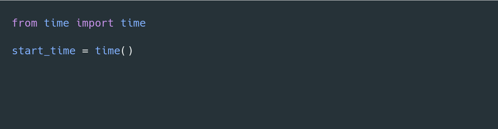
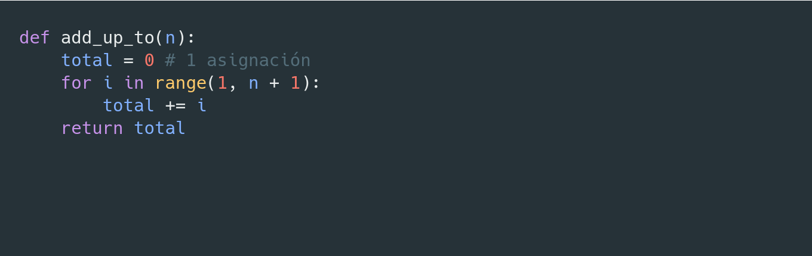
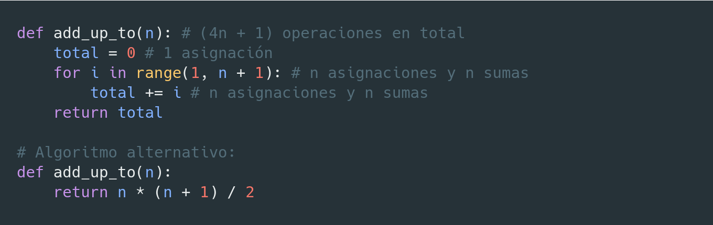

# Big O Notation

---

  

    <h2 style="white-space: nowrap; margin-right: 2rem">¡Hola! Yo soy Yus</h2>
  

  

    <ul style="list-style-type: none">
      <li class="d-flex">
        
        @yusent
      </li>
      <li class="d-flex">
        
        @yusent
      </li>
      <li class="d-flex">
        
        @yus3nt
      </li>
      <li class="d-flex">
        
        @yus3nt
      </li>
    </ul>
  

---

# Big O Notation - ¿De qué se trata?

---

# Big O Notation - ¿De qué se trata?

Imaginen que tenemos varias implementaciones de la misma función...

---

# Big O Notation - ¿De qué se trata?

Imaginen que tenemos varias implementaciones de la misma función...

¿Cómo saben cuál de ellas es mejor?

---

# Big O Notation - ¿De qué se trata?

Imaginen que tenemos varias implementaciones de la misma función...

¿Cómo saben cuál de ellas es mejor?

¿Qué significa **"mejor"**?

---

# Big O Notation - ¿De qué se trata?

Imaginen que tenemos varias implementaciones de la misma función...

¿Cómo saben cuál de ellas es mejor?

¿Qué significa **"mejor"**?

¿Que sea más **rápida**?

---

# Big O Notation - ¿De qué se trata?

Imaginen que tenemos varias implementaciones de la misma función...

¿Cómo saben cuál de ellas es mejor?

¿Qué significa **"mejor"**?

¿Que sea más **rápida**?

¿Que use menos **memoria**?

---

# Big O Notation - ¿De qué se trata?

Imaginen que tenemos varias implementaciones de la misma función...

¿Cómo saben cuál de ellas es mejor?

¿Qué significa **"mejor"**?

¿Que sea más **rápida**?

¿Que use menos **memoria**?

¿Que sea más **legible**?

---

# Big O Notation - ¿De qué se trata?

Imaginen que tenemos varias implementaciones de la misma función...

¿Cómo saben cuál de ellas es mejor?

¿Qué significa **"mejor"**?

¿Que sea más **rápida**?

¿Que use menos **memoria**?

¿Que sea más **legible**?

¿Que sea más **corta**?

---

# Big O Notation - ¿De qué se trata?

Imaginen que tenemos varias implementaciones de la misma función...

¿Cómo saben cuál de ellas es mejor?

¿Qué significa **"mejor"**?

¿Que sea más **rápida**? <b style="color: #00d">← Complejidad de tiempo (Time Complexity)</b>

¿Que use menos **memoria**?

¿Que sea más **legible**?

¿Que sea más **corta**?

---

# Big O Notation - ¿De qué se trata?

Imaginen que tenemos varias implementaciones de la misma función...

¿Cómo saben cuál de ellas es mejor?

¿Qué significa **"mejor"**?

¿Que sea más **rápida**? <b style="color: #00d">← Complejidad de tiempo (Time Complexity)</b>

¿Que use menos **memoria**? <b style="color: #00d">← Complejidad de espacio (Space Complexity)</b>

¿Que sea más **legible**?

¿Que sea más **corta**?

---

# Big O Notation - ¿Por qué nos importa?

---

# Big O Notation - ¿Por qué nos importa?

- Es importante tener un vocabulario preciso para hablar del desempeño de nuestro código

---

# Big O Notation - ¿Por qué nos importa?

- Es importante tener un vocabulario preciso para hablar del desempeño de nuestro código
- Es útil para analizar ventajas y desventajas entre distintos enfoques

---

# Big O Notation - ¿Por qué nos importa?

- Es importante tener un vocabulario preciso para hablar del desempeño de nuestro código
- Es útil para analizar ventajas y desventajas entre distintos enfoques
- Si tenemos un programa lento nos ayuda a identificar las partes ineficientes que podemos mejorar

---

# Big O Notation - ¿Por qué nos importa?

- Es importante tener un vocabulario preciso para hablar del desempeño de nuestro código
- Es útil para analizar ventajas y desventajas entre distintos enfoques
- Si tenemos un programa lento nos ayuda a identificar las partes ineficientes que podemos mejorar
- **Es un tema común en entrevistas de trabajo** 😱

---

# ¿Por qué no usamos *timers* para medir rapidez?

---

# ¿Por qué no usamos *timers* para medir rapidez?

---

# ¿Por qué no usamos *timers* para medir rapidez?

---

# ¿Por qué no usamos *timers* para medir rapidez?

---

# ¿Por qué no usamos *timers* para medir rapidez?

---

# ¿Por qué no usamos *timers* para medir rapidez?

¿Cuál es el problema? 🤷

---

# ¿Por qué no usamos *timers* para medir rapidez?

¿Cuál es el problema? 🤷

Diferentes computadoras registrarán diferentes tiempos

---

# ¿Por qué no usamos *timers* para medir rapidez?

¿Cuál es el problema? 🤷

~~Diferentes computadoras registrarán diferentes tiempos~~

**La misma computadora registrará distintos tiempos** 😩

---

# ¿Por qué no usamos *timers* para medir rapidez?

¿Cuál es el problema? 🤷

~~Diferentes computadoras registrarán diferentes tiempos~~

**La misma computadora registrará distintos tiempos** 😩

Esto sin contar que para algoritmos muy rápidos tendremos un problema de precisión

---

# ¿Entonces qué medimos?

---

# ¿Entonces qué medimos?

El número de operaciones que realiza la computadora al ejecutar nuestro algoritmo

---

# ¿Entonces qué medimos?

El número de operaciones que realiza la computadora al ejecutar nuestro algoritmo

e.g. una función que sume todos los números enteros de 1 a *n*

---

# ¿Entonces qué medimos?

El número de operaciones que realiza la computadora al ejecutar nuestro algoritmo

e.g. una función que sume todos los números enteros de 1 a *n*

---

# ¿Entonces qué medimos?

El número de operaciones que realiza la computadora al ejecutar nuestro algoritmo

e.g. una función que sume todos los números enteros de 1 a *n*

---

# ¿Entonces qué medimos?

El número de operaciones que realiza la computadora al ejecutar nuestro algoritmo

e.g. una función que sume todos los números enteros de 1 a *n*

---

# ¿Entonces qué medimos?

El número de operaciones que realiza la computadora al ejecutar nuestro algoritmo

e.g. una función que sume todos los números enteros de 1 a *n*

---

# ¿Entonces qué medimos?

El número de operaciones que realiza la computadora al ejecutar nuestro algoritmo

e.g. una función que sume todos los números enteros de 1 a *n*

---

# ¿Entonces qué medimos?

El número de operaciones que realiza la computadora al ejecutar nuestro algoritmo

e.g. una función que sume todos los números enteros de 1 a *n*

---

# ¿Entonces qué medimos?

El número de operaciones que realiza la computadora al ejecutar nuestro algoritmo

e.g. una función que sume todos los números enteros de 1 a *n*

---

# ¿Entonces qué medimos?

El número de operaciones que realiza la computadora al ejecutar nuestro algoritmo

e.g. una función que sume todos los números enteros de 1 a *n*

---

# ¿Entonces qué medimos?

El número de operaciones que realiza la computadora al ejecutar nuestro algoritmo

e.g. una función que sume todos los números enteros de 1 a *n*

---

# ¿Entonces qué medimos?

El número de operaciones que realiza la computadora al ejecutar nuestro algoritmo

e.g. una función que sume todos los números enteros de 1 a *n*

---

# Contar operaciones es difícil

---

# Contar operaciones es difícil

Dependiendo del criterio podríamos sólo querer contar cierto tipo de operaciones

---

# Contar operaciones es difícil

Dependiendo del criterio podríamos sólo querer contar cierto tipo de operaciones
- ¿Deberíamos contar el `return`?

---

# Contar operaciones es difícil

Dependiendo del criterio podríamos sólo querer contar cierto tipo de operaciones
- ¿Deberíamos contar el `return`?
- ¿Por qué no contamos el hecho de usar un *for loop* como una operación?

---

# Contar operaciones es difícil

Dependiendo del criterio podríamos sólo querer contar cierto tipo de operaciones
- ¿Deberíamos contar el `return`?
- ¿Por qué no contamos el hecho de usar un *for loop* como una operación?
- Si la asignación y la suma se hacen en la misma instrucción ¿no deberían contar como 1 sóla operación?

---

# Contar operaciones es difícil

Dependiendo del criterio podríamos sólo querer contar cierto tipo de operaciones
- ¿Deberíamos contar el `return`?
- ¿Por qué no contamos el hecho de usar un *for loop* como una operación?
- Si la asignación y la suma se hacen en la misma instrucción ¿no deberían contar como 1 sóla operación?
- El resultado de analizar el primer ejemplo podría variar desde `2n + 1` hasta `4n + 1`

---

# Contar operaciones es difícil

Dependiendo del criterio podríamos sólo querer contar cierto tipo de operaciones
- ¿Deberíamos contar el `return`?
- ¿Por qué no contamos el hecho de usar un *for loop* como una operación?
- Si la asignación y la suma se hacen en la misma instrucción ¿no deberían contar como 1 sóla operación?
- El resultado de analizar el primer ejemplo podría variar desde `2n + 1` hasta `4n + 1`

**Lo que sí sabemos es que el resultado crece en proporción a `n` para el primer ejemplo y que es constante para el segundo**

---

# Introducing... Big O

---

# Introducing... Big O

**Una manera formal de contar al tanteo** 🙃

---

# Introducing... Big O

**Una manera formal de contar al tanteo** 🙃

Expresa cómo el tiempo de ejecución crece en función del crecimiento del *input*

---

# Definición semi-formal

Decimos que un algoritmo es `O(f(n))` si el número de operaciones que la computadora tiene que realizar es eventualmente menos que `f(n)` multiplicado por una constante, conforme `n` incrementa

---

# Complejidades comunes

---

# Complejidades comunes: Constante

---

# Complejidades comunes: Constante

No depende del tamaño del input

---

# Complejidades comunes: Constante

No depende del tamaño del input:

---

# Complejidades comunes: Constante

No depende del tamaño del input:

---

# Complejidades comunes: Constante

No depende del tamaño del input:

Todas las complejidades constantes (`O(3)`, `O(12)`, `O(1000)`, etc.) se simplifican como <b style="color: #333">O(1)</b>

---

# Complejidades comunes: Lineal

---

# Complejidades comunes: Lineal

Crece en la misma proporción que el input

---

# Complejidades comunes: Lineal

Crece en la misma proporción que el input:

---

# Complejidades comunes: Lineal

Crece en la misma proporción que el input:

---

# Complejidades comunes: Lineal

Crece en la misma proporción que el input:

Todas las complejidades lineales (`O(n + 1)`, `O(3n)`, ...) se simplifican como <b style="color: #333">O(n)</b>

---

# Complejidades comunes: Logarítmica

---

# Complejidades comunes: Logarítmica

Crece en proporción al logaritmo del tamaño del input

---

# Complejidades comunes: Logarítmica

Crece en proporción al logaritmo del tamaño del input (cada vez crece menos)

---

# Complejidades comunes: Logarítmica

Crece en proporción al logaritmo del tamaño del input (cada vez crece menos):

<b>log10(10) = 1</b>

---

# Complejidades comunes: Logarítmica

Crece en proporción al logaritmo del tamaño del input (cada vez crece menos):

<b>log10(10) = 1</b>
<b>log10(100) = 2</b>

---

# Complejidades comunes: Logarítmica

Crece en proporción al logaritmo del tamaño del input (cada vez crece menos):

<b>log10(10) = 1</b>
<b>log10(100) = 2</b>
<b>log10(1000) = 3</b>

---

# Complejidades comunes: Logarítmica

Crece en proporción al logaritmo del tamaño del input (cada vez crece menos):

<b>log10(10) = 1</b>
<b>log10(100) = 2</b>
<b>log10(1000) = 3</b>
<b>log10(1000000000000000000) = 18</b>

---

# Complejidades comunes: Logarítmica

Crece en proporción al logaritmo del tamaño del input (cada vez crece menos):

---

# Complejidades comunes: Logarítmica

Crece en proporción al logaritmo del tamaño del input (cada vez crece menos):

Todas las complejidades logarítmicas se simplifican como <b style="color: #333">O(log(n))</b>

---

# Complejidades comunes: Cuadrática

---

# Complejidades comunes: Cuadrática

Crece en proporción al cuadrado del tamaño del input

---

# Complejidades comunes: Cuadrática

Crece en proporción al cuadrado del tamaño del input:

---

# Complejidades comunes: Cuadrática

Crece en proporción al cuadrado del tamaño del input:

---

# Complejidades comunes: Cuadrática

Crece en proporción al cuadrado del tamaño del input:

¿De dónde salió una n2? 🤔

---

# Complejidades comunes: Cuadrática

Crece en proporción al cuadrado del tamaño del input:

---

# Complejidades comunes: Cuadrática

Crece en proporción al cuadrado del tamaño del input:

---

# Complejidades comunes: Cuadrática

Crece en proporción al cuadrado del tamaño del input:

---

# Complejidades comunes: Cuadrática

Crece en proporción al cuadrado del tamaño del input:

---

# Complejidades comunes: Cuadrática

Crece en proporción al cuadrado del tamaño del input:

---

# Complejidades comunes: Cuadrática

Crece en proporción al cuadrado del tamaño del input:

Todas las complejidades cuadráticas (<code>O(n2 + 1)</code>, <code>O(3n2 + 2n)</code>, <code>O(n2 - n + 144)</code>, ...) se simplifican como <b style="color: #333">O(n2)</b>

---

# Complejidades comunes: Exponencial

---

# Complejidades comunes: Exponencial

El tamaño del input se usa como exponente para expresar la complejidad

---

# Complejidades comunes: Exponencial

El tamaño del input se usa como exponente para expresar la complejidad:

---

# Complejidades comunes: Exponencial

El tamaño del input se usa como exponente para expresar la complejidad:

Todas las complejidades exponenciales (<code>O(2n + 12)</code>, <code>O(3n + 2n)</code>, <code>O(3*10n - n + 144)</code>, ...) se simplifican como <b style="color: #333">O(bn)</b>

---

<h4 style="align-self: center">Comparación de complejidades</h4>

---

# Ejemplos

---

# Ejemplos

---

# Ejemplos

---

# Ejemplos

---

# Ejemplos

---

# Ejemplos

---

# Ejemplos

---

# Ejemplos

---

# Ejemplos

---

# Ejemplos

---

# Ejemplos

---

# Ejemplos

---

# Ejemplos

---

# Ejemplos

---

# Ejemplos

---

# Ejemplos

---

# Ejemplos

¿Cuántas veces se repite el ciclo? 🤔

---

# Ejemplos

💡 Cada iteración descartamos la mitad del arreglo

---

# Ejemplos

¿Cuántas veces podemos dividir n entre 2?

---

# Ejemplos

log2(n)

---

# Ejemplos

---

# Ejemplos

---

# Cheatsheet: [https://www.bigocheatsheet.com/](https://www.bigocheatsheet.com/)

---

# Cheatsheet: [https://www.bigocheatsheet.com/](https://www.bigocheatsheet.com/)

---

# ¿Preguntas?
