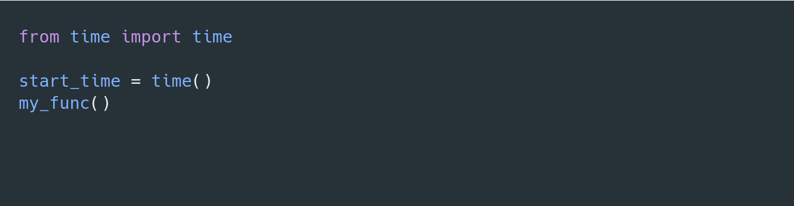
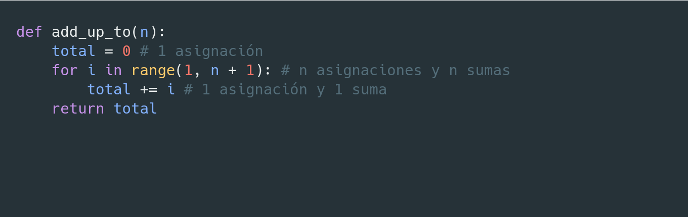
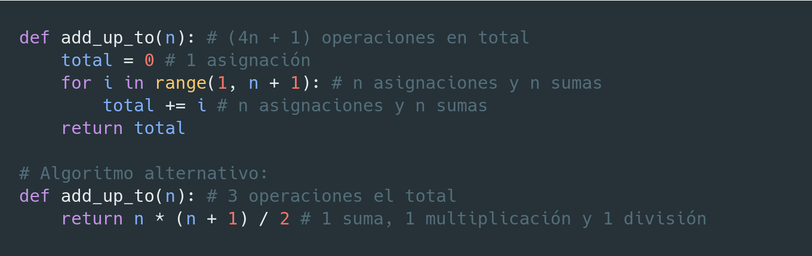
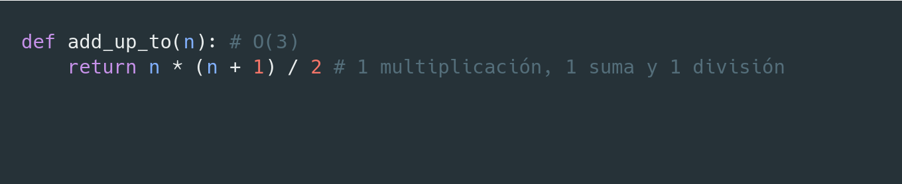
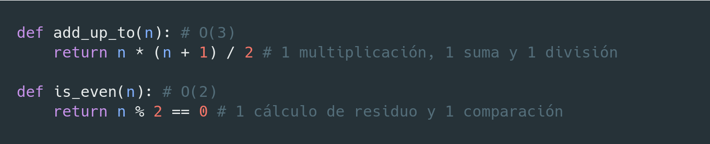
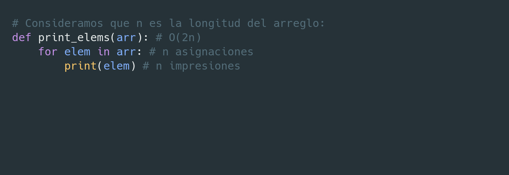
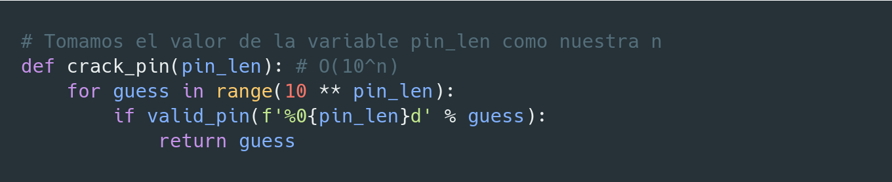
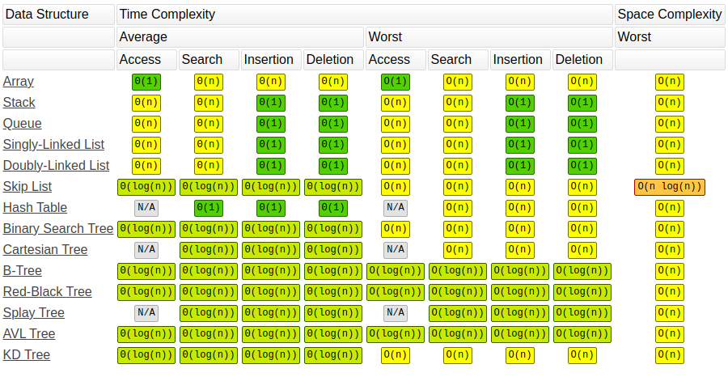

# Big O Notation

---

  

    <h2 style="white-space: nowrap; margin-right: 2rem">춰Hola! Yo soy Yus</h2>
  

  

    <ul style="list-style-type: none">
      <li class="d-flex">
        
        @yusent
      </li>
      <li class="d-flex">
        
        @yusent
      </li>
      <li class="d-flex">
        
        @yus3nt
      </li>
      <li class="d-flex">
        
        @yus3nt
      </li>
    </ul>
  

---

# Hoy veremos...

- 쮻e qu칠 se trata la notaci칩n **Big-O**?
- 쮺u치l es su importancia?
- 쮺칩mo se expresa?
- Ejemplos
- Recursos de apoyo

---

# Lo que necesitan saber previamente...

- Conceptos b치sicos de programaci칩n (variables, ciclos, funciones, etc.)
- Conceptos b치sicos de 치lgebra (e.g. n + n = 2n, n * n = n2)

---

# Big O Notation - 쮻e qu칠 se trata?

---

# Big O Notation - 쮻e qu칠 se trata?

Imaginen que tenemos varias implementaciones de la misma funci칩n...

---

# Big O Notation - 쮻e qu칠 se trata?

Imaginen que tenemos varias implementaciones de la misma funci칩n...

쮺칩mo saben cu치l de ellas es mejor?

---

# Big O Notation - 쮻e qu칠 se trata?

Imaginen que tenemos varias implementaciones de la misma funci칩n...

쮺칩mo saben cu치l de ellas es mejor?

쯈u칠 significa **"mejor"**?

---

# Big O Notation - 쮻e qu칠 se trata?

Imaginen que tenemos varias implementaciones de la misma funci칩n...

쮺칩mo saben cu치l de ellas es mejor?

쯈u칠 significa **"mejor"**?

쯈ue sea m치s **r치pida**?

---

# Big O Notation - 쮻e qu칠 se trata?

Imaginen que tenemos varias implementaciones de la misma funci칩n...

쮺칩mo saben cu치l de ellas es mejor?

쯈u칠 significa **"mejor"**?

쯈ue sea m치s **r치pida**?

쯈ue use menos **memoria**?

---

# Big O Notation - 쮻e qu칠 se trata?

Imaginen que tenemos varias implementaciones de la misma funci칩n...

쮺칩mo saben cu치l de ellas es mejor?

쯈u칠 significa **"mejor"**?

쯈ue sea m치s **r치pida**?

쯈ue use menos **memoria**?

쯈ue sea m치s **legible**?

---

# Big O Notation - 쮻e qu칠 se trata?

Imaginen que tenemos varias implementaciones de la misma funci칩n...

쮺칩mo saben cu치l de ellas es mejor?

쯈u칠 significa **"mejor"**?

쯈ue sea m치s **r치pida**?

쯈ue use menos **memoria**?

쯈ue sea m치s **legible**?

쯈ue sea m치s **corta**?

---

# Big O Notation - 쮻e qu칠 se trata?

Imaginen que tenemos varias implementaciones de la misma funci칩n...

쮺칩mo saben cu치l de ellas es mejor?

쯈u칠 significa **"mejor"**?

쯈ue sea m치s **r치pida**? <b style="color: #00d">俱뫮잺 Complejidad de tiempo (Time Complexity)</b>

쯈ue use menos **memoria**?

쯈ue sea m치s **legible**?

쯈ue sea m치s **corta**?

---

# Big O Notation - 쮻e qu칠 se trata?

Imaginen que tenemos varias implementaciones de la misma funci칩n...

쮺칩mo saben cu치l de ellas es mejor?

쯈u칠 significa **"mejor"**?

쯈ue sea m치s **r치pida**? <b style="color: #00d">俱뫮잺 Complejidad de tiempo (Time Complexity)</b>

쯈ue use menos **memoria**? <b style="color: #00d">俱뫮잺 Complejidad de espacio (Space Complexity)</b>

쯈ue sea m치s **legible**?

쯈ue sea m치s **corta**?

---

# Big O Notation - 쯇or qu칠 nos importa?

---

# Big O Notation - 쯇or qu칠 nos importa?

- Es importante tener un vocabulario preciso para hablar del desempe침o de nuestro c칩digo

---

# Big O Notation - 쯇or qu칠 nos importa?

- Es importante tener un vocabulario preciso para hablar del desempe침o de nuestro c칩digo
- Es 칰til para analizar ventajas y desventajas entre distintos enfoques

---

# Big O Notation - 쯇or qu칠 nos importa?

- Es importante tener un vocabulario preciso para hablar del desempe침o de nuestro c칩digo
- Es 칰til para analizar ventajas y desventajas entre distintos enfoques
- Si tenemos un programa lento nos ayuda a identificar las partes ineficientes que podemos mejorar

---

# Big O Notation - 쯇or qu칠 nos importa?

- Es importante tener un vocabulario preciso para hablar del desempe침o de nuestro c칩digo
- Es 칰til para analizar ventajas y desventajas entre distintos enfoques
- Si tenemos un programa lento nos ayuda a identificar las partes ineficientes que podemos mejorar
- **Es un tema com칰n en entrevistas de trabajo** 游땸

---

# 쯇or qu칠 no usamos *timers* para medir rapidez?

---

# 쯇or qu칠 no usamos *timers* para medir rapidez?

---

# 쯇or qu칠 no usamos *timers* para medir rapidez?

---

# 쯇or qu칠 no usamos *timers* para medir rapidez?

---

# 쯇or qu칠 no usamos *timers* para medir rapidez?

---

# 쯇or qu칠 no usamos *timers* para medir rapidez?

쮺u치l es el problema? 游뱡

---

# 쯇or qu칠 no usamos *timers* para medir rapidez?

쮺u치l es el problema? 游뱡

Diferentes computadoras registrar치n diferentes tiempos

---

# 쯇or qu칠 no usamos *timers* para medir rapidez?

쮺u치l es el problema? 游뱡

~~Diferentes computadoras registrar치n diferentes tiempos~~

**La misma computadora registrar치 distintos tiempos** 游땰

---

# 쯇or qu칠 no usamos *timers* para medir rapidez?

쮺u치l es el problema? 游뱡

~~Diferentes computadoras registrar치n diferentes tiempos~~

**La misma computadora registrar치 distintos tiempos** 游땰

Esto sin contar que para algoritmos muy r치pidos tendremos un problema de precisi칩n

---

# 쮼ntonces qu칠 medimos?

---

# 쮼ntonces qu칠 medimos?

El n칰mero de operaciones que realiza la computadora al ejecutar nuestro algoritmo

---

# 쮼ntonces qu칠 medimos?

El n칰mero de operaciones que realiza la computadora al ejecutar nuestro algoritmo

e.g. una funci칩n que sume todos los n칰meros enteros de 1 a *n*

---

# 쮼ntonces qu칠 medimos?

El n칰mero de operaciones que realiza la computadora al ejecutar nuestro algoritmo

e.g. una funci칩n que sume todos los n칰meros enteros de 1 a *n*

---

# 쮼ntonces qu칠 medimos?

El n칰mero de operaciones que realiza la computadora al ejecutar nuestro algoritmo

e.g. una funci칩n que sume todos los n칰meros enteros de 1 a *n*

---

# 쮼ntonces qu칠 medimos?

El n칰mero de operaciones que realiza la computadora al ejecutar nuestro algoritmo

e.g. una funci칩n que sume todos los n칰meros enteros de 1 a *n*

---

# 쮼ntonces qu칠 medimos?

El n칰mero de operaciones que realiza la computadora al ejecutar nuestro algoritmo

e.g. una funci칩n que sume todos los n칰meros enteros de 1 a *n*

---

# 쮼ntonces qu칠 medimos?

El n칰mero de operaciones que realiza la computadora al ejecutar nuestro algoritmo

e.g. una funci칩n que sume todos los n칰meros enteros de 1 a *n*

---

# 쮼ntonces qu칠 medimos?

El n칰mero de operaciones que realiza la computadora al ejecutar nuestro algoritmo

e.g. una funci칩n que sume todos los n칰meros enteros de 1 a *n*

---

# 쮼ntonces qu칠 medimos?

El n칰mero de operaciones que realiza la computadora al ejecutar nuestro algoritmo

e.g. una funci칩n que sume todos los n칰meros enteros de 1 a *n*

---

# 쮼ntonces qu칠 medimos?

El n칰mero de operaciones que realiza la computadora al ejecutar nuestro algoritmo

e.g. una funci칩n que sume todos los n칰meros enteros de 1 a *n*

---

# 쮼ntonces qu칠 medimos?

El n칰mero de operaciones que realiza la computadora al ejecutar nuestro algoritmo

e.g. una funci칩n que sume todos los n칰meros enteros de 1 a *n*

---

# 쮼ntonces qu칠 medimos?

El n칰mero de operaciones que realiza la computadora al ejecutar nuestro algoritmo

e.g. una funci칩n que sume todos los n칰meros enteros de 1 a *n*

---

# Contar operaciones es dif칤cil

---

# Contar operaciones es dif칤cil

Dependiendo del criterio podr칤amos s칩lo querer contar cierto tipo de operaciones

---

# Contar operaciones es dif칤cil

Dependiendo del criterio podr칤amos s칩lo querer contar cierto tipo de operaciones
- 쮻eber칤amos contar el `return`?

---

# Contar operaciones es dif칤cil

Dependiendo del criterio podr칤amos s칩lo querer contar cierto tipo de operaciones
- 쮻eber칤amos contar el `return`?
- 쯇or qu칠 no contamos el hecho de usar un *for loop* como una operaci칩n?

---

# Contar operaciones es dif칤cil

Dependiendo del criterio podr칤amos s칩lo querer contar cierto tipo de operaciones
- 쮻eber칤amos contar el `return`?
- 쯇or qu칠 no contamos el hecho de usar un *for loop* como una operaci칩n?
- Si la asignaci칩n y la suma se hacen en la misma instrucci칩n 쯡o deber칤an contar como 1 s칩la operaci칩n?

---

# Contar operaciones es dif칤cil

Dependiendo del criterio podr칤amos s칩lo querer contar cierto tipo de operaciones
- 쮻eber칤amos contar el `return`?
- 쯇or qu칠 no contamos el hecho de usar un *for loop* como una operaci칩n?
- Si la asignaci칩n y la suma se hacen en la misma instrucci칩n 쯡o deber칤an contar como 1 s칩la operaci칩n?

El resultado de analizar el primer ejemplo podr칤a variar desde `2n + 1` hasta `4n + 1`

---

# Contar operaciones es dif칤cil

Dependiendo del criterio podr칤amos s칩lo querer contar cierto tipo de operaciones
- 쮻eber칤amos contar el `return`?
- 쯇or qu칠 no contamos el hecho de usar un *for loop* como una operaci칩n?
- Si la asignaci칩n y la suma se hacen en la misma instrucci칩n 쯡o deber칤an contar como 1 s칩la operaci칩n?

El resultado de analizar el primer ejemplo podr칤a variar desde `2n + 1` hasta `4n + 1`

**Lo que s칤 sabemos es que el resultado crece en proporci칩n a `n` para el primer ejemplo y que es constante para el segundo**

---

# Introducing... Big O

---

# Introducing... Big O

**Una manera formal de contar al tanteo** 游뗶

---

# Introducing... Big O

**Una manera formal de contar al tanteo** 游뗶

Expresa c칩mo el tiempo de ejecuci칩n crece en funci칩n del crecimiento del *input*

---

# Definici칩n semi-formal

Decimos que un algoritmo es `O(f(n))` si el n칰mero de operaciones que la computadora tiene que realizar es eventualmente menos que `f(n)` multiplicado por una constante, conforme `n` incrementa

---

# Complejidades comunes

---

# Complejidades comunes: Constante

---

# Complejidades comunes: Constante

No depende del tama침o del input

---

# Complejidades comunes: Constante

No depende del tama침o del input:

---

# Complejidades comunes: Constante

No depende del tama침o del input:

---

# Complejidades comunes: Constante

No depende del tama침o del input:

Todas las complejidades constantes (`O(3)`, `O(12)`, `O(1000)`, etc.) se simplifican como <b style="color: #333">O(1)</b>

---

# Complejidades comunes: Lineal

---

# Complejidades comunes: Lineal

Crece en la misma proporci칩n que el input

---

# Complejidades comunes: Lineal

Crece en la misma proporci칩n que el input:

---

# Complejidades comunes: Lineal

Crece en la misma proporci칩n que el input:

---

# Complejidades comunes: Lineal

Crece en la misma proporci칩n que el input:

Todas las complejidades lineales (`O(n + 1)`, `O(3n)`, ...) se simplifican como <b style="color: #333">O(n)</b>

---

# Complejidades comunes: Logar칤tmica

---

# Complejidades comunes: Logar칤tmica

Crece en proporci칩n al logaritmo del tama침o del input

---

# Complejidades comunes: Logar칤tmica

Crece en proporci칩n al logaritmo del tama침o del input (cada vez crece menos)

---

# Complejidades comunes: Logar칤tmica

Crece en proporci칩n al logaritmo del tama침o del input (cada vez crece menos):

<b>log10(10) = 1</b>

---

# Complejidades comunes: Logar칤tmica

Crece en proporci칩n al logaritmo del tama침o del input (cada vez crece menos):

<b>log10(10) = 1</b>
<b>log10(100) = 2</b>

---

# Complejidades comunes: Logar칤tmica

Crece en proporci칩n al logaritmo del tama침o del input (cada vez crece menos):

<b>log10(10) = 1</b>
<b>log10(100) = 2</b>
<b>log10(1000) = 3</b>

---

# Complejidades comunes: Logar칤tmica

Crece en proporci칩n al logaritmo del tama침o del input (cada vez crece menos):

<b>log10(10) = 1</b>
<b>log10(100) = 2</b>
<b>log10(1000) = 3</b>
<b>log10(1000000000000000000) = 18</b>

---

# Complejidades comunes: Logar칤tmica

Crece en proporci칩n al logaritmo del tama침o del input (cada vez crece menos):

---

# Complejidades comunes: Logar칤tmica

Crece en proporci칩n al logaritmo del tama침o del input (cada vez crece menos):

Todas las complejidades logar칤tmicas se simplifican como <b style="color: #333">O(log(n))</b>

---

# Complejidades comunes: Cuadr치tica

---

# Complejidades comunes: Cuadr치tica

Crece en proporci칩n al cuadrado del tama침o del input

---

# Complejidades comunes: Cuadr치tica

Crece en proporci칩n al cuadrado del tama침o del input:

---

# Complejidades comunes: Cuadr치tica

Crece en proporci칩n al cuadrado del tama침o del input:

---

# Complejidades comunes: Cuadr치tica

Crece en proporci칩n al cuadrado del tama침o del input:

쮻e d칩nde sali칩 una n2? 游뱂

---

# Complejidades comunes: Cuadr치tica

Crece en proporci칩n al cuadrado del tama침o del input:

---

# Complejidades comunes: Cuadr치tica

Crece en proporci칩n al cuadrado del tama침o del input:

---

# Complejidades comunes: Cuadr치tica

Crece en proporci칩n al cuadrado del tama침o del input:

---

# Complejidades comunes: Cuadr치tica

Crece en proporci칩n al cuadrado del tama침o del input:

---

# Complejidades comunes: Cuadr치tica

Crece en proporci칩n al cuadrado del tama침o del input:

---

# Complejidades comunes: Cuadr치tica

Crece en proporci칩n al cuadrado del tama침o del input:

Todas las complejidades cuadr치ticas (<code>O(n2 + 1)</code>, <code>O(3n2 + 2n)</code>, <code>O(n2 - n + 144)</code>, ...) se simplifican como <b style="color: #333">O(n2)</b>

---

# Complejidades comunes: Exponencial

---

# Complejidades comunes: Exponencial

El tama침o del input se usa como exponente para expresar la complejidad

---

# Complejidades comunes: Exponencial

El tama침o del input se usa como exponente para expresar la complejidad:

---

# Complejidades comunes: Exponencial

El tama침o del input se usa como exponente para expresar la complejidad:

Todas las complejidades exponenciales (<code>O(2n + 12)</code>, <code>O(3n + 2n)</code>, <code>O(3*10n - n + 144)</code>, ...) se simplifican como <b style="color: #333">O(bn)</b>

---

<h4 style="align-self: center">Comparaci칩n de complejidades</h4>

---

# Ejemplos

---

# Ejemplos

---

# Ejemplos

---

# Ejemplos

---

# Ejemplos

---

# Ejemplos

---

# Ejemplos

---

# Ejemplos

---

# Ejemplos

---

# Ejemplos

---

# Ejemplos

---

# Ejemplos

---

# Ejemplos

---

# Ejemplos

---

# Ejemplos

---

# Ejemplos

---

# Ejemplos

쮺u치ntas veces se repite el ciclo? 游뱂

---

# Ejemplos

游눠 Cada iteraci칩n descartamos la mitad del arreglo

---

# Ejemplos

쮺u치ntas veces podemos dividir n entre 2?

---

# Ejemplos

log2(n)

---

# Ejemplos

---

# Ejemplos

---

# Cheatsheet: [https://www.bigocheatsheet.com/](https://www.bigocheatsheet.com/)

---

# Cheatsheet: [https://www.bigocheatsheet.com/](https://www.bigocheatsheet.com/)

---

# 쯇reguntas?
