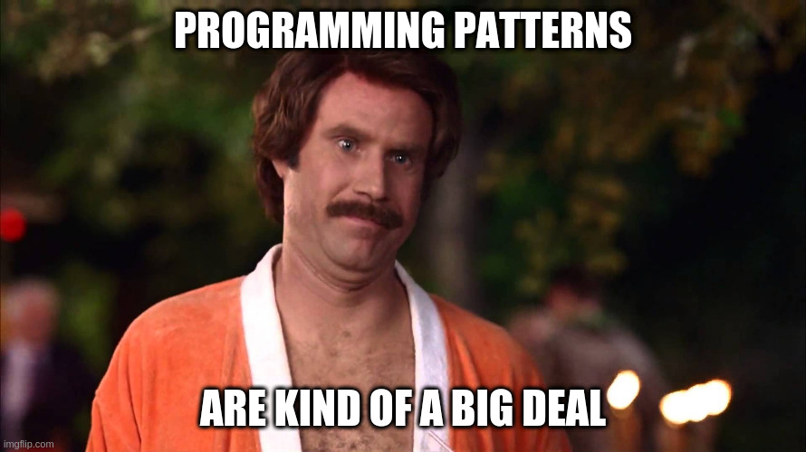
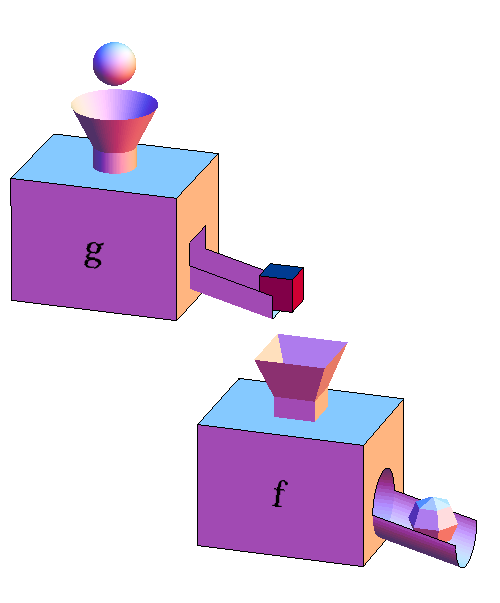
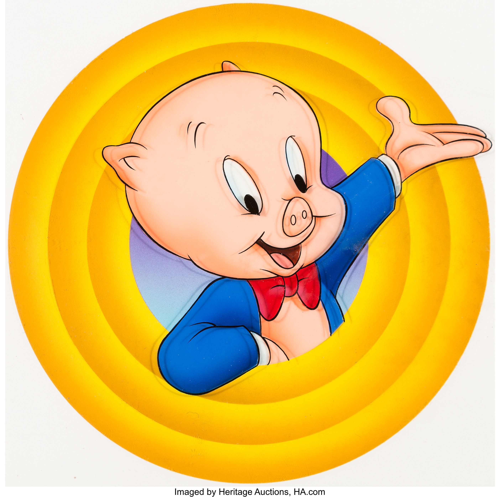

<style>
  .d-flex {
    display: flex;
    align-items: center;
  }

  #cover div {
    flex: 1;
  }

  #cover div:last-child {
    border-left: 1px solid #ccc;
  }

  #cover ul {
    list-style-type: none;
  }

  #cover ul li img {
    margin-right: 0.5rem;
  }

  section {
    justify-content: flex-start;
  }

  .title-section {
    flex: 1;
    display: flex;
    align-items: center;
    justify-content: center;
    flex-direction: column;
  }

  section[id="1"], section[id="2"], section[id="3"] {
    justify-content: center;
  }

  ul {
    margin-bottom: 0;
  }

  table {
    display: table;
  }

  th {
    background-color: #333;
    color: #fff;
    text-align: left;
  }

  img {
    object-fit: contain;
    vertical-align: middle;
  }

  .hljs-keyword {
    color: #6f42c1 !important;
  }

  .hljs-type {
    color: #660
  }

  .red {
    color: #f00;
  }

  .blue {
    color: #44f;
  }

  .transparent {
    opacity: 0;
  }

  .muted {
    color: #0005;
  }

  .chain {
    font-family: SFMono-Regular,Consolas,Liberation Mono,Menlo,monospace;
    align-self: center;
    display: flex;
    align-items: center;
    justify-content: center;
    margin-bottom: 80px;
  }

  .block {
    background-color: #ccc;
    font-weight: bold;
    padding: 2px 10px;
  }

  .service-block {
    background-color: #aaf;
  }

  .use-case-block {
    background-color: #afa;
  }

  .application-block {
    color: #fff;
    background-color: #9e111b;
    padding: 10px 20px;
  }

  .arrow {
    border: solid black;
    border-width: 0 6px 6px 0;
    display: inline-block;
    padding: 9px;
  }

  .arrow.right {
    margin: 0 20px;
    transform: rotate(-45deg);
    -webkit-transform: rotate(-45deg);
  }

  .arrow.down {
    transform: rotate(45deg);
    -webkit-transform: rotate(45deg);
  }

  .note {
    color: #f00;
    font-weight: bold;
    position: absolute;
    bottom: 100px;
    right: 100px;
  }
</style>

# Patrones de Programación Funcional en Haskell

---

<div id="cover" class="d-flex">
  <div>
    <h2>¡Hola! Yo soy Yusent</h2>
  </div>
  <div>
    <ul>
      <li class="d-flex">
        
        @yusent
      </li>
      <li class="d-flex">
        
        @yusent
      </li>
      <li class="d-flex">
        
        @yus3nt
      </li>
      <li class="d-flex">
        
        @yus3nt
      </li>
    </ul>
  </div>
</div>

---

<div id="cover" class="d-flex">
  <div>
    <h2>¡Hola! Yo soy <span class="red">Yus</span><s>ent</s></h2>
  </div>
  <div>
    <ul>
      <li class="d-flex">
        
        @yusent
      </li>
      <li class="d-flex">
        
        @yusent
      </li>
      <li class="d-flex">
        
        @yus3nt
      </li>
      <li class="d-flex">
        
        @yus3nt
      </li>
    </ul>
  </div>
</div>

---

# ¿A qué nos referimos con patrones de programación?

Estrategias para resolver problemas comunes de software, las cuales deben ser:

- Generales
- Repetibles
- Transformables directamente en código

---



---


- Nos permiten re-usar la experiencia (son formas probadas de estructurar software)

---


- Nos permiten re-usar la experiencia (son formas probadas de estructurar software)
- Se reconocen con facilidad (y nos revelan la intención)

---


- Nos permiten re-usar la experiencia (son formas probadas de estructurar software)
- Se reconocen con facilidad (y nos revelan la intención)
- Nos dan abstracción y encapsulación (esconden algunos detalles y nos ayudan a razonar en alto nivel)

---

| Patrón orientado a objetos | Patrón funcional |
| --- | --- |
| Single Responsability Principle | |
| Open/Closed Principle | |
| Liskov Substitution Principle | |
| Interface Segregation Principle | |
| Dependency Inversion Principle | |
| Factory Pattern | |
| Strategy Pattern | <span class="transparent">Seguro ya entendieron la idea</span> |
| Decorator Pattern | |
| Visitor Pattern | |

---

| Patrón orientado a objetos | Patrón funcional |
| --- | --- |
| Single Responsability Principle | Funciones |
| Open/Closed Principle | |
| Liskov Substitution Principle | |
| Interface Segregation Principle | |
| Dependency Inversion Principle | |
| Factory Pattern | |
| Strategy Pattern | <span class="transparent">Seguro ya entendieron la idea</span> |
| Decorator Pattern | |
| Visitor Pattern | |

---

| Patrón orientado a objetos | Patrón funcional |
| --- | --- |
| Single Responsability Principle | Funciones |
| Open/Closed Principle | Funciones |
| Liskov Substitution Principle | |
| Interface Segregation Principle | |
| Dependency Inversion Principle | |
| Factory Pattern | |
| Strategy Pattern | <span class="transparent">Seguro ya entendieron la idea</span> |
| Decorator Pattern | |
| Visitor Pattern | |

---

| Patrón orientado a objetos | Patrón funcional |
| --- | --- |
| Single Responsability Principle | Funciones |
| Open/Closed Principle | Funciones |
| Liskov Substitution Principle | También funciones |
| Interface Segregation Principle | |
| Dependency Inversion Principle | |
| Factory Pattern | |
| Strategy Pattern | <span class="transparent">Seguro ya entendieron la idea</span> |
| Decorator Pattern | |
| Visitor Pattern | |

---

| Patrón orientado a objetos | Patrón funcional |
| --- | --- |
| Single Responsability Principle | Funciones |
| Open/Closed Principle | Funciones |
| Liskov Substitution Principle | También funciones |
| Interface Segregation Principle | Funciones |
| Dependency Inversion Principle | |
| Factory Pattern | |
| Strategy Pattern | <span class="transparent">Seguro ya entendieron la idea</span> |
| Decorator Pattern | |
| Visitor Pattern | |

---

| Patrón orientado a objetos | Patrón funcional |
| --- | --- |
| Single Responsability Principle | Funciones |
| Open/Closed Principle | Funciones |
| Liskov Substitution Principle | También funciones |
| Interface Segregation Principle | Funciones |
| Dependency Inversion Principle | Funciones de nuevo |
| Factory Pattern | |
| Strategy Pattern | <span class="transparent">Seguro ya entendieron la idea</span> |
| Decorator Pattern | |
| Visitor Pattern | |

---

| Patrón orientado a objetos | Patrón funcional |
| --- | --- |
| Single Responsability Principle | Funciones |
| Open/Closed Principle | Funciones |
| Liskov Substitution Principle | También funciones |
| Interface Segregation Principle | Funciones |
| Dependency Inversion Principle | Funciones de nuevo |
| Factory Pattern | Funciones |
| Strategy Pattern | <span class="transparent">Seguro ya entendieron la idea</span> |
| Decorator Pattern | |
| Visitor Pattern | |

---

| Patrón orientado a objetos | Patrón funcional |
| --- | --- |
| Single Responsability Principle | Funciones |
| Open/Closed Principle | Funciones |
| Liskov Substitution Principle | También funciones |
| Interface Segregation Principle | Funciones |
| Dependency Inversion Principle | Funciones de nuevo |
| Factory Pattern | Funciones |
| Strategy Pattern | Seguro ya entendieron la idea |
| Decorator Pattern | |
| Visitor Pattern | |

---

| Patrón orientado a objetos | Patrón funcional |
| --- | --- |
| Single Responsability Principle | Funciones |
| Open/Closed Principle | Funciones |
| Liskov Substitution Principle | También funciones |
| Interface Segregation Principle | Funciones |
| Dependency Inversion Principle | Funciones de nuevo |
| Factory Pattern | Funciones |
| Strategy Pattern | Seguro ya entendieron la idea |
| Decorator Pattern | Funciones |
| Visitor Pattern | |

---

| Patrón orientado a objetos | Patrón funcional |
| --- | --- |
| Single Responsability Principle | Funciones |
| Open/Closed Principle | Funciones |
| Liskov Substitution Principle | También funciones |
| Interface Segregation Principle | Funciones |
| Dependency Inversion Principle | Funciones de nuevo |
| Factory Pattern | Funciones |
| Strategy Pattern | Seguro ya entendieron la idea |
| Decorator Pattern | Funciones |
| Visitor Pattern | Funciones |

---

# ¿Por qué usar Haskell?

---

# ¿Por qué usar Haskell?

- Es puro (no permite efectos secundarios)

---

# ¿Por qué usar Haskell?

- Es puro (no permite efectos secundarios)
- Es "popular" (ya sé, ya sé, déjenme explicarlo...)

---

# ¿Por qué usar Haskell?

- Es puro (no permite efectos secundarios)
- Es "popular" (ya sé, ya sé, déjenme explicarlo...)
- Sus sistema de tipos es fuerte

---

# ¿Por qué usar Haskell?

- Es puro (no permite efectos secundarios)
- Es "popular" (ya sé, ya sé, déjenme explicarlo...)
- Sus sistema de tipos es fuerte
- Cuenta con inferencia de tipos

---

# ¿Por qué usar Haskell?

- Es puro (no permite efectos secundarios)
- Es "popular" (ya sé, ya sé, déjenme explicarlo...)
- Sus sistema de tipos es fuerte
- Cuenta con inferencia de tipos
- Es de alto nivel

---

# ¿Por qué usar Haskell?

- Es puro (no permite efectos secundarios)
- Es "popular" (ya sé, ya sé, déjenme explicarlo...)
- Sus sistema de tipos es fuerte
- Cuenta con inferencia de tipos
- Es de alto nivel
- Es elegante <span class="red">&hearts;</span>

---

## Lo que hoy les vengo manejando

- Patrones Básicos de Programación Funcional
  - Funciones
  - Currificación
  - Composición
  - Tipos de datos como conjuntos
  - Principio de "Contemplar todos los casos para no tener que usar excepciones" (100% real no fake)

---

## Lo que hoy les vengo manejando

- Patrones Básicos de Programación Funcional
  - Funciones
  - Currificación
  - Composición
  - Tipos de datos como conjuntos
  - Principio de "Contemplar todos los casos para no tener que usar excepciones" (100% real no fake)

#### Posibles temas para secuela:

- Funciones puras / impuras
- Pattern matching
- Mónadas / Monoides

---

<div class="title-section">
  <h1>Funciones</h1>
</div>

---

## Las funciones son entidades de primera clase

---

## Las funciones son <s>entidades de primera clase</s> <span class="red">cosas.</span>

---

## Las funciones son <s>entidades de primera clase</s> <span class="red">cosas.</span>

- Se pueden almacenar en variables

---

## Las funciones son <s>entidades de primera clase</s> <span class="red">cosas.</span>

- Se pueden almacenar en variables
- Se pueden pasar como argumento a otra función

---

## Las funciones son <s>entidades de primera clase</s> <span class="red">cosas.</span>

- Se pueden almacenar en variables
- Se pueden pasar como argumento a otra función
- Se pueden regresar como resultado de otra función

---

## Las funciones son <s>entidades de primera clase</s> <span class="red">cosas.</span>

- Se pueden almacenar en variables
- Se pueden pasar como argumento a otra función
- Se pueden regresar como resultado de otra función
- Son independientes (No necesitan estar atadas a una clase u objeto)

---

<center>
  
</center>

<center style="margin-top: -30px">
  <small class="muted">Imagen tomada de https://mathinsight.org</small>
</center>

---

<center>
  
</center>

<center style="margin-top: -30px">
  <small class="muted">Imagen tomada de https://mathinsight.org</small>
</center>

<div class="note">
  Esfera -> Cubo
</div>

---

<div class="chain">
  <span class="blue">x</span>
  <span class="arrow right"></span>
  <div class="block">Función</div>
  <span class="arrow right"></span>
  <span class="blue">y</span>
</div>

---

<div class="chain">
  <span class="blue">x</span>
  <span class="arrow right"></span>
  <div class="block">Función</div>
  <span class="arrow right"></span>
  <span class="blue">y</span>
</div>

<center style="margin-bottom: 80px">
  <b class="blue">Operación de bajo nivel</b>
</center>

---

<div class="chain">
  <span class="blue">x</span>
  <span class="arrow right"></span>
  <div class="block">Función</div>
  <span class="arrow right"></span>
  <span class="blue">y</span>
</div>

<center style="margin-bottom: 80px">
  <b class="blue">Operación de bajo nivel</b>
</center>

<div class="chain">
  <span class="blue">10</span>
  <span class="arrow right"></span>
  <div class="block">half</div>
  <span class="arrow right"></span>
  <span class="blue">5&nbsp;</span>
</div>

---

<div class="chain">
  <span class="blue">x</span>
  <span class="arrow right"></span>
  <div class="block">Función</div>
  <span class="arrow right"></span>
  <span class="blue">y</span>
</div>

<center style="margin-bottom: 80px">
  <b class="blue">Operación de bajo nivel</b>
</center>

<div class="chain">
  <span class="blue">10</span>
  <span class="arrow right"></span>
  <div class="block">half</div>
  <span class="arrow right"></span>
  <span class="blue">5&nbsp;</span>
</div>

<div class="chain">
  <span class="blue">12&nbsp;</span>
  <span class="arrow right"></span>
  <div class="block">square</div>
  <span class="arrow right"></span>
  <span class="blue">144</span>
</div>

---

<div class="chain">
  <span class="blue">x</span>
  <span class="arrow right"></span>
  <div class="block">Función</div>
  <span class="arrow right"></span>
  <span class="blue">y</span>
</div>

<center style="margin-bottom: 80px">
  <b class="blue">Operación de bajo nivel</b>
</center>

<div class="chain">
  <span class="blue">10</span>
  <span class="arrow right"></span>
  <div class="block">half</div>
  <span class="arrow right"></span>
  <span class="blue">5&nbsp;</span>
</div>

<div class="chain">
  <span class="blue">12&nbsp;</span>
  <span class="arrow right"></span>
  <div class="block">square</div>
  <span class="arrow right"></span>
  <span class="blue">144</span>
</div>

<div class="chain">
  <span class="blue">"hola mundo"</span>
  <span class="arrow right"></span>
  <div class="block">toUpper</div>
  <span class="arrow right"></span>
  <span class="blue">"HOLA MUNDO"</span>
</div>

---

## Definición de funciones

```haskell
add a b = a + b
```

---

## Definición de funciones

```haskell
add a b = a + b
```

Opcionalmente podemos especificar una firma:
```haskell
add :: Int -> Int -> Int
add a b = a + b
```

---

## Definición de funciones

```haskell
add a b = a + b
```

Opcionalmente podemos especificar una firma:
```haskell
add :: Int -> Int -> Int
add a b = a + b
```

Usando notación lambda (función anónima):
```haskell
add = \a b -> a + b
```

---

## Definición de funciones

```haskell
add a b = a + b
```

Opcionalmente podemos especificar una firma:
```haskell
add :: Int -> Int -> Int
add a b = a + b
```

Usando notación lambda (función anónima):
```haskell
add = \a b -> a + b
```

Para aplicar una función separamos con espacio:
```haskell
add 10 2 -- Regresa 12
```

---

<div class="title-section">
  <h1>Currificación</h1>
</div>

---

<b class="blue">Currificación</b> es el proceso mediante el cual transformamos una función que toma múltiples argumentos en una que toma un sólo argumento y regresa una función que toma los argumentos restantes.

---

<b class="blue">Currificación</b> es el proceso mediante el cual transformamos una función que toma múltiples argumentos en una que toma un sólo argumento y regresa una función que toma los argumentos restantes.

```javascript
const add = (a, b) => a + b;
```

---

<b class="blue">Currificación</b> es el proceso mediante el cual transformamos una función que toma múltiples argumentos en una que toma un sólo argumento y regresa una función que toma los argumentos restantes.

```javascript
const add = (a, b) => a + b;

const curryfiedAdd = a => b => a + b;
```

---

<b class="blue">Currificación</b> es el proceso mediante el cual transformamos una función que toma múltiples argumentos en una que toma un sólo argumento y regresa una función que toma los argumentos restantes.

```javascript
const add = (a, b) => a + b;

const curryfiedAdd = a => b => a + b;

add(1, 2) // 3
curryfiedAdd(1)(2) // 3
```

---

<b class="blue">Currificación</b> es el proceso mediante el cual transformamos una función que toma múltiples argumentos en una que toma un sólo argumento y regresa una función que toma los argumentos restantes.

```javascript
const add = (a, b) => a + b;

const curryfiedAdd = a => b => a + b;

add(1, 2) // 3
curryfiedAdd(1)(2) // 3
```

Podemos crear funciones utilizando aplicaciones parciales:

```javascript
const add12 = curryfiedAdd(12);

add12(3) // 15
```

---

### Podemos crear una función para currificar funciones de 2 argumentos así:

```javascript
const curry2args = func => (x) => (y) => func(x, y);
const curryfiedAdd = curry2args(add);

curryfiedAdd(1)(2) // 3
```

---

### Podemos crear una función para currificar funciones de 2 argumentos así:

```javascript
const curry2args = func => (x) => (y) => func(x, y);
const curryfiedAdd = curry2args(add);

curryfiedAdd(1)(2) // 3
```

### O una que currifique funciones de 3 argumentos:

```javascript
const curry3args = func => (x) => (y) => (z) => func(x, y, z);
const mult3 = (a, b, c) => a * b * c;

const curryfiedMult = curry3args(mult3);
const multBy24 = curryfiedMult(2)(12);

multBy24(6) // 144
```

---

# En Haskell !todas las funciones están currificadas!

<center>
  
</center>

---

Hay paréntesis escondidos en la firma de la función:
```haskell
add :: Int -> Int -> Int
add a b = a + b
```

---

Hay paréntesis escondidos en la firma de la función:
```haskell
add :: Int -> (Int -> Int)
add a b = a + b
```

---

Hay paréntesis escondidos en la firma de la función:
```haskell
add :: Int -> (Int -> Int)
add a b = a + b
```

También hay paréntesis escondidos en la evaluación:
```haskell
add 12 3
```

---

Hay paréntesis escondidos en la firma de la función:
```haskell
add :: Int -> (Int -> Int)
add a b = a + b
```

También hay paréntesis escondidos en la evaluación:
```haskell
(add 12) 3
```

---

Hay paréntesis escondidos en la firma de la función:
```haskell
add :: Int -> (Int -> Int)
add a b = a + b
```

También hay paréntesis escondidos en la evaluación:
```haskell
(add 12) 3
```

Para currificar basta entonces con dar menos argumentos:
```haskell
add12 = add 12
add12 12 -- 24
```

---

<div class="title-section">
  <h1>Composición de funciones</h1>
</div>

---

<center>
  
  <br>
  <small class="muted">Imagen tomada de https://mathinsight.org</small>
</center>

---

<center>
  
  <br>
  <small class="muted">Imagen tomada de https://mathinsight.org</small>
</center>

---

<center>
  
  <br>
  <small class="muted">Imagen tomada de https://mathinsight.org</small>
</center>

<div class="note" style="bottom: 300px">
  Esfera -> Icosidodecaedro
</div>

---

<div class="chain">
  <span class="blue">x</span>
  <span class="arrow right"></span>
  <div class="block">Función 1</div>
  <span class="arrow right transparent"></span>
  <div class="block transparent">Función 2</div>
  <span class="arrow right transparent"></span>
  <div class="block transparent">Función 3</div>
  <span class="arrow right transparent"></span>
  <span class="transparent">y</span>
</div>

---

<div class="chain">
  <span class="blue">x</span>
  <span class="arrow right"></span>
  <div class="block">Función 1</div>
  <span class="arrow right"></span>
  <div class="block">Función 2</div>
  <span class="arrow right transparent"></span>
  <div class="block transparent">Función 3</div>
  <span class="arrow right transparent"></span>
  <span class="transparent">y</span>
</div>

---

<div class="chain">
  <span class="blue">x</span>
  <span class="arrow right"></span>
  <div class="block">Función 1</div>
  <span class="arrow right"></span>
  <div class="block">Función 2</div>
  <span class="arrow right"></span>
  <div class="block">Función 3</div>
  <span class="arrow right transparent"></span>
  <span class="blue transparent">y</span>
</div>

---

<div class="chain">
  <span class="blue">x</span>
  <span class="arrow right"></span>
  <div class="block">Función 1</div>
  <span class="arrow right"></span>
  <div class="block">Función 2</div>
  <span class="arrow right"></span>
  <div class="block">Función 3</div>
  <span class="arrow right"></span>
  <span class="blue">y</span>
</div>

---

<div class="chain">
  <span class="blue">x</span>
  <span class="arrow right"></span>
  <div class="block">Función 1</div>
  <span class="arrow right"></span>
  <div class="block">Función 2</div>
  <span class="arrow right"></span>
  <div class="block">Función 3</div>
  <span class="arrow right"></span>
  <span class="blue">y</span>
</div>

<center style="margin-bottom: 80px">
  <span class="arrow down"></span>
</center>

<div class="chain">
  <span class="blue">x</span>
  <span class="arrow right"></span>
  <div class="block service-block">Servicio</div>
  <span class="arrow right"></span>
  <span class="blue">y</span>
</div>

<div class="note">
  Como <i>"microservicio"</i> pero sin el <i>"micro"</i>
</div>

---

<div class="chain">
  <span class="blue">Person</span>
  <span class="arrow right transparent"></span>
  <div class="block transparent">getEmployer</div>
  <span class="arrow right transparent"></span>
  <div class="block transparent">getPayDay</div>
  <span class="arrow right transparent"></span>
  <div class="block transparent">isToday</div>
  <span class="arrow right transparent"></span>
  <span class="transparent">Boolean</span>
</div>

---

<div class="chain">
  <span class="blue">Person</span>
  <span class="arrow right"></span>
  <div class="block">getEmployer</div>
  <span class="arrow right transparent"></span>
  <div class="block transparent">getPayDay</div>
  <span class="arrow right transparent"></span>
  <div class="block transparent">isToday</div>
  <span class="arrow right transparent"></span>
  <span class="transparent">Boolean</span>
</div>

---

<div class="chain">
  <span class="blue">Person</span>
  <span class="arrow right"></span>
  <div class="block">getEmployer</div>
  <span class="arrow right"></span>
  <div class="block">getPayDay</div>
  <span class="arrow right transparent"></span>
  <div class="block transparent">isToday</div>
  <span class="arrow right transparent"></span>
  <span class="transparent">Boolean</span>
</div>

---

<div class="chain">
  <span class="blue">Person</span>
  <span class="arrow right"></span>
  <div class="block">getEmployer</div>
  <span class="arrow right"></span>
  <div class="block">getPayDay</div>
  <span class="arrow right"></span>
  <div class="block">isToday</div>
  <span class="arrow right transparent"></span>
  <span class="transparent">Boolean</span>
</div>

---

<div class="chain">
  <span class="blue">Person</span>
  <span class="arrow right"></span>
  <div class="block">getEmployer</div>
  <span class="arrow right"></span>
  <div class="block">getPayDay</div>
  <span class="arrow right"></span>
  <div class="block">isToday</div>
  <span class="arrow right"></span>
  <span class="blue">Boolean</span>
</div>

---

<div class="chain">
  <span class="blue">Person</span>
  <span class="arrow right"></span>
  <div class="block">getEmployer</div>
  <span class="arrow right"></span>
  <div class="block">getPayDay</div>
  <span class="arrow right"></span>
  <div class="block">isToday</div>
  <span class="arrow right"></span>
  <span class="blue">Boolean</span>
</div>

<center style="margin-bottom: 80px">
  <span class="arrow down"></span>
</center>

<div class="chain">
  <span class="blue transparent">&nbsp;&nbsp;Yus</span>
  <span class="arrow right transparent"></span>
  <div class="block service-block">shouldTransferMoney</div>
  <span class="arrow right transparent"></span>
  <span class="transparent">False</span>
</div>

---

<div class="chain">
  <span class="blue">Person</span>
  <span class="arrow right"></span>
  <div class="block">getEmployer</div>
  <span class="arrow right"></span>
  <div class="block">getPayDay</div>
  <span class="arrow right"></span>
  <div class="block">isToday</div>
  <span class="arrow right"></span>
  <span class="blue">Boolean</span>
</div>

<center style="margin-bottom: 80px">
  <span class="arrow down"></span>
</center>

<div class="chain">
  <span class="blue">&nbsp;&nbsp;Yus</span>
  <span class="arrow right"></span>
  <div class="block service-block">shouldTransferMoney</div>
  <span class="arrow right transparent"></span>
  <span class="transparent">False</span>
</div>

---

<div class="chain">
  <span class="blue">Person</span>
  <span class="arrow right"></span>
  <div class="block">getEmployer</div>
  <span class="arrow right"></span>
  <div class="block">getPayDay</div>
  <span class="arrow right"></span>
  <div class="block">isToday</div>
  <span class="arrow right"></span>
  <span class="blue">Boolean</span>
</div>

<center style="margin-bottom: 80px">
  <span class="arrow down"></span>
</center>

<div class="chain">
  <span class="blue">&nbsp;&nbsp;Yus</span>
  <span class="arrow right"></span>
  <div class="block service-block">shouldTransferMoney</div>
  <span class="arrow right"></span>
  <span class="blue">False</span>
</div>

<div class="note" style="font-size: 50px">
  &#9785;
</div>

---

## Utilizamos el punto para componer funciones:

```haskell
half x = x / 2

mult a b = a * b

byThreeOverTwo x = half (mult 3 x)

-- byThreeOverTwo puede ser definida como:
byThreeOverTwo = half . mult 3
```

---

## Utilizamos el punto para componer funciones:

```haskell
half x = x / 2

mult a b = a * b

byThreeOverTwo x = half (mult 3 x)

-- byThreeOverTwo puede ser definida como:
byThreeOverTwo = half . mult 3
```

Podemos componer en orden natural utilizando el operador `>>>` del módulo `Control.Arrow`:
```haskell
byThreeOverTwo = mult 3 >>> half
```

---

<div class="chain">
  <span class="blue">x</span>
  <span class="arrow right"></span>
  <div class="block service-block">Servicio 1</div>
  <span class="arrow right transparent"></span>
  <div class="block service-block transparent">Servicio 2</div>
  <span class="arrow right transparent"></span>
  <div class="block service-block transparent">Servicio 3</div>
  <span class="arrow right transparent"></span>
  <span class="transparent">y</span>
</div>

---

<div class="chain">
  <span class="blue">x</span>
  <span class="arrow right"></span>
  <div class="block service-block">Servicio 1</div>
  <span class="arrow right"></span>
  <div class="block service-block">Servicio 2</div>
  <span class="arrow right transparent"></span>
  <div class="block service-block transparent">Servicio 3</div>
  <span class="arrow right transparent"></span>
  <span class="transparent">y</span>
</div>

---

<div class="chain">
  <span class="blue">x</span>
  <span class="arrow right"></span>
  <div class="block service-block">Servicio 1</div>
  <span class="arrow right"></span>
  <div class="block service-block">Servicio 2</div>
  <span class="arrow right"></span>
  <div class="block service-block">Servicio 3</div>
  <span class="arrow right transparent"></span>
  <span class="transparent">y</span>
</div>

---

<div class="chain">
  <span class="blue">x</span>
  <span class="arrow right"></span>
  <div class="block service-block">Servicio 1</div>
  <span class="arrow right"></span>
  <div class="block service-block">Servicio 2</div>
  <span class="arrow right"></span>
  <div class="block service-block">Servicio 3</div>
  <span class="arrow right"></span>
  <span class="blue">y</span>
</div>

---

<div class="chain">
  <span class="blue">x</span>
  <span class="arrow right"></span>
  <div class="block service-block">Servicio 1</div>
  <span class="arrow right"></span>
  <div class="block service-block">Servicio 2</div>
  <span class="arrow right"></span>
  <div class="block service-block">Servicio 3</div>
  <span class="arrow right"></span>
  <span class="blue">y</span>
</div>

<center style="margin-bottom: 80px">
  <span class="arrow down"></span>
</center>

<div class="chain">
  <span class="blue">x</span>
  <span class="arrow right"></span>
  <div class="block use-case-block">Caso de uso</div>
  <span class="arrow right"></span>
  <span class="blue">y</span>
</div>

---

<div class="chain">
  <span class="blue">x</span>
  <span class="arrow right"></span>
  <div class="block use-case-block">Caso de uso 1</div>
  <span class="arrow right transparent"></span>
  <div class="block use-case-block transparent">Caso de uso 2</div>
  <span class="arrow right transparent"></span>
  <div class="block use-case-block transparent">Caso de uso 3</div>
  <span class="arrow right transparent"></span>
  <span class="transparent">y</span>
</div>

---

<div class="chain">
  <span class="blue">x</span>
  <span class="arrow right"></span>
  <div class="block use-case-block">Caso de uso 1</div>
  <span class="arrow right"></span>
  <div class="block use-case-block">Caso de uso 2</div>
  <span class="arrow right transparent"></span>
  <div class="block use-case-block transparent">Caso de uso 3</div>
  <span class="arrow right transparent"></span>
  <span class="transparent">y</span>
</div>

---

<div class="chain">
  <span class="blue">x</span>
  <span class="arrow right"></span>
  <div class="block use-case-block">Caso de uso 1</div>
  <span class="arrow right"></span>
  <div class="block use-case-block">Caso de uso 2</div>
  <span class="arrow right"></span>
  <div class="block use-case-block">Caso de uso 3</div>
  <span class="arrow right transparent"></span>
  <span class="transparent">y</span>
</div>

---

<div class="chain">
  <span class="blue">x</span>
  <span class="arrow right"></span>
  <div class="block use-case-block">Caso de uso 1</div>
  <span class="arrow right"></span>
  <div class="block use-case-block">Caso de uso 2</div>
  <span class="arrow right"></span>
  <div class="block use-case-block">Caso de uso 3</div>
  <span class="arrow right"></span>
  <span class="blue">y</span>
</div>

---

<div class="chain">
  <span class="blue">x</span>
  <span class="arrow right"></span>
  <div class="block use-case-block">Caso de uso 1</div>
  <span class="arrow right"></span>
  <div class="block use-case-block">Caso de uso 2</div>
  <span class="arrow right"></span>
  <div class="block use-case-block">Caso de uso 3</div>
  <span class="arrow right"></span>
  <span class="blue">y</span>
</div>

<center style="margin-bottom: 80px">
  <span class="arrow down"></span>
</center>

<div class="chain">
  <span class="blue">x</span>
  <span class="arrow right"></span>
  <div class="block application-block"><span>Aplicación</span></div>
  <span class="arrow right"></span>
  <span class="blue">y</span>
</div>

---

<div class="chain">
  <span class="blue">x</span>
  <span class="arrow right"></span>
  <div class="block use-case-block">Caso de uso 1</div>
  <span class="arrow right"></span>
  <div class="block use-case-block">Caso de uso 2</div>
  <span class="arrow right"></span>
  <div class="block use-case-block">Caso de uso 3</div>
  <span class="arrow right"></span>
  <span class="blue">y</span>
</div>

<center style="margin-bottom: 80px">
  <span class="arrow down"></span>
</center>

<div class="chain">
  <span class="blue">x</span>
  <span class="arrow right"></span>
  <div class="block application-block"><span>Aplicación</span></div>
  <span class="arrow right"></span>
  <span class="blue">y</span>
</div>

<div class="note">
  <u><i>¡La composición es fractal!</i></u>
</div>

---

<div class="chain">
  <span class="blue">HTTP Request</span>
  <span class="arrow right"></span>
  <div class="block use-case-block">Autenticación</div>
  <span class="arrow right"></span>
  <div class="block use-case-block">...</div>
  <span class="arrow right"></span>
  <div class="block use-case-block">Formato</div>
  <span class="arrow right"></span>
  <span class="blue">HTTP Response</span>
</div>

<center style="margin-bottom: 80px">
  <span class="arrow down"></span>
</center>

<div class="chain">
  <span class="blue">&nbsp;HTTP Request</span>
  <span class="arrow right"></span>
  <div class="block application-block">Aplicación WEB</div>
  <span class="arrow right"></span>
  <span class="blue">HTTP Response</span>
</div>

---

<div class="title-section">
  <h1>Tipos de datos</h1>
</div>

---

## Un tipo de dato es sólo un nombre para un conjunto de cosas.

`Int` <span class="red"><=</span> <span class="blue"><b>{</b></span> `-2`, `-1`, `0`, `1`, `2`, `3`, `4`, ... <span class="blue"><b>}</b></span>
`Float` <span class="red"><=</span> <span class="blue"><b>{</b></span> `-3.1415926`, `1.618033988`, `2.7182818284` ... <span class="blue"><b>}</b></span>
`String` <span class="red"><=</span> <span class="blue"><b>{</b></span> `"hola"`, `"mundo"`, `"parangaricutirimicuaro"`, `"LOL"`, ... <span class="blue"><b>}</b></span>

---

## Un tipo de dato es sólo un nombre para un conjunto de cosas.

`Int` <span class="red"><=</span> <span class="blue"><b>{</b></span> `-2`, `-1`, `0`, `1`, `2`, `3`, `4`, ... <span class="blue"><b>}</b></span>
`Float` <span class="red"><=</span> <span class="blue"><b>{</b></span> `-3.1415926`, `1.618033988`, `2.7182818284` ... <span class="blue"><b>}</b></span>
`String` <span class="red"><=</span> <span class="blue"><b>{</b></span> `"hola"`, `"mundo"`, `"parangaricutirimicuaro"`, `"LOL"`, ... <span class="blue"><b>}</b></span>

### Las funciones también tienen tipo:

`(Int -> Int)` <span class="red"><=</span> <span class="blue"><b>{</b></span> `\x -> x * 2`, `\x -> x ^ 3`, `\x -> x - 4`, ... <span class="blue"><b>}</b></span>
`(Int -> Bool)` <span class="red"><=</span> <span class="blue"><b>{</b></span> `\x -> x > 12`, `\x -> mod x 3 == 0`, ... <span class="blue"><b>}</b></span>
`(Float -> Int)` <span class="red"><=</span> <span class="blue"><b>{</b></span> `ceiling`, `floor`, ... <span class="blue"><b>}</b></span>

---

## Un tipo de dato es sólo un nombre para un conjunto de cosas.

`Int` <span class="red"><=</span> <span class="blue"><b>{</b></span> `-2`, `-1`, `0`, `1`, `2`, `3`, `4`, ... <span class="blue"><b>}</b></span>
`Float` <span class="red"><=</span> <span class="blue"><b>{</b></span> `-3.1415926`, `1.618033988`, `2.7182818284` ... <span class="blue"><b>}</b></span>
`String` <span class="red"><=</span> <span class="blue"><b>{</b></span> `"hola"`, `"mundo"`, `"parangaricutirimicuaro"`, `"LOL"`, ... <span class="blue"><b>}</b></span>

### Las funciones también tienen tipo:

`(Int -> Int)` <span class="red"><=</span> <span class="blue"><b>{</b></span> `\x -> x * 2`, `\x -> x ^ 3`, `\x -> x - 4`, ... <span class="blue"><b>}</b></span>
`(Int -> Bool)` <span class="red"><=</span> <span class="blue"><b>{</b></span> `\x -> x > 12`, `\x -> mod x 3 == 0`, ... <span class="blue"><b>}</b></span>
`(Float -> Int)` <span class="red"><=</span> <span class="blue"><b>{</b></span> `ceiling`, `floor`, ... <span class="blue"><b>}</b></span>

### ... y pueden contener tipos variables

`([a] -> a)` <span class="red"><=</span> <span class="blue"><b>{</b></span> `head`, `last`, `\x -> x !! 1`, ... <span class="blue"><b>}</b></span>
`([a] -> [a])` <span class="red"><=</span> <span class="blue"><b>{</b></span> `tail`, `init`, ... <span class="blue"><b>}</b></span>

---

# Los tipos también se pueden componer...

## Podemos entonces crear nuevos tipos a partir de los tipos existentes.

---

# Los tipos también se pueden componer...

## Podemos entonces crear nuevos tipos a partir de los tipos existentes.

### Existen 2 maneras:

- <span class="blue"><b>Conjunción</b></span>
- <span class="blue"><b>Disyunción</b></span>

---

<h1 style="margin-bottom: 0">Conjunción</h1>

<h3 style="margin-top: 0">Es como usar el operador lógico <span class="blue">"AND"</span></h3>

Podemos declarar que el tipo de dato `Person` se compone de los tipos `Int` (edad) <b class="blue">"Y"</b> `String` (nombre) así:

```haskell
data Person = Person Int String
```

---

<h1 style="margin-bottom: 0">Conjunción</h1>

<h3 style="margin-top: 0">Es como usar el operador lógico <span class="blue">"AND"</span></h3>

Podemos declarar que el tipo de dato `Person` se compone de los tipos `Int` (edad) <b class="blue">"Y"</b> `String` (nombre) así:
```haskell
data Person = Person Int String
```

El constructor del tipo puede tener nombre distinto:
```haskell
data CartesianPoint = Point Float Float
```

Podemos construir valores de estos tipos utilizando la función constructora:
```haskell
let myPoint = Point 3.1 12.14
let me = Person 34 "Yusent"
```

---

# Conjunción

Podemos especificar nombres de atributos:
```haskell
data CartesianPoint = Point { x :: Float, y :: Float }
data Person = Person { age :: Int, name :: String }
```

---

# Conjunción

Podemos especificar nombres de atributos:
```haskell
data CartesianPoint = Point { x :: Float, y :: Float }
data Person = Person { age :: Int, name :: String }
```

Podemos entonces construir de dos maneras:
```haskell
let point0 = Point 3.1 12.14
let point1 = Point { x = 3.1, y = 12.14 }
```

---

# Conjunción

Podemos especificar nombres de atributos:
```haskell
data CartesianPoint = Point { x :: Float, y :: Float }
data Person = Person { age :: Int, name :: String }
```

Podemos entonces construir de dos maneras:
```haskell
let point0 = Point 3.1 12.14
let point1 = Point { x = 3.1, y = 12.14 }
```

Los nombres de atributos funcionan como funciones auxiliares:
```haskell
let andy = Person 66 "Andrés"
age andy -- 66
```

---

# Conjunción

Es convención usar nombres explícitos para evitar colisiones:
```haskell
data CartesianPoint = Point { pointX :: Float, pointY :: Float }
data Person = Person { personAge :: Int, personName :: String }

pointY (Point 12 144) -- 144
```

---

<h1 style="margin-bottom: 0">Disyunción (exclusiva)</h1>

<h3 style="margin-top: 0">Es como usar el operador lógico <span class="blue">"XOR"</span>.</h3>

Podemos declarar que el tipo de dato `Answer` puede ser `Yes` <b class="blue">"Ó"</b> `No` <b class="blue">"Ó"</b> `Maybe`:

```haskell
data Answer = Yes
            | No
            | Maybe
```

---

<h1 style="margin-bottom: 0">Disyunción (exclusiva)</h1>

<h3 style="margin-top: 0">Es como usar el operador lógico <span class="blue">"XOR"</span>.</h3>

Podemos declarar que el tipo de dato `Answer` puede ser `Yes` <b class="blue">"Ó"</b> `No` <b class="blue">"Ó"</b> `Maybe`:

```haskell
data Answer = Yes
            | No
            | Maybe
            | Other { customText :: String }
```

---

<h1 style="margin-bottom: 0">Disyunción (exclusiva)</h1>

<b>e.g.</b>
```haskell
data Drink = Water | Beer | Wine | Soda | Milk

shouldIDrink :: Drink -> Answer
shouldIDrink drink = case drink of
                          Water -> Yes
                          Milk  -> Maybe
                          Soda  -> No
                          Beer  -> Other "¡Eso no se cuestiona!"
                          Wine  -> Yes

shouldIDrink Milk  -- Maybe
shouldIDrink Water -- Yes
```

---

## ¿Cómo representaríamos los tipos para un sistema de pagos?

---

## ¿Cómo representaríamos los tipos para un sistema de pagos?

```haskell
type CheckNumber = Int
type CardNumber = String
type MoneyAmount = Decimal
```

---

## ¿Cómo representaríamos los tipos para un sistema de pagos?

```haskell
type CheckNumber = Int
type CardNumber = String
type MoneyAmount = Decimal

data CardType = Visa | Mastercard
data Currency = MXN | USD | EUR
```

---

## ¿Cómo representaríamos los tipos para un sistema de pagos?

```haskell
type CheckNumber = Int
type CardNumber = String
type MoneyAmount = Decimal

data CardType = Visa | Mastercard
data Currency = MXN | USD | EUR

data PaymentMethod = Cash
                   | Check CheckNumber
                   | CreditCard CardType CardNumber
                   | DebitCard CardType CardNumber
```

---

## ¿Cómo representaríamos los tipos para un sistema de pagos?

```haskell
type CheckNumber = Int
type CardNumber = String
type MoneyAmount = Decimal

data CardType = Visa | Mastercard
data Currency = MXN | USD | EUR

data PaymentMethod = Cash
                   | Check CheckNumber
                   | CreditCard CardType CardNumber
                   | DebitCard CardType CardNumber

data Payment = Payment
             { amount   :: MoneyAmount
             , currency :: Currency
             , method   :: PaymentMethod
             }
```

---

<div class="title-section">
  <h1>Contemplar todos los casos</h1>
</div>

---

```haskell
myDiv :: Float -> Float
myDiv a b = a / b
```

---

```haskell
myDiv :: Float -> Float
myDiv a b = a / b

myDiv 144 12 -- 12.0
myDiv 4.8 2.4 -- 2.0
```

---

```haskell
myDiv :: Float -> Float
myDiv a b = a / b

myDiv 144 12 -- 12.0
myDiv 4.8 2.4 -- 2.0
myDiv 1 0 -- ???
```

---

```haskell
myDiv :: Float -> Float
myDiv a b = a / b

myDiv 144 12 -- 12.0
myDiv 4.8 2.4 -- 2.0
myDiv 1 0 -- Infinity
```

---

```haskell
myDiv :: Float -> Float
myDiv a b = a / b

myDiv 144 12 -- 12.0
myDiv 4.8 2.4 -- 2.0
myDiv 1 0 -- Infinity
```

<span class="red">La firma de la función es una mentira &#128546;</span>

---

```haskell
myDiv :: Float -> Float
myDiv a b = a / b

myDiv 144 12 -- 12.0
myDiv 4.8 2.4 -- 2.0
myDiv 1 0 -- Infinity
```

<span class="red">La firma de la función es una mentira &#128546;</span>

¿Cómo arreglamos `myDiv`?

---

```haskell
myDiv :: Float -> Float
myDiv a b = a / b

myDiv 144 12 -- 12.0
myDiv 4.8 2.4 -- 2.0
myDiv 1 0 -- Infinity
```

<span class="red">La firma de la función es una mentira &#128546;</span>

¿Cómo arreglamos `myDiv`?

```haskell
myDiv a b = if b != 0
               then a / b
               else error "divisor must be a nonzero number"
```

---

```haskell
myDiv :: Float -> Float
myDiv a b = a / b

myDiv 144 12 -- 12.0
myDiv 4.8 2.4 -- 2.0
myDiv 1 0 -- Infinity
```

<span class="red">La firma de la función es una mentira &#128546;</span>

¿Cómo arreglamos `myDiv`?

```haskell
myDiv a b = if b != 0
               then a / b
               else error "divisor must be a nonzero number"
```

<b class="blue">¡Problema resuelto!</b>

---

```haskell
myDiv :: Float -> Float
myDiv a b = a / b

myDiv 144 12 -- 12.0
myDiv 4.8 2.4 -- 2.0
myDiv 1 0 -- Infinity
```

<span class="red">La firma de la función es una mentira &#128546;</span>

¿Cómo arreglamos `myDiv`?

```haskell
myDiv a b = if b != 0
               then a / b
               else error "divisor must be a nonzero number"
```

<b class="blue">¡Problema resuelto!</b>

<span class="note">¿Cierto?...</span>

---

## Las excepciones son consideradas un anti-patrón en FP.

- Hacen el código difícil de leer y entender
- La mayoría de los lenguajes no te obligan a manejar las excepciones para compilar
- Los lenguajes funcionales por lo general contienen estructuras de datos especiales para lidiar con problemas sin usar excepciones

---

# Maybe al rescate

```haskell
data Maybe a = Just a | Nothing
```

---

# Maybe al rescate

```haskell
data Maybe a = Just a | Nothing
```

i.e.
```haskell
myDiv :: Float -> Maybe Float
myDiv a b = if b != 0
               then Just (a / b)
               else Nothing
```

---

# Maybe al rescate

```haskell
data Maybe a = Just a | Nothing
```

i.e.
```haskell
myDiv :: Float -> Maybe Float
myDiv a b = if b != 0
               then Just (a / b)
               else Nothing

let a = myDiv 12 2 -- Just 6
let b = myDiv 12 0 -- Nothing

a == 6 -- No compila, no podemos comparar un Float con un Maybe Float
```

---

# Maybe al rescate

```haskell
data Maybe a = Just a | Nothing
```

i.e.
```haskell
myDiv :: Float -> Maybe Float
myDiv a b = if b != 0
               then Just (a / b)
               else Nothing

let a = myDiv 12 2 -- Just 6
let b = myDiv 12 0 -- Nothing

a == 6 -- No compila, no podemos comparar un Float con un Maybe Float
a == Just 6 -- True
b == Just 1 -- False
```

---

Es común usar enunciados `case` para lidiar con los posibles valores de un tipo:

```haskell
maybeIntPrint :: Maybe Int -> IO ()
maybeIntPrint mx = case mx of
                        Just x  -> print x
                        Nothing -> print "NaN"
```

---

Es común usar enunciados `case` para lidiar con los posibles valores de un tipo:

```haskell
maybeIntPrint :: Maybe Int -> IO ()
maybeIntPrint mx = case mx of
                        Just x  -> print x
                        Nothing -> print "NaN"
```

Haskell incluye el módulo `Data.Maybe` con funciones útiles para el tipo `Maybe`:
```haskell
import Data.Maybe

isJust (Just 3)       -- True
isJust Nothing        -- False
isNothing Nothing     -- True
fromMaybe 42 (Just 2) -- 2
fromMaybe 42 Nothing  -- 42

-- Entre otras
```

---

# Conclusión

### ¡Haskell rifa!

---

# Conclusión

### <s>¡Haskell rifa!</s> Los patrones de programación son indispensables para crear soluciones de alto nivel que sean fáciles de razonar.

---



<h1 style="text-align: center">¡Eso es todo amigos!</h1>

<div class="title-section">
  <h3>Presentación disponible en:</h3>
  <a href="https://yusent.github.io/slides/patprogfun-haskell">https://yusent.github.io/slides/patprogfun-haskell</a>
</div>

---


<h1 style="text-align: center">¡Eso es todo amigos!</h1>

<div class="title-section">
  <h3>Presentación disponible en:</h3>
  <a href="https://yusent.github.io/slides/patprogfun-haskell">https://yusent.github.io/slides/patprogfun-haskell</a>
</div>

<div class="note">¿Preguntas?</div>
