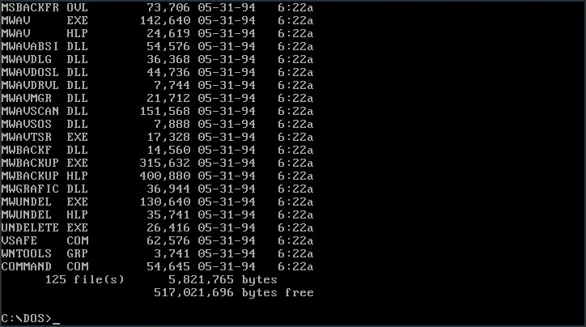

<style>
  .d-flex {
    display: flex;
    align-items: center;
  }

  .flex-column {
    flex-direction: column;
  }

  .flex-1 {
    flex: 1;
  }

  .justify-around {
    justify-content: space-around;
  }

  .space-between {
    justify-content: space-between;
  }

  #cover div {
    flex: 1;
  }

  #cover div:last-child {
    border-left: 1px solid #ccc;
  }

  #cover ul {
    list-style-type: none;
  }

  #cover ul li img {
    margin-right: 0.5rem;
  }

  section {
    justify-content: flex-start;
  }

  .title-section {
    flex: 1;
    display: flex;
    align-items: center;
    justify-content: center;
    flex-direction: column;
  }

  section[id="1"], section[id="2"], section[id="3"] {
    justify-content: center;
  }

  ul {
    margin-bottom: 0;
  }

  table {
    display: table;
  }

  th {
    background-color: #333;
    color: #fff;
    text-align: left;
  }

  img {
    object-fit: contain;
    vertical-align: middle;
  }

  .hljs-keyword {
    color: #6f42c1 !important;
  }

  .hljs-type {
    color: #660
  }

  .red {
    color: #f00;
  }

  .blue {
    color: #44f;
  }

  .transparent {
    opacity: 0;
  }

  .semi-transparent {
    opacity: 0.3;
  }

  .muted {
    color: #0005;
  }

  .bold {
    font-weight: bold;
  }

  .chain {
    font-family: SFMono-Regular,Consolas,Liberation Mono,Menlo,monospace;
    align-self: center;
    display: flex;
    align-items: center;
    justify-content: center;
    margin-bottom: 80px;
  }

  .block {
    background-color: #ccc;
    font-weight: bold;
    padding: 2px 10px;
  }

  .service-block {
    background-color: #aaf;
  }

  .use-case-block {
    background-color: #afa;
  }

  .application-block {
    color: #fff;
    background-color: #9e111b;
    padding: 10px 20px;
  }

  .arrow {
    border: solid black;
    border-width: 0 6px 6px 0;
    display: inline-block;
    padding: 9px;
  }

  .arrow.right {
    margin: 0 20px;
    transform: rotate(-45deg);
    -webkit-transform: rotate(-45deg);
  }

  .arrow.down {
    transform: rotate(45deg);
    -webkit-transform: rotate(45deg);
  }

  .note {
    color: #f00;
    font-weight: bold;
    position: absolute;
    bottom: 100px;
    right: 100px;
  }

  ol {
    counter-reset: li;
    list-style: none;
  }

  ol li::before {
    color: red;
    content: counter(li) ".";
    display: inline-block;
    font-weight: bold;
    margin-left: -1.3rem;
    width: 1.3rem;
  }

  ol li {
    counter-increment: li;
  }

  .life-grid {
    background-color: black;
    margin: 0 auto;
    display: grid;
    padding: 3px;
    grid-gap: 3px;
    grid-auto-flow: row;
  }

  .life-grid > div {
    background-color: black;
    display: flex;
    justify-content: center;
    align-items: center;
  }

  .alive, .dying, .surviving {
    background-color: white !important;
  }

  .being-born::before {
    content: "👶🏻";
  }

  .dying::before {
    content: "☠️";
  }

  .surviving::before {
    content: "🖖";
  }

  .one-by-one {
    grid-template-columns: repeat(1, 70px);
    grid-template-rows: repeat(1, 70px);
  }

  .five-by-five {
    grid-template-columns: repeat(5, 70px);
    grid-template-rows: repeat(5, 70px);
  }

  .eight-by-eight {
    grid-template-columns: repeat(8, 55px);
    grid-template-rows: repeat(8, 55px);
  }

  code {
    word-break: break-all !important;
    white-space : pre-wrap !important;
  }
</style>

<div class="title-section">
  <h1>La Programación como un Arte</h1>
</div>

---

<div id="cover" class="d-flex">
  <div>
    <h2>¡Hola! Yo soy Yusent</h2>
  </div>

  <div>
    <ul>
      <li class="d-flex">
        
        @yusent
      </li>
      <li class="d-flex">
        
        @yusent
      </li>
      <li class="d-flex">
        
        @yus3nt
      </li>
      <li class="d-flex">
        
        @yus3nt
      </li>
    </ul>
  </div>
</div>

---

<div id="cover" class="d-flex">
  <div>
    <h2>¡Hola! Yo soy <span class="red">Yus</span><s>ent</s></h2>
  </div>
  <div>
    <ul>
      <li class="d-flex">
        
        @yusent
      </li>
      <li class="d-flex">
        
        @yusent
      </li>
      <li class="d-flex">
        
        @yus3nt
      </li>
      <li class="d-flex">
        
        @yus3nt
      </li>
    </ul>
  </div>
</div>

---

<div style="height: 100%">
  <video
    height="100%"
    width="100%"
    onclick="this.paused ? this.play() : this.pause(); this.blur()"
  >
    <source src="media/alley-cat.webm" type="video/webm">
  </video>
</div>

---

<div style="height: 100%">
  <video
    height="100%"
    width="100%"
    onclick="this.paused ? this.play() : this.pause(); this.blur()"
  >
    <source src="media/dir-output.mkv" type="video/mp4">
  </video>
</div>

---



<div style="position: absolute; color: red; font-size: 8rem; right: 9rem; top: 2rem; text-align: center">
  ↑ ↑ ↑<br>
  ???
</div>

---


---

<div style="height: 100%">
  <video
    height="100%"
    width="100%"
    onclick="this.paused ? this.play() : this.pause(); this.blur()"
  >
    <source src="media/help.mkv" type="video/mp4">
  </video>
</div>

---

<div style="height: 100%">
  <video
    height="100%"
    width="100%"
    onclick="this.paused ? this.play() : this.pause(); this.blur()"
  >
    <source src="media/dir-pipe-more.mkv" type="video/mp4">
  </video>
</div>

---


---

<h1 style="text-align: center">Arte</h1>


---

<div class="d-flex" style="height: 100%">
  
  <h1 style="text-align: center; margin-left: 6rem">“Todo arte es completamente <u>inútil</u>”</h1>
</div>

---

<div class="title-section">
  <h1>Conway's Game of Life</h1>
</div>

---

# Conway's Game of Life

<div class="d-flex">
  <div class="d-flex flex-column">
    
    <small class="bold">John Horton Conway (1937 – 2020)</small>
  </div>

  <div class="flex-1">
    <ul>
      <li>Creado en <b>1970</b></li>
      <li class="transparent"><b>0 jugadores</b> (Su evolución está determinada por su estado inicial)</li>
      <li class="transparent">Consiste en una cuadrícula bidimensional de tamaño infinito cuyas celdas pueden estar en dos posibles estados:</li>
    </ul>
    <br>
    <div class="d-flex justify-around transparent">
      <div class="d-flex flex-column">
        <div class="life-grid one-by-one">
          <div></div>
        </div>
        <small class="bold">Viva</small>
      </div>
      <div class="d-flex flex-column">
        <div class="life-grid one-by-one">
          <div></div>
        </div>
        <small class="bold">Muerta</small>
      </div>
    </div>
  </div>
</div>

---

# Conway's Game of Life

<div class="d-flex">
  <div class="d-flex flex-column">
    
    <small class="bold">John Horton Conway (1937 – 2020)</small>
  </div>

  <div class="flex-1">
    <ul>
      <li>Creado en <b>1970</b></li>
      <li><b>0 jugadores</b> (Su evolución está determinada por su estado inicial)</li>
      <li class="transparent">Consiste en una cuadrícula bidimensional de tamaño infinito cuyas celdas pueden estar en dos posibles estados:</li>
    </ul>
    <br>
    <div class="d-flex justify-around transparent">
      <div class="d-flex flex-column">
        <div class="life-grid one-by-one">
          <div class="alive"></div>
        </div>
        <small class="bold">Viva</small>
      </div>
      <div class="d-flex flex-column">
        <div class="life-grid one-by-one">
          <div></div>
        </div>
        <small class="bold">Muerta</small>
      </div>
    </div>
  </div>
</div>

---

# Conway's Game of Life

<div class="d-flex">
  <div class="d-flex flex-column">
    
    <small class="bold">John Horton Conway (1937 – 2020)</small>
  </div>

  <div class="flex-1">
    <ul>
      <li>Creado en <b>1970</b></li>
      <li><b>0 jugadores</b> (Su evolución está determinada por su estado inicial)</li>
      <li>Consiste en una cuadrícula bidimensional de tamaño infinito cuyas celdas pueden estar en dos posibles estados:</li>
    </ul>
    <br>
    <div class="d-flex justify-around">
      <div class="d-flex flex-column">
        <div class="life-grid one-by-one">
          <div class="alive"></div>
        </div>
        <small class="bold">Viva</small>
      </div>
      <div class="d-flex flex-column">
        <div class="life-grid one-by-one">
          <div></div>
        </div>
        <small class="bold">Muerta</small>
      </div>
    </div>
  </div>
</div>

---

# Conway's Game of Life

<h6 style="margin-bottom: 70px">
  <span class="blue">Regla 1:</span>
  Una celda viva con
  <span class="red">menos de 2 celdas vivas alrededor</span>
  muere por <i>soledad</i>.
</h6>

---

# Conway's Game of Life

<h6 style="margin-bottom: 70px">
  <span class="blue">Regla 1:</span>
  Una celda viva con
  <span class="red">menos de 2 celdas vivas alrededor</span>
  muere por <i>soledad</i>.
</h6>

<div class="life-grid five-by-five">
  <div></div>
  <div></div>
  <div></div>
  <div></div>
  <div></div>
  <div></div>
  <div class="alive"></div>
  <div></div>
  <div></div>
  <div></div>
  <div></div>
  <div></div>
  <div class="alive"></div>
  <div></div>
  <div></div>
  <div></div>
  <div></div>
  <div></div>
  <div class="alive"></div>
  <div></div>
  <div></div>
  <div></div>
  <div></div>
  <div></div>
  <div></div>
</div>

---

# Conway's Game of Life

<h6 style="margin-bottom: 70px">
  <span class="blue">Regla 1:</span>
  Una celda viva con
  <span class="red">menos de 2 celdas vivas alrededor</span>
  muere por <i>soledad</i>.
</h6>

<div class="life-grid five-by-five">
  <div></div>
  <div></div>
  <div></div>
  <div></div>
  <div></div>
  <div></div>
  <div class="dying"></div>
  <div></div>
  <div></div>
  <div></div>
  <div></div>
  <div></div>
  <div class="alive"></div>
  <div></div>
  <div></div>
  <div></div>
  <div></div>
  <div></div>
  <div class="dying"></div>
  <div></div>
  <div></div>
  <div></div>
  <div></div>
  <div></div>
  <div></div>
</div>

---

# Conway's Game of Life

<h6 style="margin-bottom: 70px">
  <span class="blue">Regla 1:</span>
  Una celda viva con
  <span class="red">menos de 2 celdas vivas alrededor</span>
  muere por <i>soledad</i>.
</h6>

<div class="life-grid five-by-five">
  <div></div>
  <div></div>
  <div></div>
  <div></div>
  <div></div>
  <div></div>
  <div></div>
  <div></div>
  <div></div>
  <div></div>
  <div></div>
  <div></div>
  <div class="alive"></div>
  <div></div>
  <div></div>
  <div></div>
  <div></div>
  <div></div>
  <div></div>
  <div></div>
  <div></div>
  <div></div>
  <div></div>
  <div></div>
  <div></div>
</div>

---

# Conway's Game of Life

<h6 style="margin-bottom: 70px">
  <span class="blue">Regla 2:</span>
  Una celda viva con
  <span class="red">2 ó 3 celdas vivas alrededor</span>
  sobrevive a la siguiente generación.
</h6>

---

# Conway's Game of Life

<h6 style="margin-bottom: 70px">
  <span class="blue">Regla 2:</span>
  Una celda viva con
  <span class="red">2 ó 3 celdas vivas alrededor</span>
  sobrevive a la siguiente generación.
</h6>

<div class="life-grid five-by-five">
  <div></div>
  <div></div>
  <div></div>
  <div></div>
  <div></div>
  <div></div>
  <div class="alive"></div>
  <div class="alive"></div>
  <div></div>
  <div></div>
  <div></div>
  <div class="alive"></div>
  <div></div>
  <div></div>
  <div></div>
  <div></div>
  <div></div>
  <div></div>
  <div></div>
  <div></div>
  <div></div>
  <div></div>
  <div></div>
  <div></div>
  <div></div>
</div>

---

# Conway's Game of Life

<h6 style="margin-bottom: 70px">
  <span class="blue">Regla 2:</span>
  Una celda viva con
  <span class="red">2 ó 3 celdas vivas alrededor</span>
  sobrevive a la siguiente generación.
</h6>

<div class="life-grid five-by-five">
  <div></div>
  <div></div>
  <div></div>
  <div></div>
  <div></div>
  <div></div>
  <div class="surviving"></div>
  <div class="surviving"></div>
  <div></div>
  <div></div>
  <div></div>
  <div class="surviving"></div>
  <div></div>
  <div></div>
  <div></div>
  <div></div>
  <div></div>
  <div></div>
  <div></div>
  <div></div>
  <div></div>
  <div></div>
  <div></div>
  <div></div>
  <div></div>
</div>

---

# Conway's Game of Life

<h6 style="margin-bottom: 70px">
  <span class="blue">Regla 3:</span>
  Una celda viva con
  <span class="red">más de 3 celdas vivas alrededor</span>
  muere por <i>sobrepoblación</i>.
</h6>

---

# Conway's Game of Life

<h6 style="margin-bottom: 70px">
  <span class="blue">Regla 3:</span>
  Una celda viva con
  <span class="red">más de 3 celdas vivas alrededor</span>
  muere por <i>sobrepoblación</i>.
</h6>

<div class="life-grid five-by-five">
  <div></div>
  <div></div>
  <div></div>
  <div></div>
  <div></div>
  <div></div>
  <div class="alive"></div>
  <div class="alive"></div>
  <div class="alive"></div>
  <div></div>
  <div></div>
  <div class="alive"></div>
  <div class="alive"></div>
  <div></div>
  <div></div>
  <div></div>
  <div></div>
  <div></div>
  <div></div>
  <div></div>
  <div></div>
  <div></div>
  <div></div>
  <div></div>
  <div></div>
</div>

---

# Conway's Game of Life

<h6 style="margin-bottom: 70px">
  <span class="blue">Regla 3:</span>
  Una celda viva con
  <span class="red">más de 3 celdas vivas alrededor</span>
  muere por <i>sobrepoblación</i>.
</h6>

<div class="life-grid five-by-five">
  <div></div>
  <div></div>
  <div></div>
  <div></div>
  <div></div>
  <div></div>
  <div class="alive"></div>
  <div class="alive"></div>
  <div class="alive"></div>
  <div></div>
  <div></div>
  <div class="alive"></div>
  <div class="dying"></div>
  <div></div>
  <div></div>
  <div></div>
  <div></div>
  <div></div>
  <div></div>
  <div></div>
  <div></div>
  <div></div>
  <div></div>
  <div></div>
  <div></div>
</div>

---

# Conway's Game of Life

<h6 style="margin-bottom: 70px">
  <span class="blue">Regla 3:</span>
  Una celda viva con
  <span class="red">más de 3 celdas vivas alrededor</span>
  muere por <i>sobrepoblación</i>.
</h6>

<div class="life-grid five-by-five">
  <div></div>
  <div></div>
  <div></div>
  <div></div>
  <div></div>
  <div></div>
  <div class="alive"></div>
  <div class="alive"></div>
  <div class="alive"></div>
  <div></div>
  <div></div>
  <div class="alive"></div>
  <div></div>
  <div></div>
  <div></div>
  <div></div>
  <div></div>
  <div></div>
  <div></div>
  <div></div>
  <div></div>
  <div></div>
  <div></div>
  <div></div>
  <div></div>
</div>

---

# Conway's Game of Life

<h6 style="margin-bottom: 70px">
  <span class="blue">Regla 4:</span>
  Una celda muerta con
  <span class="red">exactamente 3 celdas vivas alrededor</span>
  nace por <i>reproducción</i>.
</h6>

---

# Conway's Game of Life

<h6 style="margin-bottom: 70px">
  <span class="blue">Regla 4:</span>
  Una celda muerta con
  <span class="red">exactamente 3 celdas vivas alrededor</span>
  nace por <i>reproducción</i>.
</h6>

<div class="life-grid five-by-five">
  <div></div>
  <div></div>
  <div></div>
  <div></div>
  <div></div>
  <div></div>
  <div class="alive"></div>
  <div class="alive"></div>
  <div></div>
  <div></div>
  <div></div>
  <div class="alive"></div>
  <div></div>
  <div></div>
  <div></div>
  <div></div>
  <div></div>
  <div></div>
  <div></div>
  <div></div>
  <div></div>
  <div></div>
  <div></div>
  <div></div>
  <div></div>
</div>

---

# Conway's Game of Life

<h6 style="margin-bottom: 70px">
  <span class="blue">Regla 4:</span>
  Una celda muerta con
  <span class="red">exactamente 3 celdas vivas alrededor</span>
  nace por <i>reproducción</i>.
</h6>

<div class="life-grid five-by-five">
  <div></div>
  <div></div>
  <div></div>
  <div></div>
  <div></div>
  <div></div>
  <div class="alive"></div>
  <div class="alive"></div>
  <div></div>
  <div></div>
  <div></div>
  <div class="alive"></div>
  <div class="being-born"></div>
  <div></div>
  <div></div>
  <div></div>
  <div></div>
  <div></div>
  <div></div>
  <div></div>
  <div></div>
  <div></div>
  <div></div>
  <div></div>
  <div></div>
</div>

---

# Conway's Game of Life

<h6 style="margin-bottom: 70px">
  <span class="blue">Regla 4:</span>
  Una celda muerta con
  <span class="red">exactamente 3 celdas vivas alrededor</span>
  nace por <i>reproducción</i>.
</h6>

<div class="life-grid five-by-five">
  <div></div>
  <div></div>
  <div></div>
  <div></div>
  <div></div>
  <div></div>
  <div class="alive"></div>
  <div class="alive"></div>
  <div></div>
  <div></div>
  <div></div>
  <div class="alive"></div>
  <div class="alive"></div>
  <div></div>
  <div></div>
  <div></div>
  <div></div>
  <div></div>
  <div></div>
  <div></div>
  <div></div>
  <div></div>
  <div></div>
  <div></div>
  <div></div>
</div>

---

# Conway's Game of Life - Ejemplo

<div class="d-flex">
  <div>
    <h6 style="text-align: center; margin-top: 0">Generación 0</h6>
    <div class="life-grid eight-by-eight">
      <div class="alive"></div>
      <div></div>
      <div class="alive"></div>
      <div></div>
      <div class="alive"></div>
      <div></div>
      <div class="alive"></div>
      <div></div>
      <div></div>
      <div class="alive"></div>
      <div></div>
      <div class="alive"></div>
      <div></div>
      <div class="alive"></div>
      <div></div>
      <div class="alive"></div>
      <div class="alive"></div>
      <div></div>
      <div class="alive"></div>
      <div></div>
      <div class="alive"></div>
      <div></div>
      <div class="alive"></div>
      <div></div>
      <div></div>
      <div class="alive"></div>
      <div></div>
      <div class="alive"></div>
      <div></div>
      <div class="alive"></div>
      <div></div>
      <div class="alive"></div>
      <div class="alive"></div>
      <div></div>
      <div class="alive"></div>
      <div></div>
      <div class="alive"></div>
      <div></div>
      <div class="alive"></div>
      <div></div>
      <div></div>
      <div class="alive"></div>
      <div></div>
      <div class="alive"></div>
      <div></div>
      <div class="alive"></div>
      <div></div>
      <div class="alive"></div>
      <div class="alive"></div>
      <div></div>
      <div class="alive"></div>
      <div></div>
      <div class="alive"></div>
      <div></div>
      <div class="alive"></div>
      <div></div>
      <div></div>
      <div class="alive"></div>
      <div></div>
      <div class="alive"></div>
      <div></div>
      <div class="alive"></div>
      <div></div>
      <div class="alive"></div>
    </div>
  </div>
</div>

---

# Conway's Game of Life - Ejemplo

<div class="d-flex">
  <div>
    <h6 style="text-align: center; margin-top: 0">Generación 0</h6>
    <div class="life-grid eight-by-eight">
      <div class="alive"></div>
      <div></div>
      <div class="alive"></div>
      <div></div>
      <div class="alive"></div>
      <div></div>
      <div class="alive"></div>
      <div></div>
      <div></div>
      <div class="alive"></div>
      <div></div>
      <div class="alive"></div>
      <div></div>
      <div class="alive"></div>
      <div></div>
      <div class="alive"></div>
      <div class="alive"></div>
      <div></div>
      <div class="alive"></div>
      <div></div>
      <div class="alive"></div>
      <div></div>
      <div class="alive"></div>
      <div></div>
      <div></div>
      <div class="alive"></div>
      <div></div>
      <div class="alive"></div>
      <div></div>
      <div class="alive"></div>
      <div></div>
      <div class="alive"></div>
      <div class="alive"></div>
      <div></div>
      <div class="alive"></div>
      <div></div>
      <div class="alive"></div>
      <div></div>
      <div class="alive"></div>
      <div></div>
      <div></div>
      <div class="alive"></div>
      <div></div>
      <div class="alive"></div>
      <div></div>
      <div class="alive"></div>
      <div></div>
      <div class="alive"></div>
      <div class="alive"></div>
      <div></div>
      <div class="alive"></div>
      <div></div>
      <div class="alive"></div>
      <div></div>
      <div class="alive"></div>
      <div></div>
      <div></div>
      <div class="alive"></div>
      <div></div>
      <div class="alive"></div>
      <div></div>
      <div class="alive"></div>
      <div></div>
      <div class="alive"></div>
    </div>
  </div>
  <div style="padding-left: 1rem; font-size: 1.5rem">
    <ol>
      <li>Una celda viva con menos de 2 celdas vivas alrededor muere por <i>soledad</i>.</li>
      <li class="transparent">Una celda viva con 2 ó 3 celdas vivas alrededor sobrevive a la siguiente generación.</li>
      <li class="transparent">Una celda viva con más de 3 celdas vivas alrededor muere por <i>sobrepoblación</i>.</li>
      <li class="transparent">Una celda muerta con exactamente 3 celdas vivas alrededor nace por <i>reproducción</i>.</li>
    </ol>
  </div>
</div>

---

# Conway's Game of Life - Ejemplo

<div class="d-flex">
  <div>
    <h6 style="text-align: center; margin-top: 0">Generación 0</h6>
    <div class="life-grid eight-by-eight">
      <div class="dying"></div>
      <div></div>
      <div class="alive"></div>
      <div></div>
      <div class="alive"></div>
      <div></div>
      <div class="alive"></div>
      <div></div>
      <div></div>
      <div class="alive"></div>
      <div></div>
      <div class="alive"></div>
      <div></div>
      <div class="alive"></div>
      <div></div>
      <div class="alive"></div>
      <div class="alive"></div>
      <div></div>
      <div class="alive"></div>
      <div></div>
      <div class="alive"></div>
      <div></div>
      <div class="alive"></div>
      <div></div>
      <div></div>
      <div class="alive"></div>
      <div></div>
      <div class="alive"></div>
      <div></div>
      <div class="alive"></div>
      <div></div>
      <div class="alive"></div>
      <div class="alive"></div>
      <div></div>
      <div class="alive"></div>
      <div></div>
      <div class="alive"></div>
      <div></div>
      <div class="alive"></div>
      <div></div>
      <div></div>
      <div class="alive"></div>
      <div></div>
      <div class="alive"></div>
      <div></div>
      <div class="alive"></div>
      <div></div>
      <div class="alive"></div>
      <div class="alive"></div>
      <div></div>
      <div class="alive"></div>
      <div></div>
      <div class="alive"></div>
      <div></div>
      <div class="alive"></div>
      <div></div>
      <div></div>
      <div class="alive"></div>
      <div></div>
      <div class="alive"></div>
      <div></div>
      <div class="alive"></div>
      <div></div>
      <div class="dying"></div>
    </div>
  </div>
  <div style="padding-left: 1rem; font-size: 1.5rem">
    <ol>
      <li>Una celda viva con menos de 2 celdas vivas alrededor muere por <i>soledad</i>.</li>
      <li class="transparent">Una celda viva con 2 ó 3 celdas vivas alrededor sobrevive a la siguiente generación.</li>
      <li class="transparent">Una celda viva con más de 3 celdas vivas alrededor muere por <i>sobrepoblación</i>.</li>
      <li class="transparent">Una celda muerta con exactamente 3 celdas vivas alrededor nace por <i>reproducción</i>.</li>
    </ol>
  </div>
</div>

---

# Conway's Game of Life - Ejemplo

<div class="d-flex">
  <div>
    <h6 style="text-align: center; margin-top: 0">Generación 0</h6>
    <div class="life-grid eight-by-eight">
      <div class="dying"></div>
      <div></div>
      <div class="alive"></div>
      <div></div>
      <div class="alive"></div>
      <div></div>
      <div class="alive"></div>
      <div></div>
      <div></div>
      <div class="alive"></div>
      <div></div>
      <div class="alive"></div>
      <div></div>
      <div class="alive"></div>
      <div></div>
      <div class="alive"></div>
      <div class="alive"></div>
      <div></div>
      <div class="alive"></div>
      <div></div>
      <div class="alive"></div>
      <div></div>
      <div class="alive"></div>
      <div></div>
      <div></div>
      <div class="alive"></div>
      <div></div>
      <div class="alive"></div>
      <div></div>
      <div class="alive"></div>
      <div></div>
      <div class="alive"></div>
      <div class="alive"></div>
      <div></div>
      <div class="alive"></div>
      <div></div>
      <div class="alive"></div>
      <div></div>
      <div class="alive"></div>
      <div></div>
      <div></div>
      <div class="alive"></div>
      <div></div>
      <div class="alive"></div>
      <div></div>
      <div class="alive"></div>
      <div></div>
      <div class="alive"></div>
      <div class="alive"></div>
      <div></div>
      <div class="alive"></div>
      <div></div>
      <div class="alive"></div>
      <div></div>
      <div class="alive"></div>
      <div></div>
      <div></div>
      <div class="alive"></div>
      <div></div>
      <div class="alive"></div>
      <div></div>
      <div class="alive"></div>
      <div></div>
      <div class="dying"></div>
    </div>
  </div>
  <div style="padding-left: 1rem; font-size: 1.5rem">
    <ol>
      <li class="semi-transparent">Una celda viva con menos de 2 celdas vivas alrededor muere por <i>soledad</i>.</li>
      <li>Una celda viva con 2 ó 3 celdas vivas alrededor sobrevive a la siguiente generación.</li>
      <li class="transparent">Una celda viva con más de 3 celdas vivas alrededor muere por <i>sobrepoblación</i>.</li>
      <li class="transparent">Una celda muerta con exactamente 3 celdas vivas alrededor nace por <i>reproducción</i>.</li>
    </ol>
  </div>
</div>

---

# Conway's Game of Life - Ejemplo

<div class="d-flex">
  <div>
    <h6 style="text-align: center; margin-top: 0">Generación 0</h6>
    <div class="life-grid eight-by-eight">
      <div class="dying"></div>
      <div></div>
      <div class="surviving"></div>
      <div></div>
      <div class="surviving"></div>
      <div></div>
      <div class="surviving"></div>
      <div></div>
      <div></div>
      <div class="alive"></div>
      <div></div>
      <div class="alive"></div>
      <div></div>
      <div class="alive"></div>
      <div></div>
      <div class="surviving"></div>
      <div class="surviving"></div>
      <div></div>
      <div class="alive"></div>
      <div></div>
      <div class="alive"></div>
      <div></div>
      <div class="alive"></div>
      <div></div>
      <div></div>
      <div class="alive"></div>
      <div></div>
      <div class="alive"></div>
      <div></div>
      <div class="alive"></div>
      <div></div>
      <div class="surviving"></div>
      <div class="surviving"></div>
      <div></div>
      <div class="alive"></div>
      <div></div>
      <div class="alive"></div>
      <div></div>
      <div class="alive"></div>
      <div></div>
      <div></div>
      <div class="alive"></div>
      <div></div>
      <div class="alive"></div>
      <div></div>
      <div class="alive"></div>
      <div></div>
      <div class="surviving"></div>
      <div class="surviving"></div>
      <div></div>
      <div class="alive"></div>
      <div></div>
      <div class="alive"></div>
      <div></div>
      <div class="alive"></div>
      <div></div>
      <div></div>
      <div class="surviving"></div>
      <div></div>
      <div class="surviving"></div>
      <div></div>
      <div class="surviving"></div>
      <div></div>
      <div class="dying"></div>
    </div>
  </div>
  <div style="padding-left: 1rem; font-size: 1.5rem">
    <ol>
      <li class="semi-transparent">Una celda viva con menos de 2 celdas vivas alrededor muere por <i>soledad</i>.</li>
      <li>Una celda viva con 2 ó 3 celdas vivas alrededor sobrevive a la siguiente generación.</li>
      <li class="transparent">Una celda viva con más de 3 celdas vivas alrededor muere por <i>sobrepoblación</i>.</li>
      <li class="transparent">Una celda muerta con exactamente 3 celdas vivas alrededor nace por <i>reproducción</i>.</li>
    </ol>
  </div>
</div>

---

# Conway's Game of Life - Ejemplo

<div class="d-flex">
  <div>
    <h6 style="text-align: center; margin-top: 0">Generación 0</h6>
    <div class="life-grid eight-by-eight">
      <div class="dying"></div>
      <div></div>
      <div class="surviving"></div>
      <div></div>
      <div class="surviving"></div>
      <div></div>
      <div class="surviving"></div>
      <div></div>
      <div></div>
      <div class="alive"></div>
      <div></div>
      <div class="alive"></div>
      <div></div>
      <div class="alive"></div>
      <div></div>
      <div class="surviving"></div>
      <div class="surviving"></div>
      <div></div>
      <div class="alive"></div>
      <div></div>
      <div class="alive"></div>
      <div></div>
      <div class="alive"></div>
      <div></div>
      <div></div>
      <div class="alive"></div>
      <div></div>
      <div class="alive"></div>
      <div></div>
      <div class="alive"></div>
      <div></div>
      <div class="surviving"></div>
      <div class="surviving"></div>
      <div></div>
      <div class="alive"></div>
      <div></div>
      <div class="alive"></div>
      <div></div>
      <div class="alive"></div>
      <div></div>
      <div></div>
      <div class="alive"></div>
      <div></div>
      <div class="alive"></div>
      <div></div>
      <div class="alive"></div>
      <div></div>
      <div class="surviving"></div>
      <div class="surviving"></div>
      <div></div>
      <div class="alive"></div>
      <div></div>
      <div class="alive"></div>
      <div></div>
      <div class="alive"></div>
      <div></div>
      <div></div>
      <div class="surviving"></div>
      <div></div>
      <div class="surviving"></div>
      <div></div>
      <div class="surviving"></div>
      <div></div>
      <div class="dying"></div>
    </div>
  </div>
  <div style="padding-left: 1rem; font-size: 1.5rem">
    <ol>
      <li class="semi-transparent">Una celda viva con menos de 2 celdas vivas alrededor muere por <i>soledad</i>.</li>
      <li class="semi-transparent">Una celda viva con 2 ó 3 celdas vivas alrededor sobrevive a la siguiente generación.</li>
      <li>Una celda viva con más de 3 celdas vivas alrededor muere por <i>sobrepoblación</i>.</li>
      <li class="transparent">Una celda muerta con exactamente 3 celdas vivas alrededor nace por <i>reproducción</i>.</li>
    </ol>
  </div>
</div>

---

# Conway's Game of Life - Ejemplo

<div class="d-flex">
  <div>
    <h6 style="text-align: center; margin-top: 0">Generación 0</h6>
    <div class="life-grid eight-by-eight">
      <div class="dying"></div>
      <div></div>
      <div class="surviving"></div>
      <div></div>
      <div class="surviving"></div>
      <div></div>
      <div class="surviving"></div>
      <div></div>
      <div></div>
      <div class="dying"></div>
      <div></div>
      <div class="dying"></div>
      <div></div>
      <div class="dying"></div>
      <div></div>
      <div class="surviving"></div>
      <div class="surviving"></div>
      <div></div>
      <div class="dying"></div>
      <div></div>
      <div class="dying"></div>
      <div></div>
      <div class="dying"></div>
      <div></div>
      <div></div>
      <div class="dying"></div>
      <div></div>
      <div class="dying"></div>
      <div></div>
      <div class="dying"></div>
      <div></div>
      <div class="surviving"></div>
      <div class="surviving"></div>
      <div></div>
      <div class="dying"></div>
      <div></div>
      <div class="dying"></div>
      <div></div>
      <div class="dying"></div>
      <div></div>
      <div></div>
      <div class="dying"></div>
      <div></div>
      <div class="dying"></div>
      <div></div>
      <div class="dying"></div>
      <div></div>
      <div class="surviving"></div>
      <div class="surviving"></div>
      <div></div>
      <div class="dying"></div>
      <div></div>
      <div class="dying"></div>
      <div></div>
      <div class="dying"></div>
      <div></div>
      <div></div>
      <div class="surviving"></div>
      <div></div>
      <div class="surviving"></div>
      <div></div>
      <div class="surviving"></div>
      <div></div>
      <div class="dying"></div>
    </div>
  </div>
  <div style="padding-left: 1rem; font-size: 1.5rem">
    <ol>
      <li class="semi-transparent">Una celda viva con menos de 2 celdas vivas alrededor muere por <i>soledad</i>.</li>
      <li class="semi-transparent">Una celda viva con 2 ó 3 celdas vivas alrededor sobrevive a la siguiente generación.</li>
      <li>Una celda viva con más de 3 celdas vivas alrededor muere por <i>sobrepoblación</i>.</li>
      <li class="transparent">Una celda muerta con exactamente 3 celdas vivas alrededor nace por <i>reproducción</i>.</li>
    </ol>
  </div>
</div>

---

# Conway's Game of Life - Ejemplo

<div class="d-flex">
  <div>
    <h6 style="text-align: center; margin-top: 0">Generación 0</h6>
    <div class="life-grid eight-by-eight">
      <div class="dying"></div>
      <div></div>
      <div class="surviving"></div>
      <div></div>
      <div class="surviving"></div>
      <div></div>
      <div class="surviving"></div>
      <div></div>
      <div></div>
      <div class="dying"></div>
      <div></div>
      <div class="dying"></div>
      <div></div>
      <div class="dying"></div>
      <div></div>
      <div class="surviving"></div>
      <div class="surviving"></div>
      <div></div>
      <div class="dying"></div>
      <div></div>
      <div class="dying"></div>
      <div></div>
      <div class="dying"></div>
      <div></div>
      <div></div>
      <div class="dying"></div>
      <div></div>
      <div class="dying"></div>
      <div></div>
      <div class="dying"></div>
      <div></div>
      <div class="surviving"></div>
      <div class="surviving"></div>
      <div></div>
      <div class="dying"></div>
      <div></div>
      <div class="dying"></div>
      <div></div>
      <div class="dying"></div>
      <div></div>
      <div></div>
      <div class="dying"></div>
      <div></div>
      <div class="dying"></div>
      <div></div>
      <div class="dying"></div>
      <div></div>
      <div class="surviving"></div>
      <div class="surviving"></div>
      <div></div>
      <div class="dying"></div>
      <div></div>
      <div class="dying"></div>
      <div></div>
      <div class="dying"></div>
      <div></div>
      <div></div>
      <div class="surviving"></div>
      <div></div>
      <div class="surviving"></div>
      <div></div>
      <div class="surviving"></div>
      <div></div>
      <div class="dying"></div>
    </div>
  </div>
  <div style="padding-left: 1rem; font-size: 1.5rem">
    <ol>
      <li class="semi-transparent">Una celda viva con menos de 2 celdas vivas alrededor muere por <i>soledad</i>.</li>
      <li class="semi-transparent">Una celda viva con 2 ó 3 celdas vivas alrededor sobrevive a la siguiente generación.</li>
      <li class="semi-transparent">Una celda viva con más de 3 celdas vivas alrededor muere por <i>sobrepoblación</i>.</li>
      <li>Una celda muerta con exactamente 3 celdas vivas alrededor nace por <i>reproducción</i>.</li>
    </ol>
  </div>
</div>

---

# Conway's Game of Life - Ejemplo

<div class="d-flex">
  <div>
    <h6 style="text-align: center; margin-top: 0">Generación 0</h6>
    <div class="life-grid eight-by-eight">
      <div class="dying"></div>
      <div class="being-born"></div>
      <div class="surviving"></div>
      <div class="being-born"></div>
      <div class="surviving"></div>
      <div class="being-born"></div>
      <div class="surviving"></div>
      <div></div>
      <div class="being-born"></div>
      <div class="dying"></div>
      <div></div>
      <div class="dying"></div>
      <div></div>
      <div class="dying"></div>
      <div></div>
      <div class="surviving"></div>
      <div class="surviving"></div>
      <div></div>
      <div class="dying"></div>
      <div></div>
      <div class="dying"></div>
      <div></div>
      <div class="dying"></div>
      <div class="being-born"></div>
      <div class="being-born"></div>
      <div class="dying"></div>
      <div></div>
      <div class="dying"></div>
      <div></div>
      <div class="dying"></div>
      <div></div>
      <div class="surviving"></div>
      <div class="surviving"></div>
      <div></div>
      <div class="dying"></div>
      <div></div>
      <div class="dying"></div>
      <div></div>
      <div class="dying"></div>
      <div class="being-born"></div>
      <div class="being-born"></div>
      <div class="dying"></div>
      <div></div>
      <div class="dying"></div>
      <div></div>
      <div class="dying"></div>
      <div></div>
      <div class="surviving"></div>
      <div class="surviving"></div>
      <div></div>
      <div class="dying"></div>
      <div></div>
      <div class="dying"></div>
      <div></div>
      <div class="dying"></div>
      <div class="being-born"></div>
      <div></div>
      <div class="surviving"></div>
      <div class="being-born"></div>
      <div class="surviving"></div>
      <div class="being-born"></div>
      <div class="surviving"></div>
      <div class="being-born"></div>
      <div class="dying"></div>
    </div>
  </div>
  <div style="padding-left: 1rem; font-size: 1.5rem">
    <ol>
      <li class="semi-transparent">Una celda viva con menos de 2 celdas vivas alrededor muere por <i>soledad</i>.</li>
      <li class="semi-transparent">Una celda viva con 2 ó 3 celdas vivas alrededor sobrevive a la siguiente generación.</li>
      <li class="semi-transparent">Una celda viva con más de 3 celdas vivas alrededor muere por <i>sobrepoblación</i>.</li>
      <li>Una celda muerta con exactamente 3 celdas vivas alrededor nace por <i>reproducción</i>.</li>
    </ol>
  </div>
</div>

---

# Conway's Game of Life - Ejemplo

<div class="d-flex">
  <div>
    <h6 style="text-align: center; margin-top: 0">Generación 0</h6>
    <div class="life-grid eight-by-eight">
      <div></div>
      <div class="being-born"></div>
      <div class="surviving"></div>
      <div class="being-born"></div>
      <div class="surviving"></div>
      <div class="being-born"></div>
      <div class="surviving"></div>
      <div></div>
      <div class="being-born"></div>
      <div></div>
      <div></div>
      <div></div>
      <div></div>
      <div></div>
      <div></div>
      <div class="surviving"></div>
      <div class="surviving"></div>
      <div></div>
      <div></div>
      <div></div>
      <div></div>
      <div></div>
      <div></div>
      <div class="being-born"></div>
      <div class="being-born"></div>
      <div></div>
      <div></div>
      <div></div>
      <div></div>
      <div></div>
      <div></div>
      <div class="surviving"></div>
      <div class="surviving"></div>
      <div></div>
      <div></div>
      <div></div>
      <div></div>
      <div></div>
      <div></div>
      <div class="being-born"></div>
      <div class="being-born"></div>
      <div></div>
      <div></div>
      <div></div>
      <div></div>
      <div></div>
      <div></div>
      <div class="surviving"></div>
      <div class="surviving"></div>
      <div></div>
      <div></div>
      <div></div>
      <div></div>
      <div></div>
      <div></div>
      <div class="being-born"></div>
      <div></div>
      <div class="surviving"></div>
      <div class="being-born"></div>
      <div class="surviving"></div>
      <div class="being-born"></div>
      <div class="surviving"></div>
      <div class="being-born"></div>
      <div></div>
    </div>
  </div>
  <div style="padding-left: 1rem; font-size: 1.5rem">
    <ol>
      <li class="semi-transparent">Una celda viva con menos de 2 celdas vivas alrededor muere por <i>soledad</i>.</li>
      <li class="semi-transparent">Una celda viva con 2 ó 3 celdas vivas alrededor sobrevive a la siguiente generación.</li>
      <li class="semi-transparent">Una celda viva con más de 3 celdas vivas alrededor muere por <i>sobrepoblación</i>.</li>
      <li class="semi-transparent">Una celda muerta con exactamente 3 celdas vivas alrededor nace por <i>reproducción</i>.</li>
    </ol>
  </div>
</div>

---

# Conway's Game of Life - Ejemplo

<div class="d-flex">
  <div>
    <h6 style="text-align: center; margin-top: 0">Generación 0</h6>
    <div class="life-grid eight-by-eight">
      <div></div>
      <div class="being-born"></div>
      <div class="alive"></div>
      <div class="being-born"></div>
      <div class="alive"></div>
      <div class="being-born"></div>
      <div class="alive"></div>
      <div></div>
      <div class="being-born"></div>
      <div></div>
      <div></div>
      <div></div>
      <div></div>
      <div></div>
      <div></div>
      <div class="alive"></div>
      <div class="alive"></div>
      <div></div>
      <div></div>
      <div></div>
      <div></div>
      <div></div>
      <div></div>
      <div class="being-born"></div>
      <div class="being-born"></div>
      <div></div>
      <div></div>
      <div></div>
      <div></div>
      <div></div>
      <div></div>
      <div class="alive"></div>
      <div class="alive"></div>
      <div></div>
      <div></div>
      <div></div>
      <div></div>
      <div></div>
      <div></div>
      <div class="being-born"></div>
      <div class="being-born"></div>
      <div></div>
      <div></div>
      <div></div>
      <div></div>
      <div></div>
      <div></div>
      <div class="alive"></div>
      <div class="alive"></div>
      <div></div>
      <div></div>
      <div></div>
      <div></div>
      <div></div>
      <div></div>
      <div class="being-born"></div>
      <div></div>
      <div class="alive"></div>
      <div class="being-born"></div>
      <div class="alive"></div>
      <div class="being-born"></div>
      <div class="alive"></div>
      <div class="being-born"></div>
      <div></div>
    </div>
  </div>
  <div style="padding-left: 1rem; font-size: 1.5rem">
    <ol>
      <li class="semi-transparent">Una celda viva con menos de 2 celdas vivas alrededor muere por <i>soledad</i>.</li>
      <li class="semi-transparent">Una celda viva con 2 ó 3 celdas vivas alrededor sobrevive a la siguiente generación.</li>
      <li class="semi-transparent">Una celda viva con más de 3 celdas vivas alrededor muere por <i>sobrepoblación</i>.</li>
      <li class="semi-transparent">Una celda muerta con exactamente 3 celdas vivas alrededor nace por <i>reproducción</i>.</li>
    </ol>
  </div>
</div>

---

# Conway's Game of Life - Ejemplo

<div class="d-flex">
  <div>
    <h6 style="text-align: center; margin-top: 0">Generación 1</h6>
    <div class="life-grid eight-by-eight">
      <div></div>
      <div class="alive"></div>
      <div class="alive"></div>
      <div class="alive"></div>
      <div class="alive"></div>
      <div class="alive"></div>
      <div class="alive"></div>
      <div></div>
      <div class="alive"></div>
      <div></div>
      <div></div>
      <div></div>
      <div></div>
      <div></div>
      <div></div>
      <div class="alive"></div>
      <div class="alive"></div>
      <div></div>
      <div></div>
      <div></div>
      <div></div>
      <div></div>
      <div></div>
      <div class="alive"></div>
      <div class="alive"></div>
      <div></div>
      <div></div>
      <div></div>
      <div></div>
      <div></div>
      <div></div>
      <div class="alive"></div>
      <div class="alive"></div>
      <div></div>
      <div></div>
      <div></div>
      <div></div>
      <div></div>
      <div></div>
      <div class="alive"></div>
      <div class="alive"></div>
      <div></div>
      <div></div>
      <div></div>
      <div></div>
      <div></div>
      <div></div>
      <div class="alive"></div>
      <div class="alive"></div>
      <div></div>
      <div></div>
      <div></div>
      <div></div>
      <div></div>
      <div></div>
      <div class="alive"></div>
      <div></div>
      <div class="alive"></div>
      <div class="alive"></div>
      <div class="alive"></div>
      <div class="alive"></div>
      <div class="alive"></div>
      <div class="alive"></div>
      <div></div>
    </div>
  </div>
  <div style="padding-left: 1rem; font-size: 1.5rem">
    <ol>
      <li class="semi-transparent">Una celda viva con menos de 2 celdas vivas alrededor muere por <i>soledad</i>.</li>
      <li class="semi-transparent">Una celda viva con 2 ó 3 celdas vivas alrededor sobrevive a la siguiente generación.</li>
      <li class="semi-transparent">Una celda viva con más de 3 celdas vivas alrededor muere por <i>sobrepoblación</i>.</li>
      <li class="semi-transparent">Una celda muerta con exactamente 3 celdas vivas alrededor nace por <i>reproducción</i>.</li>
    </ol>
  </div>
</div>

---

# Conway's Game of Life - Ejemplo

<div class="d-flex">
  <div>
    <h6 style="text-align: center; margin-top: 0">Generación 1</h6>
    <div class="life-grid eight-by-eight">
      <div></div>
      <div class="alive"></div>
      <div class="alive"></div>
      <div class="alive"></div>
      <div class="alive"></div>
      <div class="alive"></div>
      <div class="alive"></div>
      <div></div>
      <div class="alive"></div>
      <div></div>
      <div></div>
      <div></div>
      <div></div>
      <div></div>
      <div></div>
      <div class="alive"></div>
      <div class="alive"></div>
      <div></div>
      <div></div>
      <div></div>
      <div></div>
      <div></div>
      <div></div>
      <div class="alive"></div>
      <div class="alive"></div>
      <div></div>
      <div></div>
      <div></div>
      <div></div>
      <div></div>
      <div></div>
      <div class="alive"></div>
      <div class="alive"></div>
      <div></div>
      <div></div>
      <div></div>
      <div></div>
      <div></div>
      <div></div>
      <div class="alive"></div>
      <div class="alive"></div>
      <div></div>
      <div></div>
      <div></div>
      <div></div>
      <div></div>
      <div></div>
      <div class="alive"></div>
      <div class="alive"></div>
      <div></div>
      <div></div>
      <div></div>
      <div></div>
      <div></div>
      <div></div>
      <div class="alive"></div>
      <div></div>
      <div class="alive"></div>
      <div class="alive"></div>
      <div class="alive"></div>
      <div class="alive"></div>
      <div class="alive"></div>
      <div class="alive"></div>
      <div></div>
    </div>
  </div>
  <div style="padding-left: 1rem; font-size: 1.5rem">
    <ol>
      <li>Una celda viva con menos de 2 celdas vivas alrededor muere por <i>soledad</i>.</li>
      <li class="semi-transparent">Una celda viva con 2 ó 3 celdas vivas alrededor sobrevive a la siguiente generación.</li>
      <li class="semi-transparent">Una celda viva con más de 3 celdas vivas alrededor muere por <i>sobrepoblación</i>.</li>
      <li class="semi-transparent">Una celda muerta con exactamente 3 celdas vivas alrededor nace por <i>reproducción</i>.</li>
    </ol>
  </div>
</div>

---

# Conway's Game of Life - Ejemplo

<div class="d-flex">
  <div>
    <h6 style="text-align: center; margin-top: 0">Generación 1</h6>
    <div class="life-grid eight-by-eight">
      <div></div>
      <div class="surviving"></div>
      <div class="surviving"></div>
      <div class="surviving"></div>
      <div class="surviving"></div>
      <div class="surviving"></div>
      <div class="surviving"></div>
      <div></div>
      <div class="surviving"></div>
      <div></div>
      <div></div>
      <div></div>
      <div></div>
      <div></div>
      <div></div>
      <div class="surviving"></div>
      <div class="surviving"></div>
      <div></div>
      <div></div>
      <div></div>
      <div></div>
      <div></div>
      <div></div>
      <div class="surviving"></div>
      <div class="surviving"></div>
      <div></div>
      <div></div>
      <div></div>
      <div></div>
      <div></div>
      <div></div>
      <div class="surviving"></div>
      <div class="surviving"></div>
      <div></div>
      <div></div>
      <div></div>
      <div></div>
      <div></div>
      <div></div>
      <div class="surviving"></div>
      <div class="surviving"></div>
      <div></div>
      <div></div>
      <div></div>
      <div></div>
      <div></div>
      <div></div>
      <div class="surviving"></div>
      <div class="surviving"></div>
      <div></div>
      <div></div>
      <div></div>
      <div></div>
      <div></div>
      <div></div>
      <div class="surviving"></div>
      <div></div>
      <div class="surviving"></div>
      <div class="surviving"></div>
      <div class="surviving"></div>
      <div class="surviving"></div>
      <div class="surviving"></div>
      <div class="surviving"></div>
      <div></div>
    </div>
  </div>
  <div style="padding-left: 1rem; font-size: 1.5rem">
    <ol>
      <li class="semi-transparent">Una celda viva con menos de 2 celdas vivas alrededor muere por <i>soledad</i>.</li>
      <li>Una celda viva con 2 ó 3 celdas vivas alrededor sobrevive a la siguiente generación.</li>
      <li class="semi-transparent">Una celda viva con más de 3 celdas vivas alrededor muere por <i>sobrepoblación</i>.</li>
      <li class="semi-transparent">Una celda muerta con exactamente 3 celdas vivas alrededor nace por <i>reproducción</i>.</li>
    </ol>
  </div>
</div>

---

# Conway's Game of Life - Ejemplo

<div class="d-flex">
  <div>
    <h6 style="text-align: center; margin-top: 0">Generación 1</h6>
    <div class="life-grid eight-by-eight">
      <div></div>
      <div class="surviving"></div>
      <div class="surviving"></div>
      <div class="surviving"></div>
      <div class="surviving"></div>
      <div class="surviving"></div>
      <div class="surviving"></div>
      <div></div>
      <div class="surviving"></div>
      <div></div>
      <div></div>
      <div></div>
      <div></div>
      <div></div>
      <div></div>
      <div class="surviving"></div>
      <div class="surviving"></div>
      <div></div>
      <div></div>
      <div></div>
      <div></div>
      <div></div>
      <div></div>
      <div class="surviving"></div>
      <div class="surviving"></div>
      <div></div>
      <div></div>
      <div></div>
      <div></div>
      <div></div>
      <div></div>
      <div class="surviving"></div>
      <div class="surviving"></div>
      <div></div>
      <div></div>
      <div></div>
      <div></div>
      <div></div>
      <div></div>
      <div class="surviving"></div>
      <div class="surviving"></div>
      <div></div>
      <div></div>
      <div></div>
      <div></div>
      <div></div>
      <div></div>
      <div class="surviving"></div>
      <div class="surviving"></div>
      <div></div>
      <div></div>
      <div></div>
      <div></div>
      <div></div>
      <div></div>
      <div class="surviving"></div>
      <div></div>
      <div class="surviving"></div>
      <div class="surviving"></div>
      <div class="surviving"></div>
      <div class="surviving"></div>
      <div class="surviving"></div>
      <div class="surviving"></div>
      <div></div>
    </div>
  </div>
  <div style="padding-left: 1rem; font-size: 1.5rem">
    <ol>
      <li class="semi-transparent">Una celda viva con menos de 2 celdas vivas alrededor muere por <i>soledad</i>.</li>
      <li class="semi-transparent">Una celda viva con 2 ó 3 celdas vivas alrededor sobrevive a la siguiente generación.</li>
      <li>Una celda viva con más de 3 celdas vivas alrededor muere por <i>sobrepoblación</i>.</li>
      <li class="semi-transparent">Una celda muerta con exactamente 3 celdas vivas alrededor nace por <i>reproducción</i>.</li>
    </ol>
  </div>
</div>

---

# Conway's Game of Life - Ejemplo

<div class="d-flex">
  <div>
    <h6 style="text-align: center; margin-top: 0">Generación 1</h6>
    <div class="life-grid eight-by-eight">
      <div></div>
      <div class="surviving"></div>
      <div class="surviving"></div>
      <div class="surviving"></div>
      <div class="surviving"></div>
      <div class="surviving"></div>
      <div class="surviving"></div>
      <div></div>
      <div class="surviving"></div>
      <div></div>
      <div class="being-born"></div>
      <div class="being-born"></div>
      <div class="being-born"></div>
      <div class="being-born"></div>
      <div></div>
      <div class="surviving"></div>
      <div class="surviving"></div>
      <div class="being-born"></div>
      <div></div>
      <div></div>
      <div></div>
      <div></div>
      <div class="being-born"></div>
      <div class="surviving"></div>
      <div class="surviving"></div>
      <div class="being-born"></div>
      <div></div>
      <div></div>
      <div></div>
      <div></div>
      <div class="being-born"></div>
      <div class="surviving"></div>
      <div class="surviving"></div>
      <div class="being-born"></div>
      <div></div>
      <div></div>
      <div></div>
      <div></div>
      <div class="being-born"></div>
      <div class="surviving"></div>
      <div class="surviving"></div>
      <div class="being-born"></div>
      <div></div>
      <div></div>
      <div></div>
      <div></div>
      <div class="being-born"></div>
      <div class="surviving"></div>
      <div class="surviving"></div>
      <div></div>
      <div class="being-born"></div>
      <div class="being-born"></div>
      <div class="being-born"></div>
      <div class="being-born"></div>
      <div></div>
      <div class="surviving"></div>
      <div></div>
      <div class="surviving"></div>
      <div class="surviving"></div>
      <div class="surviving"></div>
      <div class="surviving"></div>
      <div class="surviving"></div>
      <div class="surviving"></div>
      <div></div>
    </div>
  </div>
  <div style="padding-left: 1rem; font-size: 1.5rem">
    <ol>
      <li class="semi-transparent">Una celda viva con menos de 2 celdas vivas alrededor muere por <i>soledad</i>.</li>
      <li class="semi-transparent">Una celda viva con 2 ó 3 celdas vivas alrededor sobrevive a la siguiente generación.</li>
      <li class="semi-transparent">Una celda viva con más de 3 celdas vivas alrededor muere por <i>sobrepoblación</i>.</li>
      <li>Una celda muerta con exactamente 3 celdas vivas alrededor nace por <i>reproducción</i>.</li>
    </ol>
  </div>
</div>

---

# Conway's Game of Life - Ejemplo

<div class="d-flex">
  <div>
    <h6 style="text-align: center; margin-top: 0">Generación 2</h6>
    <div class="life-grid eight-by-eight">
      <div></div>
      <div class="alive"></div>
      <div class="alive"></div>
      <div class="alive"></div>
      <div class="alive"></div>
      <div class="alive"></div>
      <div class="alive"></div>
      <div></div>
      <div class="alive"></div>
      <div></div>
      <div class="alive"></div>
      <div class="alive"></div>
      <div class="alive"></div>
      <div class="alive"></div>
      <div></div>
      <div class="alive"></div>
      <div class="alive"></div>
      <div class="alive"></div>
      <div></div>
      <div></div>
      <div></div>
      <div></div>
      <div class="alive"></div>
      <div class="alive"></div>
      <div class="alive"></div>
      <div class="alive"></div>
      <div></div>
      <div></div>
      <div></div>
      <div></div>
      <div class="alive"></div>
      <div class="alive"></div>
      <div class="alive"></div>
      <div class="alive"></div>
      <div></div>
      <div></div>
      <div></div>
      <div></div>
      <div class="alive"></div>
      <div class="alive"></div>
      <div class="alive"></div>
      <div class="alive"></div>
      <div></div>
      <div></div>
      <div></div>
      <div></div>
      <div class="alive"></div>
      <div class="alive"></div>
      <div class="alive"></div>
      <div></div>
      <div class="alive"></div>
      <div class="alive"></div>
      <div class="alive"></div>
      <div class="alive"></div>
      <div></div>
      <div class="alive"></div>
      <div></div>
      <div class="alive"></div>
      <div class="alive"></div>
      <div class="alive"></div>
      <div class="alive"></div>
      <div class="alive"></div>
      <div class="alive"></div>
      <div></div>
    </div>
  </div>
  <div style="padding-left: 1rem; font-size: 1.5rem">
    <ol>
      <li class="semi-transparent">Una celda viva con menos de 2 celdas vivas alrededor muere por <i>soledad</i>.</li>
      <li class="semi-transparent">Una celda viva con 2 ó 3 celdas vivas alrededor sobrevive a la siguiente generación.</li>
      <li class="semi-transparent">Una celda viva con más de 3 celdas vivas alrededor muere por <i>sobrepoblación</i>.</li>
      <li class="semi-transparent">Una celda muerta con exactamente 3 celdas vivas alrededor nace por <i>reproducción</i>.</li>
    </ol>
  </div>
</div>

---

# Conway's Game of Life - Ejemplo

<div class="d-flex">
  <div>
    <h6 style="text-align: center; margin-top: 0">Generación 2</h6>
    <div class="life-grid eight-by-eight">
      <div></div>
      <div class="surviving"></div>
      <div class="dying"></div>
      <div class="dying"></div>
      <div class="dying"></div>
      <div class="dying"></div>
      <div class="surviving"></div>
      <div></div>
      <div class="surviving"></div>
      <div></div>
      <div class="dying"></div>
      <div class="dying"></div>
      <div class="dying"></div>
      <div class="dying"></div>
      <div></div>
      <div class="surviving"></div>
      <div class="dying"></div>
      <div class="dying"></div>
      <div></div>
      <div class="being-born"></div>
      <div class="being-born"></div>
      <div></div>
      <div class="dying"></div>
      <div class="dying"></div>
      <div class="dying"></div>
      <div class="dying"></div>
      <div class="being-born"></div>
      <div></div>
      <div></div>
      <div class="being-born"></div>
      <div class="dying"></div>
      <div class="dying"></div>
      <div class="dying"></div>
      <div class="dying"></div>
      <div class="being-born"></div>
      <div></div>
      <div></div>
      <div class="being-born"></div>
      <div class="dying"></div>
      <div class="dying"></div>
      <div class="dying"></div>
      <div class="dying"></div>
      <div></div>
      <div class="being-born"></div>
      <div class="being-born"></div>
      <div></div>
      <div class="dying"></div>
      <div class="dying"></div>
      <div class="surviving"></div>
      <div></div>
      <div class="dying"></div>
      <div class="dying"></div>
      <div class="dying"></div>
      <div class="dying"></div>
      <div></div>
      <div class="surviving"></div>
      <div></div>
      <div class="surviving"></div>
      <div class="dying"></div>
      <div class="dying"></div>
      <div class="dying"></div>
      <div class="dying"></div>
      <div class="surviving"></div>
      <div></div>
    </div>
  </div>
  <div style="padding-left: 1rem; font-size: 1.5rem">
    <ol>
      <li>Una celda viva con menos de 2 celdas vivas alrededor muere por <i>soledad</i>.</li>
      <li>Una celda viva con 2 ó 3 celdas vivas alrededor sobrevive a la siguiente generación.</li>
      <li>Una celda viva con más de 3 celdas vivas alrededor muere por <i>sobrepoblación</i>.</li>
      <li>Una celda muerta con exactamente 3 celdas vivas alrededor nace por <i>reproducción</i>.</li>
    </ol>
  </div>
</div>

---

# Conway's Game of Life - Ejemplo

<div class="d-flex">
  <div>
    <h6 style="text-align: center; margin-top: 0">Generación 3</h6>
    <div class="life-grid eight-by-eight">
      <div></div>
      <div class="alive"></div>
      <div></div>
      <div></div>
      <div></div>
      <div></div>
      <div class="alive"></div>
      <div></div>
      <div class="alive"></div>
      <div></div>
      <div></div>
      <div></div>
      <div></div>
      <div></div>
      <div></div>
      <div class="alive"></div>
      <div></div>
      <div></div>
      <div></div>
      <div class="alive"></div>
      <div class="alive"></div>
      <div></div>
      <div></div>
      <div></div>
      <div></div>
      <div></div>
      <div class="alive"></div>
      <div></div>
      <div></div>
      <div class="alive"></div>
      <div></div>
      <div></div>
      <div></div>
      <div></div>
      <div class="alive"></div>
      <div></div>
      <div></div>
      <div class="alive"></div>
      <div></div>
      <div></div>
      <div></div>
      <div></div>
      <div></div>
      <div class="alive"></div>
      <div class="alive"></div>
      <div></div>
      <div></div>
      <div></div>
      <div class="alive"></div>
      <div></div>
      <div></div>
      <div></div>
      <div></div>
      <div></div>
      <div></div>
      <div class="alive"></div>
      <div></div>
      <div class="alive"></div>
      <div></div>
      <div></div>
      <div></div>
      <div></div>
      <div class="alive"></div>
      <div></div>
    </div>
  </div>
  <div style="padding-left: 1rem; font-size: 1.5rem">
    <ol>
      <li>Una celda viva con menos de 2 celdas vivas alrededor muere por <i>soledad</i>.</li>
      <li>Una celda viva con 2 ó 3 celdas vivas alrededor sobrevive a la siguiente generación.</li>
      <li>Una celda viva con más de 3 celdas vivas alrededor muere por <i>sobrepoblación</i>.</li>
      <li>Una celda muerta con exactamente 3 celdas vivas alrededor nace por <i>reproducción</i>.</li>
    </ol>
  </div>
</div>

---

# Conway's Game of Life - Ejemplo

<div class="d-flex">
  <div>
    <h6 style="text-align: center; margin-top: 0">Generación 4</h6>
    <div class="life-grid eight-by-eight">
      <div></div>
      <div></div>
      <div></div>
      <div></div>
      <div></div>
      <div></div>
      <div></div>
      <div></div>
      <div></div>
      <div></div>
      <div></div>
      <div></div>
      <div></div>
      <div></div>
      <div></div>
      <div></div>
      <div></div>
      <div></div>
      <div></div>
      <div class="alive"></div>
      <div class="alive"></div>
      <div></div>
      <div></div>
      <div></div>
      <div></div>
      <div></div>
      <div class="alive"></div>
      <div></div>
      <div></div>
      <div class="alive"></div>
      <div></div>
      <div></div>
      <div></div>
      <div></div>
      <div class="alive"></div>
      <div></div>
      <div></div>
      <div class="alive"></div>
      <div></div>
      <div></div>
      <div></div>
      <div></div>
      <div></div>
      <div class="alive"></div>
      <div class="alive"></div>
      <div></div>
      <div></div>
      <div></div>
      <div></div>
      <div></div>
      <div></div>
      <div></div>
      <div></div>
      <div></div>
      <div></div>
      <div></div>
      <div></div>
      <div></div>
      <div></div>
      <div></div>
      <div></div>
      <div></div>
      <div></div>
      <div></div>
    </div>
  </div>
  <div style="padding-left: 1rem; font-size: 1.5rem">
    <ol>
      <li>Una celda viva con menos de 2 celdas vivas alrededor muere por <i>soledad</i>.</li>
      <li>Una celda viva con 2 ó 3 celdas vivas alrededor sobrevive a la siguiente generación.</li>
      <li>Una celda viva con más de 3 celdas vivas alrededor muere por <i>sobrepoblación</i>.</li>
      <li>Una celda muerta con exactamente 3 celdas vivas alrededor nace por <i>reproducción</i>.</li>
    </ol>
  </div>
</div>

---

# Conway's Game of Life - Ejemplo

<div class="d-flex">
  <div>
    <h6 style="text-align: center; margin-top: 0">Generación ∞</h6>
    <div class="life-grid eight-by-eight">
      <div></div>
      <div></div>
      <div></div>
      <div></div>
      <div></div>
      <div></div>
      <div></div>
      <div></div>
      <div></div>
      <div></div>
      <div></div>
      <div></div>
      <div></div>
      <div></div>
      <div></div>
      <div></div>
      <div></div>
      <div></div>
      <div></div>
      <div class="alive"></div>
      <div class="alive"></div>
      <div></div>
      <div></div>
      <div></div>
      <div></div>
      <div></div>
      <div class="alive"></div>
      <div></div>
      <div></div>
      <div class="alive"></div>
      <div></div>
      <div></div>
      <div></div>
      <div></div>
      <div class="alive"></div>
      <div></div>
      <div></div>
      <div class="alive"></div>
      <div></div>
      <div></div>
      <div></div>
      <div></div>
      <div></div>
      <div class="alive"></div>
      <div class="alive"></div>
      <div></div>
      <div></div>
      <div></div>
      <div></div>
      <div></div>
      <div></div>
      <div></div>
      <div></div>
      <div></div>
      <div></div>
      <div></div>
      <div></div>
      <div></div>
      <div></div>
      <div></div>
      <div></div>
      <div></div>
      <div></div>
      <div></div>
    </div>
  </div>
  <div style="padding-left: 1rem; font-size: 1.5rem">
    <ol>
      <li>Una celda viva con menos de 2 celdas vivas alrededor muere por <i>soledad</i>.</li>
      <li>Una celda viva con 2 ó 3 celdas vivas alrededor sobrevive a la siguiente generación.</li>
      <li>Una celda viva con más de 3 celdas vivas alrededor muere por <i>sobrepoblación</i>.</li>
      <li>Una celda muerta con exactamente 3 celdas vivas alrededor nace por <i>reproducción</i>.</li>
    </ol>
  </div>
</div>

---

# Clasificación de entidades

<table>
  <thead>
    <tr>
      <th colspan="4">Características</th>
      <th>Clase</th>
    </tr>
  </thead>
  <tbody>
    <tr>
      <td rowspan="4">Estable</td>
      <td colspan="3">Inactiva</td>
      <td>
        <a href="https://copy.sh/life?pattern=stilllifes&fps=10" target="_blank">Clase I</a>
      </td>
    </tr>
    <tr>
      <td rowspan="3">Activa</td>
      <td colspan="2">Estacionaria</td>
      <td>
        <a href="https://copy.sh/life?gist=88c7c09eaa3ac5dda5eeacd782e3447f&fps=10" target="_blank">Clase II</a>
      </td>
    </tr>
    <tr>
      <td rowspan="2">En movimiento</td>
      <td>Tamaño constante</td>
      <td>
        <a href="https://copy.sh/life?pattern=glider&fps=10" target="_blank">Clase III</a>
      </td>
    </tr>
    <tr>
      <td>Tamaño creciente</td>
      <td>
        <a href="https://copy.sh/life?pattern=gosperglidergun&fps=10" target="_blank">Clase IV</a>
      </td>
    </tr>
    <tr>
      <td rowspan="2">Inestable</td>
      <td colspan="3">Predecible</td>
      <td>Clase V</td>
    </tr>
    <tr>
      <td colspan="3">Impredecible</td>
      <td>Clase VI</td>
    </tr>
  </tbody>
</table>

---

# Creaciones interesantes

<ul>
  <li>
    <a href="https://copy.sh/life?gist=f3413564b1fa9c69f2bad4b0400b8090&step=512" target="_blank">Reloj Digital</a>
  </li>
  <li>
    <a href="https://copy.sh/life?pattern=otcametapixel&fps=10" target="_blank">Metapixel</a>
  </li>
</ul>

---

<div class="d-flex flex-1" style="align-items: stretch">
  <video
    class="flex-1"
    onclick="this.paused ? this.play() : this.pause(); this.blur()"
  >
    <source src="media/life-in-life.webm" type="video/webm">
  </video>
</div>

---

<div class="title-section">
  <h1>El código como un arte</h1>
</div>

---

<h1 style="text-align: center; margin-bottom: 0">
  The International Obfuscated C Code Contest
</h1>

<div style="text-align: center; margin-bottom: 1rem">
  <a href="https://www.ioccc.org" target="_blank">https://www.ioccc.org</a>
</div>

---

<h1 style="text-align: center; margin-bottom: 0">
  The International Obfuscated C Code Contest
</h1>

<div style="text-align: center; margin-bottom: 1rem">
  <a href="https://www.ioccc.org" target="_blank">https://www.ioccc.org</a>
</div>

### Metas:

- Escribir el programa en C más oscuro u ofuscado dentro de las reglas.
- Mostrar la importancia del estilo en la programación de una manera irónica.
- Estresar los compiladores de C con código inusual.
- Ilustrar algunas de las sutilezas del lenguaje C.
- Proporcionar un foro seguro para mal código C.

---

<div class="d-flex space-between">
  <span>Autor: <b>Chris Mills</b></span>
  <a href="http://www.de.ioccc.org/2015/mills1/Makefile" target="_blank">http://www.de.ioccc.org/2015/mills1/Makefile</a>
</div>

```c
                  #define P(a,b,c) a##b##c
                #include/*++**++*/<curses.h>
              int         c,h,            v,x,y,s,                i,b; int
            main            () {            initscr(              ); P(cb,
          rea,                k)()                ;///
        P(n,                  oec,                ho)(
       )/*     */             ;for            (curs_set(0); s=        x=COLS/2
      ; P(    flu,            shi,          np)()){ timeout(y=c=      v=0);///
      P(c,    lea,            r)()          ;for              (P (
      mva,     d,             dstr        )(2,                3+x,
      G) ;                  ; P(        usl,                  eep,    )(U)){//
       P(m,               vad,         dstr                   )( y    >>8,x,//
    "    "); for(i=LINES; /*           */ i                   -->0
  ; mvinsch(i,0,0>(~c|i-h-H             &h-i                  )?' '
:(i-                      h|h-            i+H)            <0?'|'      :'=' ));
if((                       i=( y            +=v=        getch(        )>0?I:v+
  A)>>8)>=LINES||mvinch(i*=   0<i,            x)!=' '||' '
  !=mvinch(i,3+x))break/*&%   &*/;              mvaddstr(y
    >>8,                   x,0>v                      ?F:B        ); i=--s
    /-W;                  P(m,                        vpr,        intw)(0,
     COLS-9," %u/%u ",(0<i)*                  i,b=b<i?i:
      b); refresh(); if(++                    c==D){ c
                        -=W; h=rand()%(LINES-H-6
                          )+2; } } flash(); }}
```

---

<div class="d-flex space-between">
  <span>Autor: <b>Chris Mills</b></span>
  <a href="http://www.de.ioccc.org/2015/mills1/Makefile" target="_blank">http://www.de.ioccc.org/2015/mills1/Makefile</a>
</div>
<div>
  <video
    width="100%"
    onclick="this.paused ? this.play() : this.pause(); this.blur()"
  >
    <source src="media/tappy-bird.mkv" type="video/mp4">
  </video>
</div>

---

<div class="title-section">
  <h1>Quines</h1>
  <h4>Programas que imprimen su propio código</h4>
</div>

---

##### C
```c
char* s="char* s=%c%s%c;int main(){printf(s,34,s,34);}";int main(){printf(s,34,s,34);}
```

##### Go
```go
package main
func main(){b:=string(96);print(p,b,p,b)}
const p=`package main
func main(){b:=string(96);print(p,b,p,b)}
const p=`
```

##### Lisp
```lisp
(format t "~@?" "(format t \"~~@?\" ~:*~S)")
```

---

##### Python
```python
s='s=%a;print(s%%s)';print(s%s)
```

##### JavaScript
```javascript
(function f(){
  console.log('(' + f.toString() + ')();');
})();
```

---

##### Python
```python
s='s=%a;print(s%%s)';print(s%s)
```

##### JavaScript
```javascript
(function f(){
  console.log('(' + f.toString() + ')();');
})();
```

##### JavaScript ES6
```javascript
(_=()=>`(_=${_})()`)()
```

---

# Polyquine

<pre>
<code> #include/*
q='''*/&lt;stdio.h&gt;
main(){char*_;/*=;sub _:lvalue{$_}&lt;&lt;q;#';&lt;&lt;q#'''
def printf(a,*b):print a%b,
q
#*/
_=" #include/*%cq='''*/&lt;stdio.h&gt;%cmain(){char*_;/*=;sub _:lvalue{%c_}&lt;&lt;q;#';&lt;&lt;q#'''%cdef printf(a,*b):print a%%b,%cq%c#*/%c_=%c%s%c;printf(_,10,10,36,10,10,10,10,34,_,34,10,10,10,10);%c#/*%cq='''*/%c}//'''#=%c";printf(_,10,10,36,10,10,10,10,34,_,34,10,10,10,10);
#/*
q='''*/
}//'''#=</code>
</pre>

---

# Polyquine - C

<pre>
<code><span class="hljs-meta"> #<span class="hljs-meta-keyword">include</span><span class="hljs-comment">/*
q='''*/</span><span class="hljs-meta-string">&lt;stdio.h&gt;</span></span>
main(){<span class="hljs-keyword">char</span>*_;<span class="hljs-comment">/*=;sub _:lvalue{$_}&lt;&lt;q;#';&lt;&lt;q#'''
def printf(a,*b):print a%b,
q
#*/</span>
_=<span class="hljs-string">" #include/*%cq='''*/&lt;stdio.h&gt;%cmain(){char*_;/*=;sub _:lvalue{%c_}&lt;&lt;q;#';&lt;&lt;q#'''%cdef printf(a,*b):print a%%b,%cq%c#*/%c_=%c%s%c;printf(_,10,10,36,10,10,10,10,34,_,34,10,10,10,10);%c#/*%cq='''*/%c}//'''#=%c"</span>;<span class="hljs-built_in">printf</span>(_,<span class="hljs-number">10</span>,<span class="hljs-number">10</span>,<span class="hljs-number">36</span>,<span class="hljs-number">10</span>,<span class="hljs-number">10</span>,<span class="hljs-number">10</span>,<span class="hljs-number">10</span>,<span class="hljs-number">34</span>,_,<span class="hljs-number">34</span>,<span class="hljs-number">10</span>,<span class="hljs-number">10</span>,<span class="hljs-number">10</span>,<span class="hljs-number">10</span>);
#<span class="hljs-comment">/*
q='''*/</span>
}<span class="hljs-comment">//'''#=</span></code>
</pre>

---

# Polyquine - Ruby

<pre>
<code> <span class="hljs-comment">#include/*</span>
q=<span class="hljs-string">''</span><span class="hljs-string">'*/&lt;stdio.h&gt;
main(){char*_;/*=;sub _:lvalue{$_}&lt;&lt;q;#'</span>;<span class="hljs-string">&lt;&lt;q#'''
def printf(a,*b):print a%b,
q</span>
<span class="hljs-comment">#*/</span>
<span class="hljs-number">_</span>=<span class="hljs-string">" #include/*%cq='''*/&lt;stdio.h&gt;%cmain(){char*_;/*=;sub _:lvalue{%c_}&lt;&lt;q;#';&lt;&lt;q#'''%cdef printf(a,*b):print a%%b,%cq%c#*/%c_=%c%s%c;printf(_,10,10,36,10,10,10,10,34,_,34,10,10,10,10);%c#/*%cq='''*/%c}//'''#=%c"</span>;printf<br>(<span class="hljs-number">_</span>,<span class="hljs-number">10</span>,<span class="hljs-number">10</span>,<span class="hljs-number">36</span>,<span class="hljs-number">10</span>,<span class="hljs-number">10</span>,<span class="hljs-number">10</span>,<span class="hljs-number">10</span>,<span class="hljs-number">34</span>,<span class="hljs-number">_</span>,<span class="hljs-number">34</span>,<span class="hljs-number">10</span>,<span class="hljs-number">10</span>,<span class="hljs-number">10</span>,<span class="hljs-number">10</span>);
<span class="hljs-comment">#/*</span>
q=<span class="hljs-string">''</span><span class="hljs-string">'*/
}//'</span><span class="hljs-string">''</span><span class="hljs-comment">#=</span></code>
</pre>

---

# Polyquine - Python

<pre>
<code> <span class="hljs-comment">#include/*</span>
q=<span class="hljs-string">'''*/&lt;stdio.h&gt;
main(){char*_;/*=;sub _:lvalue{$_}&lt;&lt;q;#';&lt;&lt;q#'''</span>
<span class="hljs-function"><span class="hljs-keyword">def</span> <span class="hljs-title">printf</span>(<span class="hljs-params">a,*b</span>):</span><span class="hljs-keyword">print</span> a%b,
q
<span class="hljs-comment">#*/</span>
_=<span class="hljs-string">" #include/*%cq='''*/&lt;stdio.h&gt;%cmain(){char*_;/*=;sub _:lvalue{%c_}&lt;&lt;q;#';&lt;&lt;q#'''%cdef printf(a,*b):print a%%b,%cq%c#*/%c_=%c%s%c;printf(_,10,10,36,10,10,10,10,34,_,34,10,10,10,10);%c#/*%cq='''*/%c}//'''#=%c"</span>;printf(_,<span class="hljs-number">10</span>,<span class="hljs-number">10</span>,<span class="hljs-number">36</span>,<span class="hljs-number">10</span>,<span class="hljs-number">10</span>,<span class="hljs-number">10</span>,<span class="hljs-number">10</span>,<span class="hljs-number">34</span>,_,<span class="hljs-number">34</span>,<span class="hljs-number">10</span>,<span class="hljs-number">10</span>,<span class="hljs-number">10</span>,<span class="hljs-number">10</span>);
<span class="hljs-comment">#/*</span>
q=<span class="hljs-string">'''*/
}//'''</span><span class="hljs-comment">#=</span></code>
</pre>

---

# Polyquine - Perl

<pre>
<code> <span class="hljs-comment">#include/*</span>
<span class="hljs-keyword">q</span>=<span class="hljs-string">''</span><span class="hljs-string">'*/&lt;stdio.h&gt;
main(){char*_;/*=;sub _:lvalue{$_}&lt;&lt;q;#'</span>;&lt;&lt;<span class="hljs-keyword">q</span><span class="hljs-comment">#'''</span>
def <span class="hljs-keyword">printf</span>(a,*b):<span class="hljs-keyword">print</span> a%b,
<span class="hljs-keyword">q</span>
<span class="hljs-comment">#*/</span>
<span class="hljs-number">_</span>=<span class="hljs-string">" #include/*%cq='''*/&lt;stdio.h&gt;%cmain(){char*_;/*=;sub _:lvalue{%c_}&lt;&lt;q;#';&lt;&lt;q#'''%cdef printf(a,*b):print a%%b,%cq%c#*/%c_=%c%s%c;printf(_,10,10,36,10,10,10,10,34,_,34,10,10,10,10);%c#/*%cq='''*/%c}//'''#=%c"</span>;<span class="hljs-keyword">printf</span><br>(<span class="hljs-number">_</span>,<span class="hljs-number">10</span>,<span class="hljs-number">10</span>,<span class="hljs-number">36</span>,<span class="hljs-number">10</span>,<span class="hljs-number">10</span>,<span class="hljs-number">10</span>,<span class="hljs-number">10</span>,<span class="hljs-number">34</span>,<span class="hljs-number">_</span>,<span class="hljs-number">34</span>,<span class="hljs-number">10</span>,<span class="hljs-number">10</span>,<span class="hljs-number">10</span>,<span class="hljs-number">10</span>);
<span class="hljs-comment">#/*</span>
<span class="hljs-keyword">q</span>=<span class="hljs-string">''</span><span class="hljs-string">'*/
}//'</span><span class="hljs-string">''</span><span class="hljs-comment">#=</span></code>
</pre>

---

# Polyquine - PHP

<pre>
<code> <span class="hljs-comment">#include/*</span>
q=<span class="hljs-string">''</span><span class="hljs-string">'*/&lt;stdio.h&gt;
main(){char*_;/*=;sub _:lvalue{$_}&lt;&lt;q;#'</span>;&lt;&lt;q<span class="hljs-comment">#'''</span>
def printf(a,*b):<span class="hljs-keyword">print</span> a%b,
q
<span class="hljs-comment">#*/</span>
_=<span class="hljs-string">" #include/*%cq='''*/&lt;stdio.h&gt;%cmain(){char*_;/*=;sub _:lvalue{%c_}&lt;&lt;q;#';&lt;&lt;q#'''%cdef printf(a,*b):print a%%b,%cq%c#*/%c_=%c%s%c;printf(_,10,10,36,10,10,10,10,34,_,34,10,10,10,10);%c#/*%cq='''*/%c}//'''#=%c"</span>;printf(_,<span class="hljs-number">10</span>,<span class="hljs-number">10</span>,<span class="hljs-number">36</span>,<span class="hljs-number">10</span>,<span class="hljs-number">10</span>,<span class="hljs-number">10</span>,<span class="hljs-number">10</span>,<span class="hljs-number">34</span>,_,<span class="hljs-number">34</span>,<span class="hljs-number">10</span>,<span class="hljs-number">10</span>,<span class="hljs-number">10</span>,<span class="hljs-number">10</span>);
<span class="hljs-comment">#/*</span>
q=<span class="hljs-string">''</span><span class="hljs-string">'*/
}//'</span><span class="hljs-string">''</span><span class="hljs-comment">#=</span></code>
</pre>

---

# Polyquine

<div>
  <video
    width="100%"
    onclick="this.paused ? this.play() : this.pause(); this.blur()"
  >
    <source src="media/polyquine.mkv" type="video/mp4">
  </video>
</div>
