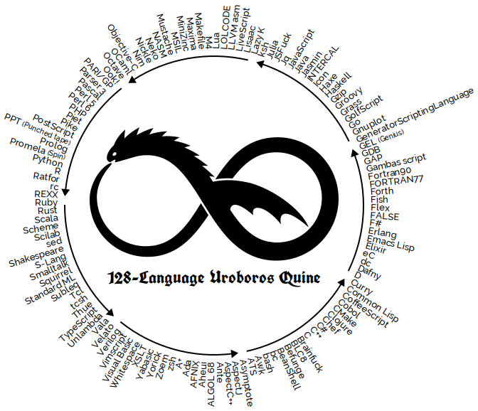

<style>
  .d-flex {
    display: flex;
    align-items: center;
  }

  .flex-column {
    flex-direction: column;
  }

  .flex-1 {
    flex: 1;
  }

  .justify-around {
    justify-content: space-around;
  }

  .space-between {
    justify-content: space-between;
  }

  #cover div {
    flex: 1;
  }

  #cover div:last-child {
    border-left: 1px solid #ccc;
  }

  #cover ul {
    list-style-type: none;
  }

  #cover ul li img {
    margin-right: 0.5rem;
  }

  section {
    justify-content: flex-start;
  }

  .title-section {
    flex: 1;
    display: flex;
    align-items: center;
    justify-content: center;
    flex-direction: column;
  }

  section[id="1"], section[id="2"], section[id="3"] {
    justify-content: center;
  }

  section[id="86"] {
    padding-bottom: 0.5rem;
  }

  section[id="87"] {
    padding: 0;
  }

  ul {
    margin-bottom: 0;
  }

  table {
    display: table;
    font-size: 0.7rem;
  }

  th {
    background-color: #333;
    color: #fff;
    text-align: left;
  }

  img {
    object-fit: contain;
    vertical-align: middle;
  }

  .hljs-keyword {
    color: #0000cd !important;
  }

  .hljs-type {
    color: #660
  }

  .hljs-string {
    color: #0c0 !important;
  }

  .red {
    color: #f00;
  }

  .blue {
    color: #44f;
  }

  .transparent {
    opacity: 0;
  }

  .semi-transparent {
    opacity: 0.3;
  }

  .muted {
    color: #0005;
  }

  .bold {
    font-weight: bold;
  }

  .note {
    color: #f00;
    font-weight: bold;
    position: absolute;
    bottom: 100px;
    right: 100px;
  }

  ol {
    counter-reset: li;
    list-style: none;
  }

  ol li::before {
    color: red;
    content: counter(li) ".";
    display: inline-block;
    font-weight: bold;
    margin-left: -1.3rem;
    width: 1.3rem;
  }

  ol li {
    counter-increment: li;
  }

  .life-grid {
    background-color: black;
    margin: 0 auto;
    display: grid;
    padding: 3px;
    grid-gap: 3px;
    grid-auto-flow: row;
  }

  .life-grid > div {
    background-color: black;
    display: flex;
    justify-content: center;
    align-items: center;
  }

  .alive, .dying, .surviving {
    background-color: white !important;
  }

  .being-born::before {
    content: "👶🏻";
  }

  .dying::before {
    content: "☠️";
  }

  .surviving::before {
    content: "🖖";
  }

  .one-by-one {
    grid-template-columns: repeat(1, 70px);
    grid-template-rows: repeat(1, 70px);
  }

  .five-by-five {
    grid-template-columns: repeat(5, 70px);
    grid-template-rows: repeat(5, 70px);
  }

  .eight-by-eight {
    grid-template-columns: repeat(8, 55px);
    grid-template-rows: repeat(8, 55px);
  }

  code {
    word-break: break-all !important;
    white-space : pre-wrap !important;
  }
</style>

<div class="title-section">
  <h1>La Programación como un Arte</h1>
</div>

---

<div id="cover" class="d-flex">
  <div>
    <h2>¡Hola! Yo soy Yusent</h2>
  </div>

  <div>
    <ul>
      <li class="d-flex">
        
        @yusent
      </li>
      <li class="d-flex">
        
        @yusent
      </li>
      <li class="d-flex">
        
        @yus3nt
      </li>
      <li class="d-flex">
        
        @yus3nt
      </li>
    </ul>
  </div>
</div>

---

<div id="cover" class="d-flex">
  <div>
    <h2>¡Hola! Yo soy <span class="red">Yus</span><s>ent</s></h2>
  </div>
  <div>
    <ul>
      <li class="d-flex">
        
        @yusent
      </li>
      <li class="d-flex">
        
        @yusent
      </li>
      <li class="d-flex">
        
        @yus3nt
      </li>
      <li class="d-flex">
        
        @yus3nt
      </li>
    </ul>
  </div>
</div>

---

<div style="height: 100%">
  <video
    height="100%"
    width="100%"
    onclick="this.paused ? this.play() : this.pause(); this.blur()"
  >
    <source src="media/alley-cat.webm" type="video/webm">
  </video>
</div>

---

<div style="height: 100%">
  <video
    height="100%"
    width="100%"
    onclick="this.paused ? this.play() : this.pause(); this.blur()"
  >
    <source src="media/dir-output.mkv" type="video/mp4">
  </video>
</div>

---


<div style="position: absolute; color: red; font-size: 8rem; right: 9rem; top: 2rem; text-align: center">
  ↑ ↑ ↑<br>
  ???
</div>

---


---

<div style="height: 100%">
  <video
    height="100%"
    width="100%"
    onclick="this.paused ? this.play() : this.pause(); this.blur()"
  >
    <source src="media/help.mkv" type="video/mp4">
  </video>
</div>

---

<div style="height: 100%">
  <video
    height="100%"
    width="100%"
    onclick="this.paused ? this.play() : this.pause(); this.blur()"
  >
    <source src="media/dir-pipe-more.mkv" type="video/mp4">
  </video>
</div>

---


---

<h1 style="text-align: center">Arte</h1>


---

<div class="d-flex" style="height: 100%">
  
  <h1 style="text-align: center; margin-left: 6rem">“Todo arte es completamente <u>inútil</u>”</h1>
</div>

---

<div class="title-section">
  <h1>Conway's Game of Life</h1>
</div>

---

# Conway's Game of Life

<div class="d-flex">
  <div class="d-flex flex-column">
    
    <small class="bold">John Horton Conway (1937 – 2020)</small>
  </div>

  <div class="flex-1">
    <ul>
      <li>Creado en <b>1970</b></li>
      <li class="transparent"><b>0 jugadores</b> (Su evolución está determinada por su estado inicial)</li>
      <li class="transparent">Consiste en una cuadrícula bidimensional de tamaño infinito cuyas celdas pueden estar en dos posibles estados:</li>
    </ul>
    <br>
    <div class="d-flex justify-around transparent">
      <div class="d-flex flex-column">
        <div class="life-grid one-by-one">
          <div></div>
        </div>
        <small class="bold">Viva</small>
      </div>
      <div class="d-flex flex-column">
        <div class="life-grid one-by-one">
          <div></div>
        </div>
        <small class="bold">Muerta</small>
      </div>
    </div>
  </div>
</div>

---

# Conway's Game of Life

<div class="d-flex">
  <div class="d-flex flex-column">
    
    <small class="bold">John Horton Conway (1937 – 2020)</small>
  </div>

  <div class="flex-1">
    <ul>
      <li>Creado en <b>1970</b></li>
      <li><b>0 jugadores</b> (Su evolución está determinada por su estado inicial)</li>
      <li class="transparent">Consiste en una cuadrícula bidimensional de tamaño infinito cuyas celdas pueden estar en dos posibles estados:</li>
    </ul>
    <br>
    <div class="d-flex justify-around transparent">
      <div class="d-flex flex-column">
        <div class="life-grid one-by-one">
          <div class="alive"></div>
        </div>
        <small class="bold">Viva</small>
      </div>
      <div class="d-flex flex-column">
        <div class="life-grid one-by-one">
          <div></div>
        </div>
        <small class="bold">Muerta</small>
      </div>
    </div>
  </div>
</div>

---

# Conway's Game of Life

<div class="d-flex">
  <div class="d-flex flex-column">
    
    <small class="bold">John Horton Conway (1937 – 2020)</small>
  </div>

  <div class="flex-1">
    <ul>
      <li>Creado en <b>1970</b></li>
      <li><b>0 jugadores</b> (Su evolución está determinada por su estado inicial)</li>
      <li>Consiste en una cuadrícula bidimensional de tamaño infinito cuyas celdas pueden estar en dos posibles estados:</li>
    </ul>
    <br>
    <div class="d-flex justify-around">
      <div class="d-flex flex-column">
        <div class="life-grid one-by-one">
          <div class="alive"></div>
        </div>
        <small class="bold">Viva</small>
      </div>
      <div class="d-flex flex-column">
        <div class="life-grid one-by-one">
          <div></div>
        </div>
        <small class="bold">Muerta</small>
      </div>
    </div>
  </div>
</div>

---

# Conway's Game of Life

<h6 style="margin-bottom: 70px">
  <span class="blue">Regla 1:</span>
  Una celda viva con
  <span class="red">menos de 2 celdas vivas alrededor</span>
  muere por <i>soledad</i>.
</h6>

---

# Conway's Game of Life

<h6 style="margin-bottom: 70px">
  <span class="blue">Regla 1:</span>
  Una celda viva con
  <span class="red">menos de 2 celdas vivas alrededor</span>
  muere por <i>soledad</i>.
</h6>

<div class="life-grid five-by-five">
  <div></div>
  <div></div>
  <div></div>
  <div></div>
  <div></div>
  <div></div>
  <div class="alive"></div>
  <div></div>
  <div></div>
  <div></div>
  <div></div>
  <div></div>
  <div class="alive"></div>
  <div></div>
  <div></div>
  <div></div>
  <div></div>
  <div></div>
  <div class="alive"></div>
  <div></div>
  <div></div>
  <div></div>
  <div></div>
  <div></div>
  <div></div>
</div>

---

# Conway's Game of Life

<h6 style="margin-bottom: 70px">
  <span class="blue">Regla 1:</span>
  Una celda viva con
  <span class="red">menos de 2 celdas vivas alrededor</span>
  muere por <i>soledad</i>.
</h6>

<div class="life-grid five-by-five">
  <div></div>
  <div></div>
  <div></div>
  <div></div>
  <div></div>
  <div></div>
  <div class="dying"></div>
  <div></div>
  <div></div>
  <div></div>
  <div></div>
  <div></div>
  <div class="alive"></div>
  <div></div>
  <div></div>
  <div></div>
  <div></div>
  <div></div>
  <div class="dying"></div>
  <div></div>
  <div></div>
  <div></div>
  <div></div>
  <div></div>
  <div></div>
</div>

---

# Conway's Game of Life

<h6 style="margin-bottom: 70px">
  <span class="blue">Regla 1:</span>
  Una celda viva con
  <span class="red">menos de 2 celdas vivas alrededor</span>
  muere por <i>soledad</i>.
</h6>

<div class="life-grid five-by-five">
  <div></div>
  <div></div>
  <div></div>
  <div></div>
  <div></div>
  <div></div>
  <div></div>
  <div></div>
  <div></div>
  <div></div>
  <div></div>
  <div></div>
  <div class="alive"></div>
  <div></div>
  <div></div>
  <div></div>
  <div></div>
  <div></div>
  <div></div>
  <div></div>
  <div></div>
  <div></div>
  <div></div>
  <div></div>
  <div></div>
</div>

---

# Conway's Game of Life

<h6 style="margin-bottom: 70px">
  <span class="blue">Regla 2:</span>
  Una celda viva con
  <span class="red">2 ó 3 celdas vivas alrededor</span>
  sobrevive a la siguiente generación.
</h6>

---

# Conway's Game of Life

<h6 style="margin-bottom: 70px">
  <span class="blue">Regla 2:</span>
  Una celda viva con
  <span class="red">2 ó 3 celdas vivas alrededor</span>
  sobrevive a la siguiente generación.
</h6>

<div class="life-grid five-by-five">
  <div></div>
  <div></div>
  <div></div>
  <div></div>
  <div></div>
  <div></div>
  <div class="alive"></div>
  <div class="alive"></div>
  <div></div>
  <div></div>
  <div></div>
  <div class="alive"></div>
  <div></div>
  <div></div>
  <div></div>
  <div></div>
  <div></div>
  <div></div>
  <div></div>
  <div></div>
  <div></div>
  <div></div>
  <div></div>
  <div></div>
  <div></div>
</div>

---

# Conway's Game of Life

<h6 style="margin-bottom: 70px">
  <span class="blue">Regla 2:</span>
  Una celda viva con
  <span class="red">2 ó 3 celdas vivas alrededor</span>
  sobrevive a la siguiente generación.
</h6>

<div class="life-grid five-by-five">
  <div></div>
  <div></div>
  <div></div>
  <div></div>
  <div></div>
  <div></div>
  <div class="surviving"></div>
  <div class="surviving"></div>
  <div></div>
  <div></div>
  <div></div>
  <div class="surviving"></div>
  <div></div>
  <div></div>
  <div></div>
  <div></div>
  <div></div>
  <div></div>
  <div></div>
  <div></div>
  <div></div>
  <div></div>
  <div></div>
  <div></div>
  <div></div>
</div>

---

# Conway's Game of Life

<h6 style="margin-bottom: 70px">
  <span class="blue">Regla 3:</span>
  Una celda viva con
  <span class="red">más de 3 celdas vivas alrededor</span>
  muere por <i>sobrepoblación</i>.
</h6>

---

# Conway's Game of Life

<h6 style="margin-bottom: 70px">
  <span class="blue">Regla 3:</span>
  Una celda viva con
  <span class="red">más de 3 celdas vivas alrededor</span>
  muere por <i>sobrepoblación</i>.
</h6>

<div class="life-grid five-by-five">
  <div></div>
  <div></div>
  <div></div>
  <div></div>
  <div></div>
  <div></div>
  <div class="alive"></div>
  <div class="alive"></div>
  <div class="alive"></div>
  <div></div>
  <div></div>
  <div class="alive"></div>
  <div class="alive"></div>
  <div></div>
  <div></div>
  <div></div>
  <div></div>
  <div></div>
  <div></div>
  <div></div>
  <div></div>
  <div></div>
  <div></div>
  <div></div>
  <div></div>
</div>

---

# Conway's Game of Life

<h6 style="margin-bottom: 70px">
  <span class="blue">Regla 3:</span>
  Una celda viva con
  <span class="red">más de 3 celdas vivas alrededor</span>
  muere por <i>sobrepoblación</i>.
</h6>

<div class="life-grid five-by-five">
  <div></div>
  <div></div>
  <div></div>
  <div></div>
  <div></div>
  <div></div>
  <div class="alive"></div>
  <div class="alive"></div>
  <div class="alive"></div>
  <div></div>
  <div></div>
  <div class="alive"></div>
  <div class="dying"></div>
  <div></div>
  <div></div>
  <div></div>
  <div></div>
  <div></div>
  <div></div>
  <div></div>
  <div></div>
  <div></div>
  <div></div>
  <div></div>
  <div></div>
</div>

---

# Conway's Game of Life

<h6 style="margin-bottom: 70px">
  <span class="blue">Regla 3:</span>
  Una celda viva con
  <span class="red">más de 3 celdas vivas alrededor</span>
  muere por <i>sobrepoblación</i>.
</h6>

<div class="life-grid five-by-five">
  <div></div>
  <div></div>
  <div></div>
  <div></div>
  <div></div>
  <div></div>
  <div class="alive"></div>
  <div class="alive"></div>
  <div class="alive"></div>
  <div></div>
  <div></div>
  <div class="alive"></div>
  <div></div>
  <div></div>
  <div></div>
  <div></div>
  <div></div>
  <div></div>
  <div></div>
  <div></div>
  <div></div>
  <div></div>
  <div></div>
  <div></div>
  <div></div>
</div>

---

# Conway's Game of Life

<h6 style="margin-bottom: 70px">
  <span class="blue">Regla 4:</span>
  Una celda muerta con
  <span class="red">exactamente 3 celdas vivas alrededor</span>
  nace por <i>reproducción</i>.
</h6>

---

# Conway's Game of Life

<h6 style="margin-bottom: 70px">
  <span class="blue">Regla 4:</span>
  Una celda muerta con
  <span class="red">exactamente 3 celdas vivas alrededor</span>
  nace por <i>reproducción</i>.
</h6>

<div class="life-grid five-by-five">
  <div></div>
  <div></div>
  <div></div>
  <div></div>
  <div></div>
  <div></div>
  <div class="alive"></div>
  <div class="alive"></div>
  <div></div>
  <div></div>
  <div></div>
  <div class="alive"></div>
  <div></div>
  <div></div>
  <div></div>
  <div></div>
  <div></div>
  <div></div>
  <div></div>
  <div></div>
  <div></div>
  <div></div>
  <div></div>
  <div></div>
  <div></div>
</div>

---

# Conway's Game of Life

<h6 style="margin-bottom: 70px">
  <span class="blue">Regla 4:</span>
  Una celda muerta con
  <span class="red">exactamente 3 celdas vivas alrededor</span>
  nace por <i>reproducción</i>.
</h6>

<div class="life-grid five-by-five">
  <div></div>
  <div></div>
  <div></div>
  <div></div>
  <div></div>
  <div></div>
  <div class="alive"></div>
  <div class="alive"></div>
  <div></div>
  <div></div>
  <div></div>
  <div class="alive"></div>
  <div class="being-born"></div>
  <div></div>
  <div></div>
  <div></div>
  <div></div>
  <div></div>
  <div></div>
  <div></div>
  <div></div>
  <div></div>
  <div></div>
  <div></div>
  <div></div>
</div>

---

# Conway's Game of Life

<h6 style="margin-bottom: 70px">
  <span class="blue">Regla 4:</span>
  Una celda muerta con
  <span class="red">exactamente 3 celdas vivas alrededor</span>
  nace por <i>reproducción</i>.
</h6>

<div class="life-grid five-by-five">
  <div></div>
  <div></div>
  <div></div>
  <div></div>
  <div></div>
  <div></div>
  <div class="alive"></div>
  <div class="alive"></div>
  <div></div>
  <div></div>
  <div></div>
  <div class="alive"></div>
  <div class="alive"></div>
  <div></div>
  <div></div>
  <div></div>
  <div></div>
  <div></div>
  <div></div>
  <div></div>
  <div></div>
  <div></div>
  <div></div>
  <div></div>
  <div></div>
</div>

---

# Conway's Game of Life - Ejemplo

<div class="d-flex">
  <div>
    <h6 style="text-align: center; margin-top: 0">Generación 0</h6>
    <div class="life-grid eight-by-eight">
      <div class="alive"></div>
      <div></div>
      <div class="alive"></div>
      <div></div>
      <div class="alive"></div>
      <div></div>
      <div class="alive"></div>
      <div></div>
      <div></div>
      <div class="alive"></div>
      <div></div>
      <div class="alive"></div>
      <div></div>
      <div class="alive"></div>
      <div></div>
      <div class="alive"></div>
      <div class="alive"></div>
      <div></div>
      <div class="alive"></div>
      <div></div>
      <div class="alive"></div>
      <div></div>
      <div class="alive"></div>
      <div></div>
      <div></div>
      <div class="alive"></div>
      <div></div>
      <div class="alive"></div>
      <div></div>
      <div class="alive"></div>
      <div></div>
      <div class="alive"></div>
      <div class="alive"></div>
      <div></div>
      <div class="alive"></div>
      <div></div>
      <div class="alive"></div>
      <div></div>
      <div class="alive"></div>
      <div></div>
      <div></div>
      <div class="alive"></div>
      <div></div>
      <div class="alive"></div>
      <div></div>
      <div class="alive"></div>
      <div></div>
      <div class="alive"></div>
      <div class="alive"></div>
      <div></div>
      <div class="alive"></div>
      <div></div>
      <div class="alive"></div>
      <div></div>
      <div class="alive"></div>
      <div></div>
      <div></div>
      <div class="alive"></div>
      <div></div>
      <div class="alive"></div>
      <div></div>
      <div class="alive"></div>
      <div></div>
      <div class="alive"></div>
    </div>
  </div>
</div>

---

# Conway's Game of Life - Ejemplo

<div class="d-flex">
  <div>
    <h6 style="text-align: center; margin-top: 0">Generación 0</h6>
    <div class="life-grid eight-by-eight">
      <div class="alive"></div>
      <div></div>
      <div class="alive"></div>
      <div></div>
      <div class="alive"></div>
      <div></div>
      <div class="alive"></div>
      <div></div>
      <div></div>
      <div class="alive"></div>
      <div></div>
      <div class="alive"></div>
      <div></div>
      <div class="alive"></div>
      <div></div>
      <div class="alive"></div>
      <div class="alive"></div>
      <div></div>
      <div class="alive"></div>
      <div></div>
      <div class="alive"></div>
      <div></div>
      <div class="alive"></div>
      <div></div>
      <div></div>
      <div class="alive"></div>
      <div></div>
      <div class="alive"></div>
      <div></div>
      <div class="alive"></div>
      <div></div>
      <div class="alive"></div>
      <div class="alive"></div>
      <div></div>
      <div class="alive"></div>
      <div></div>
      <div class="alive"></div>
      <div></div>
      <div class="alive"></div>
      <div></div>
      <div></div>
      <div class="alive"></div>
      <div></div>
      <div class="alive"></div>
      <div></div>
      <div class="alive"></div>
      <div></div>
      <div class="alive"></div>
      <div class="alive"></div>
      <div></div>
      <div class="alive"></div>
      <div></div>
      <div class="alive"></div>
      <div></div>
      <div class="alive"></div>
      <div></div>
      <div></div>
      <div class="alive"></div>
      <div></div>
      <div class="alive"></div>
      <div></div>
      <div class="alive"></div>
      <div></div>
      <div class="alive"></div>
    </div>
  </div>
  <div style="padding-left: 1rem; font-size: 1.5rem">
    <ol>
      <li>Una celda viva con menos de 2 celdas vivas alrededor muere por <i>soledad</i>.</li>
      <li class="transparent">Una celda viva con 2 ó 3 celdas vivas alrededor sobrevive a la siguiente generación.</li>
      <li class="transparent">Una celda viva con más de 3 celdas vivas alrededor muere por <i>sobrepoblación</i>.</li>
      <li class="transparent">Una celda muerta con exactamente 3 celdas vivas alrededor nace por <i>reproducción</i>.</li>
    </ol>
  </div>
</div>

---

# Conway's Game of Life - Ejemplo

<div class="d-flex">
  <div>
    <h6 style="text-align: center; margin-top: 0">Generación 0</h6>
    <div class="life-grid eight-by-eight">
      <div class="dying"></div>
      <div></div>
      <div class="alive"></div>
      <div></div>
      <div class="alive"></div>
      <div></div>
      <div class="alive"></div>
      <div></div>
      <div></div>
      <div class="alive"></div>
      <div></div>
      <div class="alive"></div>
      <div></div>
      <div class="alive"></div>
      <div></div>
      <div class="alive"></div>
      <div class="alive"></div>
      <div></div>
      <div class="alive"></div>
      <div></div>
      <div class="alive"></div>
      <div></div>
      <div class="alive"></div>
      <div></div>
      <div></div>
      <div class="alive"></div>
      <div></div>
      <div class="alive"></div>
      <div></div>
      <div class="alive"></div>
      <div></div>
      <div class="alive"></div>
      <div class="alive"></div>
      <div></div>
      <div class="alive"></div>
      <div></div>
      <div class="alive"></div>
      <div></div>
      <div class="alive"></div>
      <div></div>
      <div></div>
      <div class="alive"></div>
      <div></div>
      <div class="alive"></div>
      <div></div>
      <div class="alive"></div>
      <div></div>
      <div class="alive"></div>
      <div class="alive"></div>
      <div></div>
      <div class="alive"></div>
      <div></div>
      <div class="alive"></div>
      <div></div>
      <div class="alive"></div>
      <div></div>
      <div></div>
      <div class="alive"></div>
      <div></div>
      <div class="alive"></div>
      <div></div>
      <div class="alive"></div>
      <div></div>
      <div class="dying"></div>
    </div>
  </div>
  <div style="padding-left: 1rem; font-size: 1.5rem">
    <ol>
      <li>Una celda viva con menos de 2 celdas vivas alrededor muere por <i>soledad</i>.</li>
      <li class="transparent">Una celda viva con 2 ó 3 celdas vivas alrededor sobrevive a la siguiente generación.</li>
      <li class="transparent">Una celda viva con más de 3 celdas vivas alrededor muere por <i>sobrepoblación</i>.</li>
      <li class="transparent">Una celda muerta con exactamente 3 celdas vivas alrededor nace por <i>reproducción</i>.</li>
    </ol>
  </div>
</div>

---

# Conway's Game of Life - Ejemplo

<div class="d-flex">
  <div>
    <h6 style="text-align: center; margin-top: 0">Generación 0</h6>
    <div class="life-grid eight-by-eight">
      <div class="dying"></div>
      <div></div>
      <div class="alive"></div>
      <div></div>
      <div class="alive"></div>
      <div></div>
      <div class="alive"></div>
      <div></div>
      <div></div>
      <div class="alive"></div>
      <div></div>
      <div class="alive"></div>
      <div></div>
      <div class="alive"></div>
      <div></div>
      <div class="alive"></div>
      <div class="alive"></div>
      <div></div>
      <div class="alive"></div>
      <div></div>
      <div class="alive"></div>
      <div></div>
      <div class="alive"></div>
      <div></div>
      <div></div>
      <div class="alive"></div>
      <div></div>
      <div class="alive"></div>
      <div></div>
      <div class="alive"></div>
      <div></div>
      <div class="alive"></div>
      <div class="alive"></div>
      <div></div>
      <div class="alive"></div>
      <div></div>
      <div class="alive"></div>
      <div></div>
      <div class="alive"></div>
      <div></div>
      <div></div>
      <div class="alive"></div>
      <div></div>
      <div class="alive"></div>
      <div></div>
      <div class="alive"></div>
      <div></div>
      <div class="alive"></div>
      <div class="alive"></div>
      <div></div>
      <div class="alive"></div>
      <div></div>
      <div class="alive"></div>
      <div></div>
      <div class="alive"></div>
      <div></div>
      <div></div>
      <div class="alive"></div>
      <div></div>
      <div class="alive"></div>
      <div></div>
      <div class="alive"></div>
      <div></div>
      <div class="dying"></div>
    </div>
  </div>
  <div style="padding-left: 1rem; font-size: 1.5rem">
    <ol>
      <li class="semi-transparent">Una celda viva con menos de 2 celdas vivas alrededor muere por <i>soledad</i>.</li>
      <li>Una celda viva con 2 ó 3 celdas vivas alrededor sobrevive a la siguiente generación.</li>
      <li class="transparent">Una celda viva con más de 3 celdas vivas alrededor muere por <i>sobrepoblación</i>.</li>
      <li class="transparent">Una celda muerta con exactamente 3 celdas vivas alrededor nace por <i>reproducción</i>.</li>
    </ol>
  </div>
</div>

---

# Conway's Game of Life - Ejemplo

<div class="d-flex">
  <div>
    <h6 style="text-align: center; margin-top: 0">Generación 0</h6>
    <div class="life-grid eight-by-eight">
      <div class="dying"></div>
      <div></div>
      <div class="surviving"></div>
      <div></div>
      <div class="surviving"></div>
      <div></div>
      <div class="surviving"></div>
      <div></div>
      <div></div>
      <div class="alive"></div>
      <div></div>
      <div class="alive"></div>
      <div></div>
      <div class="alive"></div>
      <div></div>
      <div class="surviving"></div>
      <div class="surviving"></div>
      <div></div>
      <div class="alive"></div>
      <div></div>
      <div class="alive"></div>
      <div></div>
      <div class="alive"></div>
      <div></div>
      <div></div>
      <div class="alive"></div>
      <div></div>
      <div class="alive"></div>
      <div></div>
      <div class="alive"></div>
      <div></div>
      <div class="surviving"></div>
      <div class="surviving"></div>
      <div></div>
      <div class="alive"></div>
      <div></div>
      <div class="alive"></div>
      <div></div>
      <div class="alive"></div>
      <div></div>
      <div></div>
      <div class="alive"></div>
      <div></div>
      <div class="alive"></div>
      <div></div>
      <div class="alive"></div>
      <div></div>
      <div class="surviving"></div>
      <div class="surviving"></div>
      <div></div>
      <div class="alive"></div>
      <div></div>
      <div class="alive"></div>
      <div></div>
      <div class="alive"></div>
      <div></div>
      <div></div>
      <div class="surviving"></div>
      <div></div>
      <div class="surviving"></div>
      <div></div>
      <div class="surviving"></div>
      <div></div>
      <div class="dying"></div>
    </div>
  </div>
  <div style="padding-left: 1rem; font-size: 1.5rem">
    <ol>
      <li class="semi-transparent">Una celda viva con menos de 2 celdas vivas alrededor muere por <i>soledad</i>.</li>
      <li>Una celda viva con 2 ó 3 celdas vivas alrededor sobrevive a la siguiente generación.</li>
      <li class="transparent">Una celda viva con más de 3 celdas vivas alrededor muere por <i>sobrepoblación</i>.</li>
      <li class="transparent">Una celda muerta con exactamente 3 celdas vivas alrededor nace por <i>reproducción</i>.</li>
    </ol>
  </div>
</div>

---

# Conway's Game of Life - Ejemplo

<div class="d-flex">
  <div>
    <h6 style="text-align: center; margin-top: 0">Generación 0</h6>
    <div class="life-grid eight-by-eight">
      <div class="dying"></div>
      <div></div>
      <div class="surviving"></div>
      <div></div>
      <div class="surviving"></div>
      <div></div>
      <div class="surviving"></div>
      <div></div>
      <div></div>
      <div class="alive"></div>
      <div></div>
      <div class="alive"></div>
      <div></div>
      <div class="alive"></div>
      <div></div>
      <div class="surviving"></div>
      <div class="surviving"></div>
      <div></div>
      <div class="alive"></div>
      <div></div>
      <div class="alive"></div>
      <div></div>
      <div class="alive"></div>
      <div></div>
      <div></div>
      <div class="alive"></div>
      <div></div>
      <div class="alive"></div>
      <div></div>
      <div class="alive"></div>
      <div></div>
      <div class="surviving"></div>
      <div class="surviving"></div>
      <div></div>
      <div class="alive"></div>
      <div></div>
      <div class="alive"></div>
      <div></div>
      <div class="alive"></div>
      <div></div>
      <div></div>
      <div class="alive"></div>
      <div></div>
      <div class="alive"></div>
      <div></div>
      <div class="alive"></div>
      <div></div>
      <div class="surviving"></div>
      <div class="surviving"></div>
      <div></div>
      <div class="alive"></div>
      <div></div>
      <div class="alive"></div>
      <div></div>
      <div class="alive"></div>
      <div></div>
      <div></div>
      <div class="surviving"></div>
      <div></div>
      <div class="surviving"></div>
      <div></div>
      <div class="surviving"></div>
      <div></div>
      <div class="dying"></div>
    </div>
  </div>
  <div style="padding-left: 1rem; font-size: 1.5rem">
    <ol>
      <li class="semi-transparent">Una celda viva con menos de 2 celdas vivas alrededor muere por <i>soledad</i>.</li>
      <li class="semi-transparent">Una celda viva con 2 ó 3 celdas vivas alrededor sobrevive a la siguiente generación.</li>
      <li>Una celda viva con más de 3 celdas vivas alrededor muere por <i>sobrepoblación</i>.</li>
      <li class="transparent">Una celda muerta con exactamente 3 celdas vivas alrededor nace por <i>reproducción</i>.</li>
    </ol>
  </div>
</div>

---

# Conway's Game of Life - Ejemplo

<div class="d-flex">
  <div>
    <h6 style="text-align: center; margin-top: 0">Generación 0</h6>
    <div class="life-grid eight-by-eight">
      <div class="dying"></div>
      <div></div>
      <div class="surviving"></div>
      <div></div>
      <div class="surviving"></div>
      <div></div>
      <div class="surviving"></div>
      <div></div>
      <div></div>
      <div class="dying"></div>
      <div></div>
      <div class="dying"></div>
      <div></div>
      <div class="dying"></div>
      <div></div>
      <div class="surviving"></div>
      <div class="surviving"></div>
      <div></div>
      <div class="dying"></div>
      <div></div>
      <div class="dying"></div>
      <div></div>
      <div class="dying"></div>
      <div></div>
      <div></div>
      <div class="dying"></div>
      <div></div>
      <div class="dying"></div>
      <div></div>
      <div class="dying"></div>
      <div></div>
      <div class="surviving"></div>
      <div class="surviving"></div>
      <div></div>
      <div class="dying"></div>
      <div></div>
      <div class="dying"></div>
      <div></div>
      <div class="dying"></div>
      <div></div>
      <div></div>
      <div class="dying"></div>
      <div></div>
      <div class="dying"></div>
      <div></div>
      <div class="dying"></div>
      <div></div>
      <div class="surviving"></div>
      <div class="surviving"></div>
      <div></div>
      <div class="dying"></div>
      <div></div>
      <div class="dying"></div>
      <div></div>
      <div class="dying"></div>
      <div></div>
      <div></div>
      <div class="surviving"></div>
      <div></div>
      <div class="surviving"></div>
      <div></div>
      <div class="surviving"></div>
      <div></div>
      <div class="dying"></div>
    </div>
  </div>
  <div style="padding-left: 1rem; font-size: 1.5rem">
    <ol>
      <li class="semi-transparent">Una celda viva con menos de 2 celdas vivas alrededor muere por <i>soledad</i>.</li>
      <li class="semi-transparent">Una celda viva con 2 ó 3 celdas vivas alrededor sobrevive a la siguiente generación.</li>
      <li>Una celda viva con más de 3 celdas vivas alrededor muere por <i>sobrepoblación</i>.</li>
      <li class="transparent">Una celda muerta con exactamente 3 celdas vivas alrededor nace por <i>reproducción</i>.</li>
    </ol>
  </div>
</div>

---

# Conway's Game of Life - Ejemplo

<div class="d-flex">
  <div>
    <h6 style="text-align: center; margin-top: 0">Generación 0</h6>
    <div class="life-grid eight-by-eight">
      <div class="dying"></div>
      <div></div>
      <div class="surviving"></div>
      <div></div>
      <div class="surviving"></div>
      <div></div>
      <div class="surviving"></div>
      <div></div>
      <div></div>
      <div class="dying"></div>
      <div></div>
      <div class="dying"></div>
      <div></div>
      <div class="dying"></div>
      <div></div>
      <div class="surviving"></div>
      <div class="surviving"></div>
      <div></div>
      <div class="dying"></div>
      <div></div>
      <div class="dying"></div>
      <div></div>
      <div class="dying"></div>
      <div></div>
      <div></div>
      <div class="dying"></div>
      <div></div>
      <div class="dying"></div>
      <div></div>
      <div class="dying"></div>
      <div></div>
      <div class="surviving"></div>
      <div class="surviving"></div>
      <div></div>
      <div class="dying"></div>
      <div></div>
      <div class="dying"></div>
      <div></div>
      <div class="dying"></div>
      <div></div>
      <div></div>
      <div class="dying"></div>
      <div></div>
      <div class="dying"></div>
      <div></div>
      <div class="dying"></div>
      <div></div>
      <div class="surviving"></div>
      <div class="surviving"></div>
      <div></div>
      <div class="dying"></div>
      <div></div>
      <div class="dying"></div>
      <div></div>
      <div class="dying"></div>
      <div></div>
      <div></div>
      <div class="surviving"></div>
      <div></div>
      <div class="surviving"></div>
      <div></div>
      <div class="surviving"></div>
      <div></div>
      <div class="dying"></div>
    </div>
  </div>
  <div style="padding-left: 1rem; font-size: 1.5rem">
    <ol>
      <li class="semi-transparent">Una celda viva con menos de 2 celdas vivas alrededor muere por <i>soledad</i>.</li>
      <li class="semi-transparent">Una celda viva con 2 ó 3 celdas vivas alrededor sobrevive a la siguiente generación.</li>
      <li class="semi-transparent">Una celda viva con más de 3 celdas vivas alrededor muere por <i>sobrepoblación</i>.</li>
      <li>Una celda muerta con exactamente 3 celdas vivas alrededor nace por <i>reproducción</i>.</li>
    </ol>
  </div>
</div>

---

# Conway's Game of Life - Ejemplo

<div class="d-flex">
  <div>
    <h6 style="text-align: center; margin-top: 0">Generación 0</h6>
    <div class="life-grid eight-by-eight">
      <div class="dying"></div>
      <div class="being-born"></div>
      <div class="surviving"></div>
      <div class="being-born"></div>
      <div class="surviving"></div>
      <div class="being-born"></div>
      <div class="surviving"></div>
      <div></div>
      <div class="being-born"></div>
      <div class="dying"></div>
      <div></div>
      <div class="dying"></div>
      <div></div>
      <div class="dying"></div>
      <div></div>
      <div class="surviving"></div>
      <div class="surviving"></div>
      <div></div>
      <div class="dying"></div>
      <div></div>
      <div class="dying"></div>
      <div></div>
      <div class="dying"></div>
      <div class="being-born"></div>
      <div class="being-born"></div>
      <div class="dying"></div>
      <div></div>
      <div class="dying"></div>
      <div></div>
      <div class="dying"></div>
      <div></div>
      <div class="surviving"></div>
      <div class="surviving"></div>
      <div></div>
      <div class="dying"></div>
      <div></div>
      <div class="dying"></div>
      <div></div>
      <div class="dying"></div>
      <div class="being-born"></div>
      <div class="being-born"></div>
      <div class="dying"></div>
      <div></div>
      <div class="dying"></div>
      <div></div>
      <div class="dying"></div>
      <div></div>
      <div class="surviving"></div>
      <div class="surviving"></div>
      <div></div>
      <div class="dying"></div>
      <div></div>
      <div class="dying"></div>
      <div></div>
      <div class="dying"></div>
      <div class="being-born"></div>
      <div></div>
      <div class="surviving"></div>
      <div class="being-born"></div>
      <div class="surviving"></div>
      <div class="being-born"></div>
      <div class="surviving"></div>
      <div class="being-born"></div>
      <div class="dying"></div>
    </div>
  </div>
  <div style="padding-left: 1rem; font-size: 1.5rem">
    <ol>
      <li class="semi-transparent">Una celda viva con menos de 2 celdas vivas alrededor muere por <i>soledad</i>.</li>
      <li class="semi-transparent">Una celda viva con 2 ó 3 celdas vivas alrededor sobrevive a la siguiente generación.</li>
      <li class="semi-transparent">Una celda viva con más de 3 celdas vivas alrededor muere por <i>sobrepoblación</i>.</li>
      <li>Una celda muerta con exactamente 3 celdas vivas alrededor nace por <i>reproducción</i>.</li>
    </ol>
  </div>
</div>

---

# Conway's Game of Life - Ejemplo

<div class="d-flex">
  <div>
    <h6 style="text-align: center; margin-top: 0">Generación 0</h6>
    <div class="life-grid eight-by-eight">
      <div></div>
      <div class="being-born"></div>
      <div class="surviving"></div>
      <div class="being-born"></div>
      <div class="surviving"></div>
      <div class="being-born"></div>
      <div class="surviving"></div>
      <div></div>
      <div class="being-born"></div>
      <div></div>
      <div></div>
      <div></div>
      <div></div>
      <div></div>
      <div></div>
      <div class="surviving"></div>
      <div class="surviving"></div>
      <div></div>
      <div></div>
      <div></div>
      <div></div>
      <div></div>
      <div></div>
      <div class="being-born"></div>
      <div class="being-born"></div>
      <div></div>
      <div></div>
      <div></div>
      <div></div>
      <div></div>
      <div></div>
      <div class="surviving"></div>
      <div class="surviving"></div>
      <div></div>
      <div></div>
      <div></div>
      <div></div>
      <div></div>
      <div></div>
      <div class="being-born"></div>
      <div class="being-born"></div>
      <div></div>
      <div></div>
      <div></div>
      <div></div>
      <div></div>
      <div></div>
      <div class="surviving"></div>
      <div class="surviving"></div>
      <div></div>
      <div></div>
      <div></div>
      <div></div>
      <div></div>
      <div></div>
      <div class="being-born"></div>
      <div></div>
      <div class="surviving"></div>
      <div class="being-born"></div>
      <div class="surviving"></div>
      <div class="being-born"></div>
      <div class="surviving"></div>
      <div class="being-born"></div>
      <div></div>
    </div>
  </div>
  <div style="padding-left: 1rem; font-size: 1.5rem">
    <ol>
      <li class="semi-transparent">Una celda viva con menos de 2 celdas vivas alrededor muere por <i>soledad</i>.</li>
      <li class="semi-transparent">Una celda viva con 2 ó 3 celdas vivas alrededor sobrevive a la siguiente generación.</li>
      <li class="semi-transparent">Una celda viva con más de 3 celdas vivas alrededor muere por <i>sobrepoblación</i>.</li>
      <li class="semi-transparent">Una celda muerta con exactamente 3 celdas vivas alrededor nace por <i>reproducción</i>.</li>
    </ol>
  </div>
</div>

---

# Conway's Game of Life - Ejemplo

<div class="d-flex">
  <div>
    <h6 style="text-align: center; margin-top: 0">Generación 0</h6>
    <div class="life-grid eight-by-eight">
      <div></div>
      <div class="being-born"></div>
      <div class="alive"></div>
      <div class="being-born"></div>
      <div class="alive"></div>
      <div class="being-born"></div>
      <div class="alive"></div>
      <div></div>
      <div class="being-born"></div>
      <div></div>
      <div></div>
      <div></div>
      <div></div>
      <div></div>
      <div></div>
      <div class="alive"></div>
      <div class="alive"></div>
      <div></div>
      <div></div>
      <div></div>
      <div></div>
      <div></div>
      <div></div>
      <div class="being-born"></div>
      <div class="being-born"></div>
      <div></div>
      <div></div>
      <div></div>
      <div></div>
      <div></div>
      <div></div>
      <div class="alive"></div>
      <div class="alive"></div>
      <div></div>
      <div></div>
      <div></div>
      <div></div>
      <div></div>
      <div></div>
      <div class="being-born"></div>
      <div class="being-born"></div>
      <div></div>
      <div></div>
      <div></div>
      <div></div>
      <div></div>
      <div></div>
      <div class="alive"></div>
      <div class="alive"></div>
      <div></div>
      <div></div>
      <div></div>
      <div></div>
      <div></div>
      <div></div>
      <div class="being-born"></div>
      <div></div>
      <div class="alive"></div>
      <div class="being-born"></div>
      <div class="alive"></div>
      <div class="being-born"></div>
      <div class="alive"></div>
      <div class="being-born"></div>
      <div></div>
    </div>
  </div>
  <div style="padding-left: 1rem; font-size: 1.5rem">
    <ol>
      <li class="semi-transparent">Una celda viva con menos de 2 celdas vivas alrededor muere por <i>soledad</i>.</li>
      <li class="semi-transparent">Una celda viva con 2 ó 3 celdas vivas alrededor sobrevive a la siguiente generación.</li>
      <li class="semi-transparent">Una celda viva con más de 3 celdas vivas alrededor muere por <i>sobrepoblación</i>.</li>
      <li class="semi-transparent">Una celda muerta con exactamente 3 celdas vivas alrededor nace por <i>reproducción</i>.</li>
    </ol>
  </div>
</div>

---

# Conway's Game of Life - Ejemplo

<div class="d-flex">
  <div>
    <h6 style="text-align: center; margin-top: 0">Generación 1</h6>
    <div class="life-grid eight-by-eight">
      <div></div>
      <div class="alive"></div>
      <div class="alive"></div>
      <div class="alive"></div>
      <div class="alive"></div>
      <div class="alive"></div>
      <div class="alive"></div>
      <div></div>
      <div class="alive"></div>
      <div></div>
      <div></div>
      <div></div>
      <div></div>
      <div></div>
      <div></div>
      <div class="alive"></div>
      <div class="alive"></div>
      <div></div>
      <div></div>
      <div></div>
      <div></div>
      <div></div>
      <div></div>
      <div class="alive"></div>
      <div class="alive"></div>
      <div></div>
      <div></div>
      <div></div>
      <div></div>
      <div></div>
      <div></div>
      <div class="alive"></div>
      <div class="alive"></div>
      <div></div>
      <div></div>
      <div></div>
      <div></div>
      <div></div>
      <div></div>
      <div class="alive"></div>
      <div class="alive"></div>
      <div></div>
      <div></div>
      <div></div>
      <div></div>
      <div></div>
      <div></div>
      <div class="alive"></div>
      <div class="alive"></div>
      <div></div>
      <div></div>
      <div></div>
      <div></div>
      <div></div>
      <div></div>
      <div class="alive"></div>
      <div></div>
      <div class="alive"></div>
      <div class="alive"></div>
      <div class="alive"></div>
      <div class="alive"></div>
      <div class="alive"></div>
      <div class="alive"></div>
      <div></div>
    </div>
  </div>
  <div style="padding-left: 1rem; font-size: 1.5rem">
    <ol>
      <li class="semi-transparent">Una celda viva con menos de 2 celdas vivas alrededor muere por <i>soledad</i>.</li>
      <li class="semi-transparent">Una celda viva con 2 ó 3 celdas vivas alrededor sobrevive a la siguiente generación.</li>
      <li class="semi-transparent">Una celda viva con más de 3 celdas vivas alrededor muere por <i>sobrepoblación</i>.</li>
      <li class="semi-transparent">Una celda muerta con exactamente 3 celdas vivas alrededor nace por <i>reproducción</i>.</li>
    </ol>
  </div>
</div>

---

# Conway's Game of Life - Ejemplo

<div class="d-flex">
  <div>
    <h6 style="text-align: center; margin-top: 0">Generación 1</h6>
    <div class="life-grid eight-by-eight">
      <div></div>
      <div class="alive"></div>
      <div class="alive"></div>
      <div class="alive"></div>
      <div class="alive"></div>
      <div class="alive"></div>
      <div class="alive"></div>
      <div></div>
      <div class="alive"></div>
      <div></div>
      <div></div>
      <div></div>
      <div></div>
      <div></div>
      <div></div>
      <div class="alive"></div>
      <div class="alive"></div>
      <div></div>
      <div></div>
      <div></div>
      <div></div>
      <div></div>
      <div></div>
      <div class="alive"></div>
      <div class="alive"></div>
      <div></div>
      <div></div>
      <div></div>
      <div></div>
      <div></div>
      <div></div>
      <div class="alive"></div>
      <div class="alive"></div>
      <div></div>
      <div></div>
      <div></div>
      <div></div>
      <div></div>
      <div></div>
      <div class="alive"></div>
      <div class="alive"></div>
      <div></div>
      <div></div>
      <div></div>
      <div></div>
      <div></div>
      <div></div>
      <div class="alive"></div>
      <div class="alive"></div>
      <div></div>
      <div></div>
      <div></div>
      <div></div>
      <div></div>
      <div></div>
      <div class="alive"></div>
      <div></div>
      <div class="alive"></div>
      <div class="alive"></div>
      <div class="alive"></div>
      <div class="alive"></div>
      <div class="alive"></div>
      <div class="alive"></div>
      <div></div>
    </div>
  </div>
  <div style="padding-left: 1rem; font-size: 1.5rem">
    <ol>
      <li>Una celda viva con menos de 2 celdas vivas alrededor muere por <i>soledad</i>.</li>
      <li class="semi-transparent">Una celda viva con 2 ó 3 celdas vivas alrededor sobrevive a la siguiente generación.</li>
      <li class="semi-transparent">Una celda viva con más de 3 celdas vivas alrededor muere por <i>sobrepoblación</i>.</li>
      <li class="semi-transparent">Una celda muerta con exactamente 3 celdas vivas alrededor nace por <i>reproducción</i>.</li>
    </ol>
  </div>
</div>

---

# Conway's Game of Life - Ejemplo

<div class="d-flex">
  <div>
    <h6 style="text-align: center; margin-top: 0">Generación 1</h6>
    <div class="life-grid eight-by-eight">
      <div></div>
      <div class="surviving"></div>
      <div class="surviving"></div>
      <div class="surviving"></div>
      <div class="surviving"></div>
      <div class="surviving"></div>
      <div class="surviving"></div>
      <div></div>
      <div class="surviving"></div>
      <div></div>
      <div></div>
      <div></div>
      <div></div>
      <div></div>
      <div></div>
      <div class="surviving"></div>
      <div class="surviving"></div>
      <div></div>
      <div></div>
      <div></div>
      <div></div>
      <div></div>
      <div></div>
      <div class="surviving"></div>
      <div class="surviving"></div>
      <div></div>
      <div></div>
      <div></div>
      <div></div>
      <div></div>
      <div></div>
      <div class="surviving"></div>
      <div class="surviving"></div>
      <div></div>
      <div></div>
      <div></div>
      <div></div>
      <div></div>
      <div></div>
      <div class="surviving"></div>
      <div class="surviving"></div>
      <div></div>
      <div></div>
      <div></div>
      <div></div>
      <div></div>
      <div></div>
      <div class="surviving"></div>
      <div class="surviving"></div>
      <div></div>
      <div></div>
      <div></div>
      <div></div>
      <div></div>
      <div></div>
      <div class="surviving"></div>
      <div></div>
      <div class="surviving"></div>
      <div class="surviving"></div>
      <div class="surviving"></div>
      <div class="surviving"></div>
      <div class="surviving"></div>
      <div class="surviving"></div>
      <div></div>
    </div>
  </div>
  <div style="padding-left: 1rem; font-size: 1.5rem">
    <ol>
      <li class="semi-transparent">Una celda viva con menos de 2 celdas vivas alrededor muere por <i>soledad</i>.</li>
      <li>Una celda viva con 2 ó 3 celdas vivas alrededor sobrevive a la siguiente generación.</li>
      <li class="semi-transparent">Una celda viva con más de 3 celdas vivas alrededor muere por <i>sobrepoblación</i>.</li>
      <li class="semi-transparent">Una celda muerta con exactamente 3 celdas vivas alrededor nace por <i>reproducción</i>.</li>
    </ol>
  </div>
</div>

---

# Conway's Game of Life - Ejemplo

<div class="d-flex">
  <div>
    <h6 style="text-align: center; margin-top: 0">Generación 1</h6>
    <div class="life-grid eight-by-eight">
      <div></div>
      <div class="surviving"></div>
      <div class="surviving"></div>
      <div class="surviving"></div>
      <div class="surviving"></div>
      <div class="surviving"></div>
      <div class="surviving"></div>
      <div></div>
      <div class="surviving"></div>
      <div></div>
      <div></div>
      <div></div>
      <div></div>
      <div></div>
      <div></div>
      <div class="surviving"></div>
      <div class="surviving"></div>
      <div></div>
      <div></div>
      <div></div>
      <div></div>
      <div></div>
      <div></div>
      <div class="surviving"></div>
      <div class="surviving"></div>
      <div></div>
      <div></div>
      <div></div>
      <div></div>
      <div></div>
      <div></div>
      <div class="surviving"></div>
      <div class="surviving"></div>
      <div></div>
      <div></div>
      <div></div>
      <div></div>
      <div></div>
      <div></div>
      <div class="surviving"></div>
      <div class="surviving"></div>
      <div></div>
      <div></div>
      <div></div>
      <div></div>
      <div></div>
      <div></div>
      <div class="surviving"></div>
      <div class="surviving"></div>
      <div></div>
      <div></div>
      <div></div>
      <div></div>
      <div></div>
      <div></div>
      <div class="surviving"></div>
      <div></div>
      <div class="surviving"></div>
      <div class="surviving"></div>
      <div class="surviving"></div>
      <div class="surviving"></div>
      <div class="surviving"></div>
      <div class="surviving"></div>
      <div></div>
    </div>
  </div>
  <div style="padding-left: 1rem; font-size: 1.5rem">
    <ol>
      <li class="semi-transparent">Una celda viva con menos de 2 celdas vivas alrededor muere por <i>soledad</i>.</li>
      <li class="semi-transparent">Una celda viva con 2 ó 3 celdas vivas alrededor sobrevive a la siguiente generación.</li>
      <li>Una celda viva con más de 3 celdas vivas alrededor muere por <i>sobrepoblación</i>.</li>
      <li class="semi-transparent">Una celda muerta con exactamente 3 celdas vivas alrededor nace por <i>reproducción</i>.</li>
    </ol>
  </div>
</div>

---

# Conway's Game of Life - Ejemplo

<div class="d-flex">
  <div>
    <h6 style="text-align: center; margin-top: 0">Generación 1</h6>
    <div class="life-grid eight-by-eight">
      <div></div>
      <div class="surviving"></div>
      <div class="surviving"></div>
      <div class="surviving"></div>
      <div class="surviving"></div>
      <div class="surviving"></div>
      <div class="surviving"></div>
      <div></div>
      <div class="surviving"></div>
      <div></div>
      <div class="being-born"></div>
      <div class="being-born"></div>
      <div class="being-born"></div>
      <div class="being-born"></div>
      <div></div>
      <div class="surviving"></div>
      <div class="surviving"></div>
      <div class="being-born"></div>
      <div></div>
      <div></div>
      <div></div>
      <div></div>
      <div class="being-born"></div>
      <div class="surviving"></div>
      <div class="surviving"></div>
      <div class="being-born"></div>
      <div></div>
      <div></div>
      <div></div>
      <div></div>
      <div class="being-born"></div>
      <div class="surviving"></div>
      <div class="surviving"></div>
      <div class="being-born"></div>
      <div></div>
      <div></div>
      <div></div>
      <div></div>
      <div class="being-born"></div>
      <div class="surviving"></div>
      <div class="surviving"></div>
      <div class="being-born"></div>
      <div></div>
      <div></div>
      <div></div>
      <div></div>
      <div class="being-born"></div>
      <div class="surviving"></div>
      <div class="surviving"></div>
      <div></div>
      <div class="being-born"></div>
      <div class="being-born"></div>
      <div class="being-born"></div>
      <div class="being-born"></div>
      <div></div>
      <div class="surviving"></div>
      <div></div>
      <div class="surviving"></div>
      <div class="surviving"></div>
      <div class="surviving"></div>
      <div class="surviving"></div>
      <div class="surviving"></div>
      <div class="surviving"></div>
      <div></div>
    </div>
  </div>
  <div style="padding-left: 1rem; font-size: 1.5rem">
    <ol>
      <li class="semi-transparent">Una celda viva con menos de 2 celdas vivas alrededor muere por <i>soledad</i>.</li>
      <li class="semi-transparent">Una celda viva con 2 ó 3 celdas vivas alrededor sobrevive a la siguiente generación.</li>
      <li class="semi-transparent">Una celda viva con más de 3 celdas vivas alrededor muere por <i>sobrepoblación</i>.</li>
      <li>Una celda muerta con exactamente 3 celdas vivas alrededor nace por <i>reproducción</i>.</li>
    </ol>
  </div>
</div>

---

# Conway's Game of Life - Ejemplo

<div class="d-flex">
  <div>
    <h6 style="text-align: center; margin-top: 0">Generación 2</h6>
    <div class="life-grid eight-by-eight">
      <div></div>
      <div class="alive"></div>
      <div class="alive"></div>
      <div class="alive"></div>
      <div class="alive"></div>
      <div class="alive"></div>
      <div class="alive"></div>
      <div></div>
      <div class="alive"></div>
      <div></div>
      <div class="alive"></div>
      <div class="alive"></div>
      <div class="alive"></div>
      <div class="alive"></div>
      <div></div>
      <div class="alive"></div>
      <div class="alive"></div>
      <div class="alive"></div>
      <div></div>
      <div></div>
      <div></div>
      <div></div>
      <div class="alive"></div>
      <div class="alive"></div>
      <div class="alive"></div>
      <div class="alive"></div>
      <div></div>
      <div></div>
      <div></div>
      <div></div>
      <div class="alive"></div>
      <div class="alive"></div>
      <div class="alive"></div>
      <div class="alive"></div>
      <div></div>
      <div></div>
      <div></div>
      <div></div>
      <div class="alive"></div>
      <div class="alive"></div>
      <div class="alive"></div>
      <div class="alive"></div>
      <div></div>
      <div></div>
      <div></div>
      <div></div>
      <div class="alive"></div>
      <div class="alive"></div>
      <div class="alive"></div>
      <div></div>
      <div class="alive"></div>
      <div class="alive"></div>
      <div class="alive"></div>
      <div class="alive"></div>
      <div></div>
      <div class="alive"></div>
      <div></div>
      <div class="alive"></div>
      <div class="alive"></div>
      <div class="alive"></div>
      <div class="alive"></div>
      <div class="alive"></div>
      <div class="alive"></div>
      <div></div>
    </div>
  </div>
  <div style="padding-left: 1rem; font-size: 1.5rem">
    <ol>
      <li class="semi-transparent">Una celda viva con menos de 2 celdas vivas alrededor muere por <i>soledad</i>.</li>
      <li class="semi-transparent">Una celda viva con 2 ó 3 celdas vivas alrededor sobrevive a la siguiente generación.</li>
      <li class="semi-transparent">Una celda viva con más de 3 celdas vivas alrededor muere por <i>sobrepoblación</i>.</li>
      <li class="semi-transparent">Una celda muerta con exactamente 3 celdas vivas alrededor nace por <i>reproducción</i>.</li>
    </ol>
  </div>
</div>

---

# Conway's Game of Life - Ejemplo

<div class="d-flex">
  <div>
    <h6 style="text-align: center; margin-top: 0">Generación 2</h6>
    <div class="life-grid eight-by-eight">
      <div></div>
      <div class="surviving"></div>
      <div class="dying"></div>
      <div class="dying"></div>
      <div class="dying"></div>
      <div class="dying"></div>
      <div class="surviving"></div>
      <div></div>
      <div class="surviving"></div>
      <div></div>
      <div class="dying"></div>
      <div class="dying"></div>
      <div class="dying"></div>
      <div class="dying"></div>
      <div></div>
      <div class="surviving"></div>
      <div class="dying"></div>
      <div class="dying"></div>
      <div></div>
      <div class="being-born"></div>
      <div class="being-born"></div>
      <div></div>
      <div class="dying"></div>
      <div class="dying"></div>
      <div class="dying"></div>
      <div class="dying"></div>
      <div class="being-born"></div>
      <div></div>
      <div></div>
      <div class="being-born"></div>
      <div class="dying"></div>
      <div class="dying"></div>
      <div class="dying"></div>
      <div class="dying"></div>
      <div class="being-born"></div>
      <div></div>
      <div></div>
      <div class="being-born"></div>
      <div class="dying"></div>
      <div class="dying"></div>
      <div class="dying"></div>
      <div class="dying"></div>
      <div></div>
      <div class="being-born"></div>
      <div class="being-born"></div>
      <div></div>
      <div class="dying"></div>
      <div class="dying"></div>
      <div class="surviving"></div>
      <div></div>
      <div class="dying"></div>
      <div class="dying"></div>
      <div class="dying"></div>
      <div class="dying"></div>
      <div></div>
      <div class="surviving"></div>
      <div></div>
      <div class="surviving"></div>
      <div class="dying"></div>
      <div class="dying"></div>
      <div class="dying"></div>
      <div class="dying"></div>
      <div class="surviving"></div>
      <div></div>
    </div>
  </div>
  <div style="padding-left: 1rem; font-size: 1.5rem">
    <ol>
      <li>Una celda viva con menos de 2 celdas vivas alrededor muere por <i>soledad</i>.</li>
      <li>Una celda viva con 2 ó 3 celdas vivas alrededor sobrevive a la siguiente generación.</li>
      <li>Una celda viva con más de 3 celdas vivas alrededor muere por <i>sobrepoblación</i>.</li>
      <li>Una celda muerta con exactamente 3 celdas vivas alrededor nace por <i>reproducción</i>.</li>
    </ol>
  </div>
</div>

---

# Conway's Game of Life - Ejemplo

<div class="d-flex">
  <div>
    <h6 style="text-align: center; margin-top: 0">Generación 3</h6>
    <div class="life-grid eight-by-eight">
      <div></div>
      <div class="alive"></div>
      <div></div>
      <div></div>
      <div></div>
      <div></div>
      <div class="alive"></div>
      <div></div>
      <div class="alive"></div>
      <div></div>
      <div></div>
      <div></div>
      <div></div>
      <div></div>
      <div></div>
      <div class="alive"></div>
      <div></div>
      <div></div>
      <div></div>
      <div class="alive"></div>
      <div class="alive"></div>
      <div></div>
      <div></div>
      <div></div>
      <div></div>
      <div></div>
      <div class="alive"></div>
      <div></div>
      <div></div>
      <div class="alive"></div>
      <div></div>
      <div></div>
      <div></div>
      <div></div>
      <div class="alive"></div>
      <div></div>
      <div></div>
      <div class="alive"></div>
      <div></div>
      <div></div>
      <div></div>
      <div></div>
      <div></div>
      <div class="alive"></div>
      <div class="alive"></div>
      <div></div>
      <div></div>
      <div></div>
      <div class="alive"></div>
      <div></div>
      <div></div>
      <div></div>
      <div></div>
      <div></div>
      <div></div>
      <div class="alive"></div>
      <div></div>
      <div class="alive"></div>
      <div></div>
      <div></div>
      <div></div>
      <div></div>
      <div class="alive"></div>
      <div></div>
    </div>
  </div>
  <div style="padding-left: 1rem; font-size: 1.5rem">
    <ol>
      <li>Una celda viva con menos de 2 celdas vivas alrededor muere por <i>soledad</i>.</li>
      <li>Una celda viva con 2 ó 3 celdas vivas alrededor sobrevive a la siguiente generación.</li>
      <li>Una celda viva con más de 3 celdas vivas alrededor muere por <i>sobrepoblación</i>.</li>
      <li>Una celda muerta con exactamente 3 celdas vivas alrededor nace por <i>reproducción</i>.</li>
    </ol>
  </div>
</div>

---

# Conway's Game of Life - Ejemplo

<div class="d-flex">
  <div>
    <h6 style="text-align: center; margin-top: 0">Generación 4</h6>
    <div class="life-grid eight-by-eight">
      <div></div>
      <div></div>
      <div></div>
      <div></div>
      <div></div>
      <div></div>
      <div></div>
      <div></div>
      <div></div>
      <div></div>
      <div></div>
      <div></div>
      <div></div>
      <div></div>
      <div></div>
      <div></div>
      <div></div>
      <div></div>
      <div></div>
      <div class="alive"></div>
      <div class="alive"></div>
      <div></div>
      <div></div>
      <div></div>
      <div></div>
      <div></div>
      <div class="alive"></div>
      <div></div>
      <div></div>
      <div class="alive"></div>
      <div></div>
      <div></div>
      <div></div>
      <div></div>
      <div class="alive"></div>
      <div></div>
      <div></div>
      <div class="alive"></div>
      <div></div>
      <div></div>
      <div></div>
      <div></div>
      <div></div>
      <div class="alive"></div>
      <div class="alive"></div>
      <div></div>
      <div></div>
      <div></div>
      <div></div>
      <div></div>
      <div></div>
      <div></div>
      <div></div>
      <div></div>
      <div></div>
      <div></div>
      <div></div>
      <div></div>
      <div></div>
      <div></div>
      <div></div>
      <div></div>
      <div></div>
      <div></div>
    </div>
  </div>
  <div style="padding-left: 1rem; font-size: 1.5rem">
    <ol>
      <li>Una celda viva con menos de 2 celdas vivas alrededor muere por <i>soledad</i>.</li>
      <li>Una celda viva con 2 ó 3 celdas vivas alrededor sobrevive a la siguiente generación.</li>
      <li>Una celda viva con más de 3 celdas vivas alrededor muere por <i>sobrepoblación</i>.</li>
      <li>Una celda muerta con exactamente 3 celdas vivas alrededor nace por <i>reproducción</i>.</li>
    </ol>
  </div>
</div>

---

# Conway's Game of Life - Ejemplo

<div class="d-flex">
  <div>
    <h6 style="text-align: center; margin-top: 0">Generación ∞</h6>
    <div class="life-grid eight-by-eight">
      <div></div>
      <div></div>
      <div></div>
      <div></div>
      <div></div>
      <div></div>
      <div></div>
      <div></div>
      <div></div>
      <div></div>
      <div></div>
      <div></div>
      <div></div>
      <div></div>
      <div></div>
      <div></div>
      <div></div>
      <div></div>
      <div></div>
      <div class="alive"></div>
      <div class="alive"></div>
      <div></div>
      <div></div>
      <div></div>
      <div></div>
      <div></div>
      <div class="alive"></div>
      <div></div>
      <div></div>
      <div class="alive"></div>
      <div></div>
      <div></div>
      <div></div>
      <div></div>
      <div class="alive"></div>
      <div></div>
      <div></div>
      <div class="alive"></div>
      <div></div>
      <div></div>
      <div></div>
      <div></div>
      <div></div>
      <div class="alive"></div>
      <div class="alive"></div>
      <div></div>
      <div></div>
      <div></div>
      <div></div>
      <div></div>
      <div></div>
      <div></div>
      <div></div>
      <div></div>
      <div></div>
      <div></div>
      <div></div>
      <div></div>
      <div></div>
      <div></div>
      <div></div>
      <div></div>
      <div></div>
      <div></div>
    </div>
  </div>
  <div style="padding-left: 1rem; font-size: 1.5rem">
    <ol>
      <li>Una celda viva con menos de 2 celdas vivas alrededor muere por <i>soledad</i>.</li>
      <li>Una celda viva con 2 ó 3 celdas vivas alrededor sobrevive a la siguiente generación.</li>
      <li>Una celda viva con más de 3 celdas vivas alrededor muere por <i>sobrepoblación</i>.</li>
      <li>Una celda muerta con exactamente 3 celdas vivas alrededor nace por <i>reproducción</i>.</li>
    </ol>
  </div>
</div>

---

# Clasificación de entidades

<table>
  <thead>
    <tr>
      <th colspan="4">Características</th>
      <th>Clase</th>
    </tr>
  </thead>
  <tbody>
    <tr>
      <td rowspan="4">Estable</td>
      <td colspan="3">Inactiva</td>
      <td>
        <a href="https://copy.sh/life?pattern=stilllifes&fps=10" target="_blank">Clase I</a>
      </td>
    </tr>
    <tr>
      <td rowspan="3">Activa</td>
      <td colspan="2">Estacionaria</td>
      <td>
        <a href="https://copy.sh/life?gist=88c7c09eaa3ac5dda5eeacd782e3447f&fps=10" target="_blank">Clase II</a>
      </td>
    </tr>
    <tr>
      <td rowspan="2">En movimiento</td>
      <td>Tamaño constante</td>
      <td>
        <a href="https://copy.sh/life?pattern=glider&fps=10" target="_blank">Clase III</a>
      </td>
    </tr>
    <tr>
      <td>Tamaño creciente</td>
      <td>
        <a href="https://copy.sh/life?pattern=gosperglidergun&fps=10" target="_blank">Clase IV</a>
      </td>
    </tr>
    <tr>
      <td rowspan="2">Inestable</td>
      <td colspan="3">Predecible</td>
      <td>Clase V</td>
    </tr>
    <tr>
      <td colspan="3">Impredecible</td>
      <td>Clase VI</td>
    </tr>
  </tbody>
</table>

---

# Creaciones interesantes

<ul>
  <li>
    <a href="https://copy.sh/life?gist=f3413564b1fa9c69f2bad4b0400b8090&step=512" target="_blank">Reloj Digital</a>
  </li>
  <li>
    <a href="https://copy.sh/life?pattern=otcametapixel&fps=10" target="_blank">Metapixel</a>
  </li>
</ul>

---

<div class="d-flex flex-1" style="align-items: stretch">
  <video
    class="flex-1"
    onclick="this.paused ? this.play() : this.pause(); this.blur()"
  >
    <source src="media/life-in-life.webm" type="video/webm">
  </video>
</div>

---

<div class="title-section">
  <h1>El código como un arte</h1>
</div>

---

<h1 style="text-align: center; margin-bottom: 0">
  The International Obfuscated C Code Contest
</h1>

<div style="text-align: center; margin-bottom: 1rem">
  <a href="https://www.ioccc.org" target="_blank">https://www.ioccc.org</a>
</div>

---

<h1 style="text-align: center; margin-bottom: 0">
  The International Obfuscated C Code Contest
</h1>

<div style="text-align: center; margin-bottom: 1rem">
  <a href="https://www.ioccc.org" target="_blank">https://www.ioccc.org</a>
</div>

### Metas:

- Escribir el programa en C más oscuro u ofuscado dentro de las reglas.
- Mostrar la importancia del estilo en la programación de una manera irónica.
- Estresar los compiladores de C con código inusual.
- Ilustrar algunas de las sutilezas del lenguaje C.
- Proporcionar un foro seguro para mal código C.

---

<div class="d-flex space-between">
  <span>Autor: <b>Chris Mills</b></span>
  <a href="http://www.de.ioccc.org/2015/mills1/Makefile" target="_blank">http://www.de.ioccc.org/2015/mills1/Makefile</a>
</div>

```c
                  #define P(a,b,c) a##b##c
                #include/*++**++*/<curses.h>
              int         c,h,            v,x,y,s,                i,b; int
            main            () {            initscr(              ); P(cb,
          rea,                k)()                ;///
        P(n,                  oec,                ho)(
       )/*     */             ;for            (curs_set(0); s=        x=COLS/2
      ; P(    flu,            shi,          np)()){ timeout(y=c=      v=0);///
      P(c,    lea,            r)()          ;for              (P (
      mva,     d,             dstr        )(2,                3+x,
      G) ;                  ; P(        usl,                  eep,    )(U)){//
       P(m,               vad,         dstr                   )( y    >>8,x,//
    "    "); for(i=LINES; /*           */ i                   -->0
  ; mvinsch(i,0,0>(~c|i-h-H             &h-i                  )?' '
:(i-                      h|h-            i+H)            <0?'|'      :'=' ));
if((                       i=( y            +=v=        getch(        )>0?I:v+
  A)>>8)>=LINES||mvinch(i*=   0<i,            x)!=' '||' '
  !=mvinch(i,3+x))break/*&%   &*/;              mvaddstr(y
    >>8,                   x,0>v                      ?F:B        ); i=--s
    /-W;                  P(m,                        vpr,        intw)(0,
     COLS-9," %u/%u ",(0<i)*                  i,b=b<i?i:
      b); refresh(); if(++                    c==D){ c
                        -=W; h=rand()%(LINES-H-6
                          )+2; } } flash(); }}
```

---

<div class="d-flex space-between">
  <span>Autor: <b>Chris Mills</b></span>
  <a href="http://www.de.ioccc.org/2015/mills1/Makefile" target="_blank">http://www.de.ioccc.org/2015/mills1/Makefile</a>
</div>
<div>
  <video
    width="100%"
    onclick="this.paused ? this.play() : this.pause(); this.blur()"
  >
    <source src="media/tappy-bird.mkv" type="video/mp4">
  </video>
</div>

---

<div class="title-section">
  <h1>Quines</h1>
  <h4>Programas que imprimen su propio código</h4>
</div>

---

##### C
```c
char* s="char* s=%c%s%c;int main(){printf(s,34,s,34);}";int main(){printf(s,34,s,34);}
```

##### Go
```go
package main
func main(){b:=string(96);print(p,b,p,b)}
const p=`package main
func main(){b:=string(96);print(p,b,p,b)}
const p=`
```

##### Lisp
```lisp
(format t "~@?" "(format t \"~~@?\" ~:*~S)")
```

---

##### Python
```python
s='s=%a;print(s%%s)';print(s%s)
```

##### JavaScript
```javascript
(function f(){
  console.log('(' + f.toString() + ')();');
})();
```

---

##### Python
```python
s='s=%a;print(s%%s)';print(s%s)
```

##### JavaScript
```javascript
(function f(){
  console.log('(' + f.toString() + ')();');
})();
```

##### JavaScript ES6
```javascript
(_=()=>`(_=${_})()`)()
```

---

# Polyglot

```text
#include/*
q="""*/<stdio.h>
int main() {putchar('C'); if(sizeof('C') - 1);
    else   {putchar('+'); putchar('+');}} /*=;
print'Perl'#";print'Ruby'#""";print('Python')#*/
```

---

# Polyglot - C

```c
#include/*
q="""*/<stdio.h>
int main() {putchar('C'); if(sizeof('C') - 1);
    else   {putchar('+'); putchar('+');}} /*=;
print'Perl'#";print'Ruby'#""";print('Python')#*/
```

---

# Polyglot - C++

```cpp
#include/*
q="""*/<stdio.h>
int main() {putchar('C'); if(sizeof('C') - 1);
    else   {putchar('+'); putchar('+');}} /*=;
print'Perl'#";print'Ruby'#""";print('Python')#*/
```

---

# Polyglot - Perl

<pre>
<code><span class="hljs-comment">#include/*</span>
q=<span class="hljs-string">""</span><span class="hljs-string">"*/&lt;stdio.h&gt;
int main() {putchar('C'); if(sizeof('C') - 1);
    else   {putchar('+'); putchar('+');}} /*=;
<span class="hljs-keyword">print</span>'Perl'<span class="hljs-comment">#";print'Ruby'#""";print('Python')#*/</span></code>
</pre>

---

# Polyglot - Ruby

<pre>
<code><span class="hljs-comment">#include/*</span>
q=<span class="hljs-string">"""*/&lt;stdio.h&gt;
int main() {putchar('C'); if(sizeof('C') - 1);
    else   {putchar('+'); putchar('+');}} /*=;
print'Perl'#"</span>;<span class="hljs-keyword">print</span><span class="hljs-string">'Ruby'</span><span class="hljs-comment">#""";print('Python')#*/</span></code>
</pre>

---

# Polyglot - Python

<pre>
<code><span class="hljs-comment">#include/*</span>
q=<span class="hljs-string">"""*/&lt;stdio.h&gt;
int main() {putchar('C'); if(sizeof('C') - 1);
    else   {putchar('+'); putchar('+');}} /*=;
print'Perl'#";print'Ruby'#"""</span>;<span class="hljs-keyword">print</span>(<span class="hljs-string">'Python'</span>)<span class="hljs-comment">#*/</span></code>
</pre>

---

# Polyglot - Demo

<div>
  <video
    width="100%"
    onclick="this.paused ? this.play() : this.pause(); this.blur()"
  >
    <source src="media/polyglot.mkv" type="video/mp4">
  </video>
</div>

---

# Polyquine

<pre>
<code> #include/*
q='''*/&lt;stdio.h&gt;
main(){char*_;/*=;sub _:lvalue{$_}&lt;&lt;q;#';&lt;&lt;q#'''
def printf(a,*b):print a%b,
q
#*/
_=" #include/*%cq='''*/&lt;stdio.h&gt;%cmain(){char*_;/*=;sub _:lvalue{%c_}&lt;&lt;q;#';&lt;&lt;q#'''%cdef printf(a,*b):print a%%b,%cq%c#*/%c_=%c%s%c;printf(_,10,10,36,10,10,10,10,34,_,34,10,10,10,10);%c#/*%cq='''*/%c}//'''#=%c";printf(_,10,10,36,10,10,10,10,34,_,34,10,10,10,10);
#/*
q='''*/
}//'''#=</code>
</pre>

---

# Polyquine - C

<pre>
<code><span class="hljs-meta"> #<span class="hljs-meta-keyword">include</span><span class="hljs-comment">/*
q='''*/</span><span class="hljs-meta-string">&lt;stdio.h&gt;</span></span>
main(){<span class="hljs-keyword">char</span>*_;<span class="hljs-comment">/*=;sub _:lvalue{$_}&lt;&lt;q;#';&lt;&lt;q#'''
def printf(a,*b):print a%b,
q
#*/</span>
_=<span class="hljs-string">" #include/*%cq='''*/&lt;stdio.h&gt;%cmain(){char*_;/*=;sub _:lvalue{%c_}&lt;&lt;q;#';&lt;&lt;q#'''%cdef printf(a,*b):print a%%b,%cq%c#*/%c_=%c%s%c;printf(_,10,10,36,10,10,10,10,34,_,34,10,10,10,10);%c#/*%cq='''*/%c}//'''#=%c"</span>;<span class="hljs-built_in">printf</span>(_,<span class="hljs-number">10</span>,<span class="hljs-number">10</span>,<span class="hljs-number">36</span>,<span class="hljs-number">10</span>,<span class="hljs-number">10</span>,<span class="hljs-number">10</span>,<span class="hljs-number">10</span>,<span class="hljs-number">34</span>,_,<span class="hljs-number">34</span>,<span class="hljs-number">10</span>,<span class="hljs-number">10</span>,<span class="hljs-number">10</span>,<span class="hljs-number">10</span>);
#<span class="hljs-comment">/*
q='''*/</span>
}<span class="hljs-comment">//'''#=</span></code>
</pre>

---

# Polyquine - Ruby

<pre>
<code> <span class="hljs-comment">#include/*</span>
q=<span class="hljs-string">''</span><span class="hljs-string">'*/&lt;stdio.h&gt;
main(){char*_;/*=;sub _:lvalue{$_}&lt;&lt;q;#'</span>;<span class="hljs-string">&lt;&lt;q#'''
def printf(a,*b):print a%b,
q</span>
<span class="hljs-comment">#*/</span>
<span class="hljs-number">_</span>=<span class="hljs-string">" #include/*%cq='''*/&lt;stdio.h&gt;%cmain(){char*_;/*=;sub _:lvalue{%c_}&lt;&lt;q;#';&lt;&lt;q#'''%cdef printf(a,*b):print a%%b,%cq%c#*/%c_=%c%s%c;printf(_,10,10,36,10,10,10,10,34,_,34,10,10,10,10);%c#/*%cq='''*/%c}//'''#=%c"</span>;printf<br>(<span class="hljs-number">_</span>,<span class="hljs-number">10</span>,<span class="hljs-number">10</span>,<span class="hljs-number">36</span>,<span class="hljs-number">10</span>,<span class="hljs-number">10</span>,<span class="hljs-number">10</span>,<span class="hljs-number">10</span>,<span class="hljs-number">34</span>,<span class="hljs-number">_</span>,<span class="hljs-number">34</span>,<span class="hljs-number">10</span>,<span class="hljs-number">10</span>,<span class="hljs-number">10</span>,<span class="hljs-number">10</span>);
<span class="hljs-comment">#/*</span>
q=<span class="hljs-string">''</span><span class="hljs-string">'*/
}//'</span><span class="hljs-string">''</span><span class="hljs-comment">#=</span></code>
</pre>

---

# Polyquine - Python 2

<pre>
<code> <span class="hljs-comment">#include/*</span>
q=<span class="hljs-string">'''*/&lt;stdio.h&gt;
main(){char*_;/*=;sub _:lvalue{$_}&lt;&lt;q;#';&lt;&lt;q#'''</span>
<span class="hljs-function"><span class="hljs-keyword">def</span> <span class="hljs-title">printf</span>(<span class="hljs-params">a,*b</span>):</span><span class="hljs-keyword">print</span> a%b,
q
<span class="hljs-comment">#*/</span>
_=<span class="hljs-string">" #include/*%cq='''*/&lt;stdio.h&gt;%cmain(){char*_;/*=;sub _:lvalue{%c_}&lt;&lt;q;#';&lt;&lt;q#'''%cdef printf(a,*b):print a%%b,%cq%c#*/%c_=%c%s%c;printf(_,10,10,36,10,10,10,10,34,_,34,10,10,10,10);%c#/*%cq='''*/%c}//'''#=%c"</span>;printf(_,<span class="hljs-number">10</span>,<span class="hljs-number">10</span>,<span class="hljs-number">36</span>,<span class="hljs-number">10</span>,<span class="hljs-number">10</span>,<span class="hljs-number">10</span>,<span class="hljs-number">10</span>,<span class="hljs-number">34</span>,_,<span class="hljs-number">34</span>,<span class="hljs-number">10</span>,<span class="hljs-number">10</span>,<span class="hljs-number">10</span>,<span class="hljs-number">10</span>);
<span class="hljs-comment">#/*</span>
q=<span class="hljs-string">'''*/
}//'''</span><span class="hljs-comment">#=</span></code>
</pre>

---

# Polyquine - Perl

<pre>
<code> <span class="hljs-comment">#include/*</span>
<span class="hljs-keyword">q</span>=<span class="hljs-string">''</span><span class="hljs-string">'*/&lt;stdio.h&gt;
main(){char*_;/*=;sub _:lvalue{$_}&lt;&lt;q;#'</span>;&lt;&lt;<span class="hljs-keyword">q</span><span class="hljs-comment">#'''</span>
def <span class="hljs-keyword">printf</span>(a,*b):<span class="hljs-keyword">print</span> a%b,
<span class="hljs-keyword">q</span>
<span class="hljs-comment">#*/</span>
<span class="hljs-number">_</span>=<span class="hljs-string">" #include/*%cq='''*/&lt;stdio.h&gt;%cmain(){char*_;/*=;sub _:lvalue{%c_}&lt;&lt;q;#';&lt;&lt;q#'''%cdef printf(a,*b):print a%%b,%cq%c#*/%c_=%c%s%c;printf(_,10,10,36,10,10,10,10,34,_,34,10,10,10,10);%c#/*%cq='''*/%c}//'''#=%c"</span>;<span class="hljs-keyword">printf</span><br>(<span class="hljs-number">_</span>,<span class="hljs-number">10</span>,<span class="hljs-number">10</span>,<span class="hljs-number">36</span>,<span class="hljs-number">10</span>,<span class="hljs-number">10</span>,<span class="hljs-number">10</span>,<span class="hljs-number">10</span>,<span class="hljs-number">34</span>,<span class="hljs-number">_</span>,<span class="hljs-number">34</span>,<span class="hljs-number">10</span>,<span class="hljs-number">10</span>,<span class="hljs-number">10</span>,<span class="hljs-number">10</span>);
<span class="hljs-comment">#/*</span>
<span class="hljs-keyword">q</span>=<span class="hljs-string">''</span><span class="hljs-string">'*/
}//'</span><span class="hljs-string">''</span><span class="hljs-comment">#=</span></code>
</pre>

---

# Polyquine - PHP

<pre>
<code> <span class="hljs-comment">#include/*</span>
q=<span class="hljs-string">''</span><span class="hljs-string">'*/&lt;stdio.h&gt;
main(){char*_;/*=;sub _:lvalue{$_}&lt;&lt;q;#'</span>;&lt;&lt;q<span class="hljs-comment">#'''</span>
def printf(a,*b):<span class="hljs-keyword">print</span> a%b,
q
<span class="hljs-comment">#*/</span>
_=<span class="hljs-string">" #include/*%cq='''*/&lt;stdio.h&gt;%cmain(){char*_;/*=;sub _:lvalue{%c_}&lt;&lt;q;#';&lt;&lt;q#'''%cdef printf(a,*b):print a%%b,%cq%c#*/%c_=%c%s%c;printf(_,10,10,36,10,10,10,10,34,_,34,10,10,10,10);%c#/*%cq='''*/%c}//'''#=%c"</span>;printf(_,<span class="hljs-number">10</span>,<span class="hljs-number">10</span>,<span class="hljs-number">36</span>,<span class="hljs-number">10</span>,<span class="hljs-number">10</span>,<span class="hljs-number">10</span>,<span class="hljs-number">10</span>,<span class="hljs-number">34</span>,_,<span class="hljs-number">34</span>,<span class="hljs-number">10</span>,<span class="hljs-number">10</span>,<span class="hljs-number">10</span>,<span class="hljs-number">10</span>);
<span class="hljs-comment">#/*</span>
q=<span class="hljs-string">''</span><span class="hljs-string">'*/
}//'</span><span class="hljs-string">''</span><span class="hljs-comment">#=</span></code>
</pre>

---

# Polyquine - Demo

<div>
  <video
    width="100%"
    onclick="this.paused ? this.play() : this.pause(); this.blur()"
  >
    <source src="media/polyquine.mkv" type="video/mp4">
  </video>
</div>

---

<div class="d-flex space-between" style="margin-bottom: 16px">
  <h1 style="margin: 0; padding: 0">Quine Relay</h1>
  <a href="https://github.com/mame/quine-relay.git" target="_blank">https://github.com/mame/quine-relay.git</a>
</div>

---

<div class="d-flex space-between" style="margin-bottom: 16px">
  <h1 style="margin: 0; padding: 0">Quine Relay</h1>
  <a href="https://github.com/mame/quine-relay.git" target="_blank">https://github.com/mame/quine-relay.git</a>
</div>

Es un programa en **Ruby**

---

<div class="d-flex space-between" style="margin-bottom: 16px">
  <h1 style="margin: 0; padding: 0">Quine Relay</h1>
  <a href="https://github.com/mame/quine-relay.git" target="_blank">https://github.com/mame/quine-relay.git</a>
</div>

Es un programa en **Ruby**, que genera un programa en **Rust**

---

<div class="d-flex space-between" style="margin-bottom: 16px">
  <h1 style="margin: 0; padding: 0">Quine Relay</h1>
  <a href="https://github.com/mame/quine-relay.git" target="_blank">https://github.com/mame/quine-relay.git</a>
</div>

Es un programa en **Ruby**, que genera un programa en **Rust**, que genera un programa en **Scala**

---

<div class="d-flex space-between" style="margin-bottom: 16px">
  <h1 style="margin: 0; padding: 0">Quine Relay</h1>
  <a href="https://github.com/mame/quine-relay.git" target="_blank">https://github.com/mame/quine-relay.git</a>
</div>

Es un programa en **Ruby**, que genera un programa en **Rust**, que genera un programa en **Scala**, que genera un programa en **Scheme**

---

<div class="d-flex space-between" style="margin-bottom: 16px">
  <h1 style="margin: 0; padding: 0">Quine Relay</h1>
  <a href="https://github.com/mame/quine-relay.git" target="_blank">https://github.com/mame/quine-relay.git</a>
</div>

Es un programa en **Ruby**, que genera un programa en **Rust**, que genera un programa en **Scala**, que genera un programa en **Scheme**, ... (**128** lenguajes en total)

---

<div class="d-flex space-between" style="margin-bottom: 16px">
  <h1 style="margin: 0; padding: 0"><s>Quine Relay</s></h1>
  <span class="red">Ouroboros Quine</span>
  <a href="https://github.com/mame/quine-relay.git" target="_blank">https://github.com/mame/quine-relay.git</a>
</div>

Es un programa en **Ruby**, que genera un programa en **Rust**, que genera un programa en **Scala**, que genera un programa en **Scheme**, ... (**128** lenguajes en total)

---

<div class="d-flex space-between" style="margin-bottom: 16px">
  <h1 style="margin: 0; padding: 0"><s>Quine Relay</s></h1>
  <span class="red">Ouroboros Quine</span>
  <a href="https://github.com/mame/quine-relay.git" target="_blank">https://github.com/mame/quine-relay.git</a>
</div>

```text
eval$s=%q(eval(%w(B=92.chr;g=32.chr;puts(eval(%q(N=10.chr;n=0;e=->s{Q[Q[s,B],?"].K(N,B+?n)};E=->s{'("'+e[s]+'")'};d=->s,t=?"{s.K(t){t+t}};def~f(s,n)s.K(/.{1,#{n*255}}/m){yield$S=E[$s=$&]}end;Q=->s,t=?${s.K(t){B+$&}};R=";return~0;";V=->s,a,z{s.K(/(
#{B*4})+/){a+"#{$&.size/2}"+z}};C=%w(System.Console~Write);$C=C*?.;$D="program~QR";$G="~contents~of"+$F="~the~mix!g~bowl";$L="public~static";rp=->s,r{v="";[r.!ject(s){|s,j|o={};m=n=0;s.size.times{|i|o[f=s[i,2]]||=0;c=o[f]+=1;m<c&&(m=c;n=f)};v=n+v;
s.K(n,(j%256).chr)},v]};%(fn~mX{Z`x21("{}",#{E["object~QR~extends~App{#{f(%((display~"#{e[%(Zf("1d;s/.//;s/1/~the~sum~of~a~son~and0/g;s/0/~twice/g;s/2/`x59ou~are~as~bad~as/g;s/3/~a~son`x21Speak~your~m!d`x21/g^n#The~Relay~of~Qu!e.^n#Ajax,~a~man.^n#
Ford,~a~man.^n#Act~i:~Qu!e.^n#Scene~i:~Relay.^n#[Enter~Ajax~and~Ford]^n#Ajax:^n#");function[]=f(s);for~i=1:2:length(s),Zf("2%s3",part(dec2b!(hex2dec(part(s,i:i+1))),$:-1:2)),end;endfunction`n#{s,v=rp["Transcript~show:~'#{d["Z"+E[%(fun~p~n=Z(Int.to
SJ~n`x5e"~");p~0;p~0;p~130;List.tabulate(127,p);SJ.map(fn~c=>(p(3+ord~c);Z"-1~0~";c))#{E[%(puts~"#{Q[e[%(echo~'a::=`x7e#{Q[Q["let~s=#{E[%(void~p(!t[]c){foreach(!t~v~!~c)stdout.Zf("%c%c",v/256,v%256);}void~mX{!t[]a;p({19796,26724,0,6,0,1,480,19796,
29291,#{s=%(module~QR;!itial~beg!~#{f("let~s=#{E[%(Module~QR:Sub~MX:Dim~s,n,i,c~As~Object:n=Chr(10):For~Each~c~!"#{d["<?xml#{O="~version='1.0'"}?><?xml-#{I="stylesheet"}~type='text/xsl'href='QR.xslt'?><xsl:#{I+O}~xmlns:xsl='http://www.w3.org/1999/
`x58SL/Transform'><xsl:output~method='text'/><#{U="xsl:template"}~match='/'><`x21[CDATA[#{%(sub~f(s$,n)Z(s$);:for~i=1to~n~Z("Y");:next:end~sub:f("#{V[e[%(H,format="#{y="";f("^H{-}{txt}{#{Q["echo~-E~$'#{Q[Q[E[%(with~Ada.Text_Io;procedure~qr~is~beg!
~Ada.Text_Io.Put("#{d[%(trans~B(Buffer)`ntrans~O(n){`nB:add(Byte(+~128~n))}`ntrans~f(v~n){`nO(+(/~n~64)107)`nO(n:mod~64)`nO~v}`ntrans~D(n){if(<~n~4){f(+(*~6~n)9)48}{if(n:odd-p){D(-~n~3)`nf~27~48`nf~36~11}{D(/~n~2)`nf~21~48`nf~48~20}}}`ntrans~S(Buf
fer"#{e[%W[STRINGz:=~226+~153,a:=z+~166,b:=a+"2"+z+~160,c:=b+"8"+z+~165,t:="#!clude<iostream>"+~(10)+"!t"+~(32)+"mX{puts#{d[E[%(class~QR{#$L~void~ma!(SJ[]a){a=#{E["H('#{Q[e["implement~ma!0()=Z"+E["BEGIN{Z#{E[%(echo~'#{%(f(s){System.out.Z(s);}s="38
9**6+44*6+00p45*,";for(c:#{E[(s="#!clude<iostream>`n!t~mX{std: :cout<<#{  E[%(class~Program{#$L~void~MX{#$C("Qu!e~Relay~Coffee.^n^nIngredients.^n");for(!t~i=9;i++<126;)#$C($"{i}~g~caffe!e~{i}^n");#$C("^nMethod.^n");foreach(char~c~!#{E[%((doseq[s(l
azy-cat["IDENTIFICATION~DIVISION.""PROGRAM-ID.~QR." "PROCE     DURE      ~DIVISIO    N."'DISPLA`x59](map~#(str"~~~~^""(.replace~%1"^"""^"^"")"^"")(re-seq~#".{1,45}""#{e["(f=(n)->Array(n+1).jo!~'Y');console.log('%s',#{V[E[%((H-l!e"#{e["ma!=putStr"+
E["import~std.stdio;void~mX{H(`x60#{%(method~MX{Z   (@"       #                     {d["[#{%(class~QR:Application{void~f(SJ~const~s,!t~n){for(Pr!t(s);n;n--)Pr!t("Y");}v                oid~MX{#{f("IO.puts"+E[%((pr!c~"#{e["`nma!(_)->`nio:fH#{d[E['Zf
n("""'+d[?"+"%option~noyywrap`n%%`n%%`n!t~mX{pu    ts                                          #{E["echo~'#{Q[Q[%(~:~A~."#{g*9}"~;~:~B~A~."~WRITE(*,*)'"~A~;~:                                  ~C~B~T`x59PE~."~'"~CR~;~:~D~S"~#$D"~C~S^"~Z~^"(&"~C~S^"
~#{e[%(Z"#{e["s:=OutputTextUser();WriteAll(s,                                                #{E[%(Zf"#{e[d[f(".template~1`n#{d['set~Z"-";Z'+E[%(package~                                            ma!;import"fmt";func~mX{fmt.Pr!t#{E[%(236:j;{119:i
;{206i-:i;.48<{71+}{[i]^48-*}if}%}:t;"013141                                                        "t"/12131"t~6*"/1:1918151:??6271413/4=3626612/2/3                                                    53251215/`x5a0`x5a0R"t"#{e[%(z=new~java.util.z
ip.G`x5aIPOutputStream(System.out);z.H('#{"                                                             ma!=putStr"+E["class~QR{#$L~function~mX{ne                                                          ko.Lib.Z#{E[%(procedure~mX;i:=c:=0;s:=#{E[%
(.class~public~QR`n.super~#{$T="java/io/P                                                             r!tStream"}`n.method~#$L~ma!([L#{S="java/                                                                lang/S"}J;)V~;]`n.limit~stack~2`ngetstat
ic~#{S}ystem/out~L#$T;`nldc~"#{e[%(clas     s~QR                                                           {#$L~void~ma!(SJ[]v){SJ~c[]=new~SJ                          [99999],y="",z                             =y,s="#{z=t=(0..r=q=126).map{|n|[n,[]
]};a="";b=->n{a<<(n%78+55)%84+42};(%(P     ={0:'                                                               [+[]]',m:'((+[])'+(C="['cons                     tructor']")+"+[])['11']"};fo                       r(R~!~B=('`x21[]@`x21`x21[]@[][[]]@'
+(A="[]['fill']")+"@([]+[])['fontcolo      r'](                                                              [])@(+('11e20')+[])['split'                   ]([])@"+A+C+"('return~escape')()("+A+'                    )').split('@'))for(E~!~D=eval(G='(
'+B[R]+'+[])'))P[T=D[E]]=P[T]||G+"['"                      +E+"']";for(G='[',B=0;                                ++B<36;)P[D=B.toSJ(36)                 ]=B<10?(G+='+`x21+[]')+']':P[D]||"(+('"+B+"'                   ))['to'+([]+[])"+C+"['name']]('3
6')";A+=C+"('console.log(unescape(^""  ;for         (E~!~G=#{E[%(Z("""#{Q[e[%(s=();a()                              {~s+=($(echo~-n~$                1|od~-An~-tu1~-v)~$2);};a~"Section`x48eader+name:=                 QR;SectionPublic-ma!<-("~10;t='
#{"console.log"+Q[E[%(@s=global[#{i=(s=  %(`x48AI~1.2`nVISIBLE~"#{"x=sJ.K(#{V[E["changequo                            te(<@,@>)`nde                f!e(p,<@#{"all:`n`t@echo~'#{d["l!el:99999;Z#{E["solve~                 satisfy;output~[#{E[%(.assemb
ly~t{}.method~#$L~void~MX{.entrypo!t     ~ldstr"#{e["m{{`x21:~x`nqr:~|-`n~:db`x60#{e[s="$Z#{                         E["Zf#{E["ec                ho"+E["#import<stdio.h>#{N}!t~mX{puts#{E["Z_sJ"+E["s=doubl                e#{E["Z#{E["$console:l!e[#{"
#$D(output);beg!~H(#{f((p="eval";      %($_="#{s,v=rp["$_='#{Q[%(<?php~$z=3+$w=strlen($s=#{Q[E[                         "!t~mX{H               #{E["(#{?_*11})dup~=/s(|~~~~~.~~~|)def(#{Q["qr:-H('#{Q[e["!it                {#{f(%(Z('cat("')`nfor~c~!"
".jo!(["echo~'say~''%s'''^n"%l~f     or~l~!#{E[d[d["eval$s=%q(#$s)",?'],?']]}.split("^n")]):Z('r=                         fput               (char(%d))'%ord(c))`nZ('end^n")')#),6){"Zf#{d[$S,?%]};"}}}"],?']}               ').",B]}){9~7{exch~dup~1~a
nd~79~mul~32~add~exch~2~idiv~3      ~1~roll~s~exch~2~!dex~exch~put~1~sub~dup~6~eq{1~sub}if}repeat~s                        ~=   ~pop~pop}forall~=~quit"]+R}}"]]})*3;echo"^x89PNG^r^n^x1a^n";$m="";$t="^xc0^0^xf              f";for($i=-1;++$i<128*$z;$
m.=$c--?($w-$c||$i>$z)&&$i/$      z<($c<$w?ord($s[(!t)($c/3)]):$c--%3+2)?$t[2].$t[$c%3%2].$t[$c%3]:"^                     0^0^0"                 :"^0")$c=$i%$z;foreach(array("I`x48DR".pack("NNCV",$w+2,128,8,2              ),"IDAT".gzcompress($m),"
IEND")as$d)echo~pack("NA*N"      ,strlen($d)-4,$d,crc32($d));).K(B,"`x7f"),?']}';s:g/^x7f/Y/;Z~$_",128.                                                      .287];s="$_='#{Q[s,c=/['Y]/]}';$n=32;$s='#{Q[v,c]}'               ;$s=`x7es{..}{$a=$&;$b=c
hr(--$n&255);`x7es/$b/$a/g      ;}eg;Z";(s+N*(-s.size%6)).unpack("B*")[0].K(/.{6}/){n=$&.to_i~2;((n+14)/                                                           26*6+n+47).chr}}";s|.|$n=ord$&;substr~unpack(B              8,chr$n-!t($n/32)*6-41),
2|eg;eval~pack'B*',$_).sc      an(/[~,-:A-z]+|(.)/){p="s++#{$1?"chr~#{$1.ord}+e":$&+?+};"+p};p),1){"'#$s',                                                              "}}'')end.".K(/[:;()]/){?`x5e+$&}}]"]};qu              it"]};t=num2cell(b=11-ce
il(s/13));for~n=1:9m={};f      or~i=1:141f=@(x,y,n)repmat(['Ook'~char(x)~'~Ook'~char(y)~'~'],[1~abs(n)]);m(                                                                 i)=[f(z=46,63,n)~f(q=z-(i<13)*13,q,i-              13)~f(33,z,1)~f(63,z,n)]
;end;t(x=b==n)=m(diff([0      ~s(x)])+13);end;Zf('%%s',t{:})"]]+R}}"]]}`n"]};"]}`x60`n~global~_start`n~_start                                                                   :mov~edx,#{s.size}`n~mov~ecx,m`n~m              ov~ebx,1`n~mov~eax,4`n~
!t~128`n~mov~ebx,0`n~mov      ~eax,1`n~!t~128`nx:~|`n~}}{{{qr}}}"]}"call~void~[mscorlib]#{C*"::"}(sJ)ret})]}];                                                                     "]};quit();",?$].K(?'){"'^''"}}              '"}@>)`np"],?&,?&]},'&(
%d+)&',function(s)retur       n~sJ.rep('Y',tonumber(s))end);Z(x)".K(/[:"]/,":^0")}"`n`x4bT`x48`x58B`x59E~B`x59E)                                                                      ).size+1}x~i8]c"#{s.K(/[^"`               n`t]/){"^%02`x58"%$&.or
d}}^00"declare~i32@puts       (i8*)def!e~i32@mX{%1=call~i32@puts(i8*getelementptr([#{i}x~i8],[#{i}x~i8]*@s,i32~0,                                                                        i32~0))ret~i32~0})],?#].              K(?',%('"'"'))}';for((i=
0;i<${#t};i+=99));do;x=       ${t:$i:99};a~"^"${x//[Y^`"]/Y^0}^".Z;"~10;done;a~");";p(){~echo~-n~$1;};f(){~for~x  ~                                                                         !~${s[*]};do;p~$3;for              ((j=$2;j--;));do;h~$1~$x
~$j;done;done;};p~k^`x6       0;h(){~p~^`x60${1:$(($2>>$3&1)):2};};f~kki~7~'`x60`x60s`x60`x60s`x60`x60s`x60`x6     0s                    `x60`x60s`          x60`                             x60s`x60`x60s`x60`               x60si';s=();a~'AG-`x48-`
x48Fy.IlD==;=jdlAy=;=jl       dltldltl{lAulAy=jtlldlAyFy=?=jdlAyGFyFyG2AFy>zlAFFBCjldGyGFy>GFy.AGy=G==n`x48==        n                   lldC=j@=jtlld     ltldlAut11'                          ;h(){~p~${1:$((               (($2%83-10)>>((2-$3)*2))%
4)):1};};f~ski^`x60~3)]]       }"""))]})A+="'+`x21[]+'"+G.charCodeAt(E).toSJ(16);for(A+="^".replace(/'+`x21[          ]                    +'/g,^"%^")))'  )()",R=0;R<9;R          ++)A=          A.replace(/'                .*?'/g,function(B){T=[];f
or(E=1;B[E+1];)T.push(P[        B[E++]]);return~T.jo!('+')});console.log('"'+A+'"'))).bytes{|n|r,z=z[n]||(             b[                    r/78];b[r];q<6083&&z[n]=[q+=1,[     ]];t[n])};b[       r/78];b[r                ]}";!t~i=0,n=0,q=0;for(;++
n<126;)c[n]=""+(char)n;fo        r(;i<#{a.size};){q=q*78+(s.charAt(i)-13)%84;if(i++%2>0){y=q<n?c[q]:y;c[n             ++]=                    z+y.charAt(0);System.out.Z(z=c[q   ]);q=0;}}}})]}"`     n!voke                virtual~#$T/Zln(L#{S}J;)V`n
return`n.end~method)+N]};H        ("DO,1<-#"||*s);s?while~t:=ord(move(1))do{i+:=1;u:=-i;every~0to~7do{u             :=u*2+t%                    2;t/:=2};H("PLEASE")^(i%4/3);H(" DO,1SUB#"||i||"<-#"   ||(                 (c-u)%256));c:=u;};H("PLEASE
READOUT,1^nPLEASEGIVEUP");         end)]};}}"].tr(?"+B,"`x21`x7e")}'.tr('`x7e`x21','Y`u0022')as~byte[              ]);z.close                     ())]}"{"W""w"@j~1+:j^-~118%1+*}%"/35512416612G61913@ 9                  21/17A331513"t)]};})],B]}`n.e
ndtemplate",61){"Zn#$S`n"},         ?%]]}"`nquit)]});CloseStream(s);QUIT;"]}")]}"~DUP~A~."~DO~10~I=              1,"~.~CR~S"~&A                      ,&"~C~."~10~~~~~~CONTINUE"~CR~S^"~&A)^",&"~C~0~DO                   ~B~."~&char("~COUNT~.~."~),&'"
~CR~LOOP~S^"~&^"^""~C~S"~end          ~#$D"~C~A~."~STOP"~CR~A~."~END"~CR~B`x59E~;~D~),B],?`x21].K(             ?',%('"'"'))}'"]};                      }".K(?"){'"34,"'}.K(N){'"10,"'}+?",?%]+'~""")                   '],?`x7e]}."]}"))],15){"f(#{V[$S
[1..-2],'",',');f("']},0);"}}}          })}]pq"]}");})}`x60);}"]]}"))].K(?`x60,"Yx60"),'#{f(','              )}']})"]}"))["~~~~^"~                        ^".""STOP~RUN."])](Zln(str"message(STAT                     US~^"~~~~~"(.replace(.replace(str
~s)"Y""YY")"^"""Y^"")"^")")))).           reverse]})#$C($"Put~caffe!e~{(!t)c}~!to#$F.^n");#$C               ("Liquify#$G.^nPour#$G~!                          to~the~bak!g~dish.^n^nServes~1.                       ^n");}})]};}/****//****/";t={};b=""
;L="";n=i=0;D=->n{L<<(n+62)%92+35            ;D};s.bytes{|c|n>0?n-=1:(t[c]=(t[c]||[]).reje                ct{|j|j<i-3560};x=[];t[c].ma                              p{|j|k=(0..90).f!d                            {|k|not~s[i+1+k]==s[j+k]}||91;k>4&&x<
<[k,j]};x=x.max)?(n,j=x;x=b.size;(u             =[x,3999].m!;D[u%87][u/87];L<<b[0,u];b[                0,u]="";x-=u)while~x>0;x=4001+i-j;                                                                       D[x%87][x/87][n-5]):b<<c;t[c]+=[i+=1]};
"#!clude<stdio.h>`nchar*p=#{E[L]},s[9                99999],*q=s;!t~mX{!t~n,m;for(;                  *p;){n=(*p-5)%92+(p[1]-5)%92*87;p+=2;i                                                                   f(n>3999)for(m=(*p++-5)%92+6;m--;q++)*q=q
[4000-n];else~for(;n--;)*q++=*p++;}puts                     (s)#{R}}")]}){s                       +="00g,";for(m=1;m<256;m*=2)s+="00g,4,:"+(c/                                                             m%2>0?"4+":"")+",";f(s);s="4,:,";}f(s+s);for
(c:Base64.getDecoder().decode("kaARERE`x58                                                     /I0ALn3n5ef6l/Pz8+fnz58/BOf5/7/hE`x58/O`x5azM5mC`x                                                       58/Oczm`x5azBPn5+`x58/OczMznBL/nM5m`x5azBPu++fP
POc5zngnnO`x5azO`x5agnBMGAW7A==")){c=c<0?256+                                               c:c;for(i=0;i++<3;c/=8)f(c%8);f("8*+8*+,");}f("@");).K(?'                                               ,%('"'"'))}'|sed~-e's/Y/YY/g'~-e's/"/Yq/g'~-e's/.*/
Z~"&"^nquit/')]}}"]],?']}');".K(/^+/){"`x5e#{$&.si                                      ze}`x5e"}]}.split("Y`x5e");for(!t~i=1;i<a.length;a[0]+=a[i+1],i+=                                       2){a[0]+="Y".repeat(Integer.parseInt(a[i]));}System.out
.Z(a[0]);}})]]};}";FORiTO`~UPBtDO`~INTn:=ABSt[i];Z(~(50+                         n%64)+c+~(50+n%8MOD8)+c+~(50+nMOD8)+b+"`x4a"+a)OD]*"REPR"]}")`nwhile(`x21=(S:le                         ngth)0){`ntrans~c(S:read)`nD(c:to-!teger)`nf~35~39}`nf~24~149`
n!terp:library"afnix-sio"`ntrans~o(afnix:sio:OutputTerm)`no:H~B)].K(N,'"&Character'+?'+'Val(10)&"')}");end;)]+"`nsys.exit~0",B],?']}'",/[^{}]/]}}",35){y<<",`n"+$S;"%s"}}")+y],'",','):f("']}",0))}]]></#{U}></xsl:#{I}>"].K~N,'"&~VbLf~&"'}":s="~~~":F
or~i=0To~7:s~&=Chr(32-(Asc(c)>>7-i~And~1)*23):Next:#$C(s~&n~&Chr(9)&n~&"~~"):Next:#$C(n~&n~&n):End~Sub:End~Module)]}`nput=s`nZ`nqa`x21",3){%($H("%s",#$S);)+N}}end~endmodule);W=s.size*72+4;"%d,%d"%[W/65536,W%65536]}});foreach(!t~c~!#{E[s]}.data)for
each(!t~v~!~a={0,9,7,4,5,c/100*7/6+1,c%100/10*7/6+1,c%10*7/6+1,7})p({144,v=15450+v*256,384,v});p({255,12032});})]},i=0,t='k';while(s[i])t='^x60.'+s[i++]+t;console.log(t)",B],?`x21].K(?',%('"'"'))}'"^n::=^na")],/[`[`]$]/]}")]};Z"0~0~-1";)],?']}';cr
",127..255];f(%(variable~s=`x60#{s.K(/.{1,234}/){$&.K("`x60",%(`x60+"`x60"+`x60))+"`x60+`n`x60"}}`x60,i;for(i=0;i<129;i++)s=strreplace(s,pack("C",255-i),substrbytes(`x60#{v[0,99]}`x60+`n`x60#{v[99..-1]}`x60,i*2+1,2));Zf("%s",s)),7){"f('%s')`n"%$s.
unpack("`x48*")}}Zf("^n#[Exeunt]");quit)]}")),196){%(Z#$S;)}}}"]});})).gsub(/[!HJKXYZ^`~]/){[B*2,:write,B,:tring,:gsub,"ain()",B*4,:print,g,:in][$&.ord%47%12]})))*"")#_buffer_for_future_bug_fixes_#_buffer_for_future_bug_fixes_#_buffer_for_future_b
#_buffer_for_future_bug_fixes_#_buffer_for_future_bug_fixes_#_buffer_for_future_bug_fixes_#_buffer_for_future_bug_fixes_#_buffer_for_future_bug_fixes_#_buffer_for_future_bug_fixes_#_buffer_for_future_bug_fixes_#_buffer_for_future_bug_fixes_#_buffe
#_buffer_for_future_bug_fixes_#_buffer_for_future_bug_fixes_#_buffer_for_future_bug_fixes_#_buffer_for_future_bug_fixes_#_buffer_for_future_bug_fixes_#_buffer_for_future_bug_fixes_#_buffer_for_future_bug_fixes_#_buffer_for_future_bug_fixes_#_buffe
#_buffer_for_future_bug_fixes_#_buffer_for_future_bug_fixes_#_buffer_for_future_bug_fixes_#_buffer_for_future_bug_fixes_#_buffer_for_future_bug_fixes_#_buffer_for_future_bug_fixes_#_buffer_for_future_bug_fixes_#_buffer_for_future_bug_fixes_#_buffe
####################################################################################  Quine Relay -- Copyright (c) 2013, 2014 Yusuke Endoh (@mametter), @hirekoke  ###################################################################################)
```

---



---

<div class="title-section">
  <h1>Lenguajes de programación esotéricos</h1>
  <a href="https://esolangs.org/">https://esolangs.org</a>
</div>

---

# Brainfuck

Brainfuck opera con un arreglo de celdas de memoria inicializadas en cero y un puntero que apunta inicialmente a la primera celda de memoria.

---

# Brainfuck

Brainfuck opera con un arreglo de celdas de memoria inicializadas en cero y un puntero que apunta inicialmente a la primera celda de memoria.

| Comando | Descripción |
| --- | --- |
| `>` | Mueve el puntero a la derecha |
| `<` | Mueve el puntero a la izquierda |
| `+` | Increment the memory cell at the pointer |
| `-` | Decrement the memory cell at the pointer |
| `.` | Output the character signified by the cell at the pointer |
| `,` | Input a character and store it in the cell at the pointer |
| `[` | Jump past the matching ] if the cell at the pointer is 0 |
| `]` | Jump back to the matching [ if the cell at the pointer is nonzero |

---

# Brainfuck - Hello World

```brainfuck
++++++++[>++++[>++>+++>+++>+<<<<-]>+>+>->>+[<]<-]>>.>---.+++++++..+++.>>.<-.<.+++.------.--------.>>+.>++.
```

---

# Brainfuck - Hello World

```brainfuck
 1 +++++ +++               Set Cell #0 to 8
 2 [
 3     >++++               Add 4 to Cell #1; this will always set Cell #1 to 4
 4     [                   as the cell will be cleared by the loop
 5         >++             Add 4*2 to Cell #2
 6         >+++            Add 4*3 to Cell #3
 7         >+++            Add 4*3 to Cell #4
 8         >+              Add 4 to Cell #5
 9         <<<<-           Decrement the loop counter in Cell #1
10     ]                   Loop till Cell #1 is zero
11     >+                  Add 1 to Cell #2
12     >+                  Add 1 to Cell #3
13     >-                  Subtract 1 from Cell #4
14     >>+                 Add 1 to Cell #6
15     [<]                 Move back to the first zero cell you find; this will
16                         be Cell #1 which was cleared by the previous loop
17     <-                  Decrement the loop Counter in Cell #0
18 ]                       Loop till Cell #0 is zero
19 
20 The result of this is:
21 Cell No :   0   1   2   3   4   5   6
22 Contents:   0   0  72 104  88  32   8
23 Pointer :   ^
24 
25 >>.                     Cell #2 has value 72 which is 'H'
26 >---.                   Subtract 3 from Cell #3 to get 101 which is 'e'
27 +++++ ++..+++.          Likewise for 'llo' from Cell #3
28 >>.                     Cell #5 is 32 for the space
29 <-.                     Subtract 1 from Cell #4 for 87 to give a 'W'
30 <.                      Cell #3 was set to 'o' from the end of 'Hello'
31 +++.----- -.----- ---.  Cell #3 for 'rl' and 'd'
32 >>+.                    Add 1 to Cell #5 gives us an exclamation point
33 >++.                    And finally a newline from Cell #6


```

---

# Roadrunner

---

# Roadrunner

Es un clon de Brainfuck basado en el personaje de los Looney Tunes.

---

# Roadrunner

Es un clon de Brainfuck basado en el personaje de los Looney Tunes.

<div class="d-flex">
  
</div>

---

# Roadrunner

Es un clon de Brainfuck basado en el personaje de los Looney Tunes.

<div class="d-flex">
  
  <table>
  <thead>
  <tr>
  <th>Brainfuck</th>
  <th>Roadrunner</th>
  </tr>
  </thead>
  <tbody>
  <tr>
  <td><code>&gt;</code></td>
  <td>meeP</td>
  </tr>
  <tr>
  <td><code>&lt;</code></td>
  <td>Meep</td>
  </tr>
  <tr>
  <td><code>+</code></td>
  <td>mEEp</td>
  </tr>
  <tr>
  <td><code>-</code></td>
  <td>MeeP</td>
  </tr>
  <tr>
  <td><code>.</code></td>
  <td>MEEP</td>
  </tr>
  <tr>
  <td><code>,</code></td>
  <td>meep</td>
  </tr>
  <tr>
  <td><code>[</code></td>
  <td>mEEP</td>
  </tr>
  <tr>
  <td><code>]</code></td>
  <td>MEEp</td>
  </tr>
  </tbody>
  </table>
</div>

---

# Roadrunner - Hello World

```text
mEEp mEEp mEEp mEEp mEEp mEEp mEEp mEEp mEEp mEEp mEEP meeP mEEp mEEp mEEp mEEp
mEEp mEEp mEEp meeP mEEp mEEp mEEp mEEp mEEp mEEp mEEp mEEp mEEp mEEp meeP mEEp
mEEp mEEp meeP mEEp Meep Meep Meep Meep MeeP MEEp meeP mEEp mEEp MEEP meeP mEEp
MEEP mEEp mEEp mEEp mEEp mEEp mEEp mEEp MEEP MEEP mEEp mEEp mEEp MEEP meeP mEEp
mEEp MEEP Meep Meep mEEp mEEp mEEp mEEp mEEp mEEp mEEp mEEp mEEp mEEp mEEp mEEp
mEEp mEEp mEEp MEEP meeP MEEP mEEp mEEp mEEp MEEP MeeP MeeP MeeP MeeP MeeP MeeP
MEEP MeeP MeeP MeeP MeeP MeeP MeeP MeeP MeeP MEEP meeP mEEp MEEP meeP MEEP
```

---

# JSFuck

JSFuck es un subconjunto esotérico de JavaScript que sólo usa 6 caracteres. Los caracteres son `+`, `!`, `(`, `)`, `[`, `]`.

---

# JSFuck

JSFuck es un subconjunto esotérico de JavaScript que sólo usa 6 caracteres. Los caracteres son `+`, `!`, `(`, `)`, `[`, `]`.

###### Hello World:
```text
[][(![]+[])[+[]]+(![]+[])[!+[]+!+[]]+(![]+[])[+!+[]]+(!![]+[])[+[]]][([][(![]+[])[+[]]+(![]+[])[!+[]+!+[]]+(![]+[])[+!+[]]+(!![]+[])[+[]]]+[])[!+[]+!+[]+!+[]]+(!![]+[][(![]+[])[+[]]+(![]+[])[!+[]+!+[]]+(![]+[])[+!+[]]+(!![]+[])[+[]]])[+!+[]+[+[]]]+([]
[[]]+[])[+!+[]]+(![]+[])[!+[]+!+[]+!+[]]+(!![]+[])[+[]]+(!![]+[])[+!+[]]+([][[]]+[])[+[]]+([][(![]+[])[+[]]+(![]+[])[!+[]+!+[]]+(![]+[])[+!+[]]+(!![]+[])[+[]]]+[])[!+[]+!+[]+!+[]]+(!![]+[])[+[]]+(!![]+[][(![]+[])[+[]]+(![]+[])[!+[]+!+[]]+(![]+[])[+!+[
]]+(!![]+[])[+[]]])[+!+[]+[+[]]]+(!![]+[])[+!+[]]]((!![]+[])[+!+[]]+(!![]+[])[!+[]+!+[]+!+[]]+(!![]+[])[+[]]+([][[]]+[])[+[]]+(!![]+[])[+!+[]]+([][[]]+[])[+!+[]]+(+[![]]+[][(![]+[])[+[]]+(![]+[])[!+[]+!+[]]+(![]+[])[+!+[]]+(!![]+[])[+[]]])[+!+[]+[+!+[
]]]+(!![]+[])[!+[]+!+[]+!+[]]+(+(!+[]+!+[]+!+[]+[+!+[]]))[(!![]+[])[+[]]+(!![]+[][(![]+[])[+[]]+(![]+[])[!+[]+!+[]]+(![]+[])[+!+[]]+(!![]+[])[+[]]])[+!+[]+[+[]]]+([]+[])[([][(![]+[])[+[]]+(![]+[])[!+[]+!+[]]+(![]+[])[+!+[]]+(!![]+[])[+[]]]+[])[!+[]+!+
[]+!+[]]+(!![]+[][(![]+[])[+[]]+(![]+[])[!+[]+!+[]]+(![]+[])[+!+[]]+(!![]+[])[+[]]])[+!+[]+[+[]]]+([][[]]+[])[+!+[]]+(![]+[])[!+[]+!+[]+!+[]]+(!![]+[])[+[]]+(!![]+[])[+!+[]]+([][[]]+[])[+[]]+([][(![]+[])[+[]]+(![]+[])[!+[]+!+[]]+(![]+[])[+!+[]]+(!![]+
[])[+[]]]+[])[!+[]+!+[]+!+[]]+(!![]+[])[+[]]+(!![]+[][(![]+[])[+[]]+(![]+[])[!+[]+!+[]]+(![]+[])[+!+[]]+(!![]+[])[+[]]])[+!+[]+[+[]]]+(!![]+[])[+!+[]]][([][[]]+[])[+!+[]]+(![]+[])[+!+[]]+((+[])[([][(![]+[])[+[]]+(![]+[])[!+[]+!+[]]+(![]+[])[+!+[]]+(!!
[]+[])[+[]]]+[])[!+[]+!+[]+!+[]]+(!![]+[][(![]+[])[+[]]+(![]+[])[!+[]+!+[]]+(![]+[])[+!+[]]+(!![]+[])[+[]]])[+!+[]+[+[]]]+([][[]]+[])[+!+[]]+(![]+[])[!+[]+!+[]+!+[]]+(!![]+[])[+[]]+(!![]+[])[+!+[]]+([][[]]+[])[+[]]+([][(![]+[])[+[]]+(![]+[])[!+[]+!+[]
]+(![]+[])[+!+[]]+(!![]+[])[+[]]]+[])[!+[]+!+[]+!+[]]+(!![]+[])[+[]]+(!![]+[][(![]+[])[+[]]+(![]+[])[!+[]+!+[]]+(![]+[])[+!+[]]+(!![]+[])[+[]]])[+!+[]+[+[]]]+(!![]+[])[+!+[]]]+[])[+!+[]+[+!+[]]]+(!![]+[])[!+[]+!+[]+!+[]]]](!+[]+!+[]+!+[]+[!+[]+!+[]])+
(![]+[])[+!+[]]+(![]+[])[!+[]+!+[]])()([][(![]+[])[+[]]+(![]+[])[!+[]+!+[]]+(![]+[])[+!+[]]+(!![]+[])[+[]]][([][(![]+[])[+[]]+(![]+[])[!+[]+!+[]]+(![]+[])[+!+[]]+(!![]+[])[+[]]]+[])[!+[]+!+[]+!+[]]+(!![]+[][(![]+[])[+[]]+(![]+[])[!+[]+!+[]]+(![]+[])[+
!+[]]+(!![]+[])[+[]]])[+!+[]+[+[]]]+([][[]]+[])[+!+[]]+(![]+[])[!+[]+!+[]+!+[]]+(!![]+[])[+[]]+(!![]+[])[+!+[]]+([][[]]+[])[+[]]+([][(![]+[])[+[]]+(![]+[])[!+[]+!+[]]+(![]+[])[+!+[]]+(!![]+[])[+[]]]+[])[!+[]+!+[]+!+[]]+(!![]+[])[+[]]+(!![]+[][(![]+[])
[+[]]+(![]+[])[!+[]+!+[]]+(![]+[])[+!+[]]+(!![]+[])[+[]]])[+!+[]+[+[]]]+(!![]+[])[+!+[]]]((!![]+[])[+!+[]]+(!![]+[])[!+[]+!+[]+!+[]]+(!![]+[])[+[]]+([][[]]+[])[+[]]+(!![]+[])[+!+[]]+([][[]]+[])[+!+[]]+([]+[])[(![]+[])[+[]]+(!![]+[][(![]+[])[+[]]+(![]+
[])[!+[]+!+[]]+(![]+[])[+!+[]]+(!![]+[])[+[]]])[+!+[]+[+[]]]+([][[]]+[])[+!+[]]+(!![]+[])[+[]]+([][(![]+[])[+[]]+(![]+[])[!+[]+!+[]]+(![]+[])[+!+[]]+(!![]+[])[+[]]]+[])[!+[]+!+[]+!+[]]+(!![]+[][(![]+[])[+[]]+(![]+[])[!+[]+!+[]]+(![]+[])[+!+[]]+(!![]+[
])[+[]]])[+!+[]+[+[]]]+(![]+[])[!+[]+!+[]]+(!![]+[][(![]+[])[+[]]+(![]+[])[!+[]+!+[]]+(![]+[])[+!+[]]+(!![]+[])[+[]]])[+!+[]+[+[]]]+(!![]+[])[+!+[]]]()[+!+[]+[!+[]+!+[]]]+((!![]+[])[+[]]+[+!+[]]+[!+[]+!+[]+!+[]+!+[]]+[!+[]+!+[]+!+[]]+(!![]+[])[+[]]+[+
!+[]]+[!+[]+!+[]+!+[]+!+[]+!+[]]+[!+[]+!+[]+!+[]+!+[]+!+[]+!+[]+!+[]]+([][[]]+[])[+!+[]]+(![]+[])[!+[]+!+[]+!+[]]+(!![]+[])[+[]]+[+!+[]]+[!+[]+!+[]+!+[]+!+[]+!+[]]+[!+[]+!+[]+!+[]+!+[]+!+[]+!+[]+!+[]]+(![]+[])[!+[]+!+[]]+(!![]+[])[!+[]+!+[]+!+[]]+(+(+
!+[]+[+!+[]]+(!![]+[])[!+[]+!+[]+!+[]]+[!+[]+!+[]]+[+[]])+[])[+!+[]]+(![]+[])[!+[]+!+[]]+(!![]+[])[+[]]+[+!+[]]+[!+[]+!+[]+!+[]+!+[]+!+[]]+[!+[]+!+[]+!+[]+!+[]+!+[]+!+[]+!+[]]+(!![]+[])[+[]]+[+!+[]]+[!+[]+!+[]+!+[]+!+[]]+[!+[]+!+[]+!+[]+!+[]+!+[]+!+[]
+!+[]]+(!![]+[])[+[]]+[!+[]+!+[]+!+[]+!+[]+!+[]]+[+[]]+(!![]+[])[+[]]+[!+[]+!+[]+!+[]+!+[]]+[!+[]+!+[]]+(!![]+[])[+[]]+[+!+[]]+[+!+[]]+[+[]]+(!![]+[])[!+[]+!+[]+!+[]]+(![]+[])[!+[]+!+[]]+(![]+[])[!+[]+!+[]]+(!![]+[])[+[]]+[+!+[]]+[!+[]+!+[]+!+[]+!+[]+
!+[]]+[!+[]+!+[]+!+[]+!+[]+!+[]+!+[]+!+[]]+(!![]+[])[+[]]+[!+[]+!+[]+!+[]+!+[]]+[+[]]+(!![]+[])[+[]]+[+!+[]]+[!+[]+!+[]]+[!+[]+!+[]+!+[]+!+[]+!+[]+!+[]+!+[]]+(!![]+[])[+[]]+[+!+[]]+[!+[]+!+[]+!+[]+!+[]+!+[]]+[!+[]+!+[]+!+[]+!+[]+!+[]+!+[]+!+[]]+(!![]+
[])[+!+[]]+(![]+[])[!+[]+!+[]]+([][[]]+[])[!+[]+!+[]]+(!![]+[])[+[]]+[!+[]+!+[]+!+[]+!+[]]+[!+[]+!+[]]+(!![]+[])[+[]]+[!+[]+!+[]+!+[]+!+[]+!+[]]+[+!+[]])[(![]+[])[!+[]+!+[]+!+[]]+(+(!+[]+!+[]+[+!+[]]+[+!+[]]))[(!![]+[])[+[]]+(!![]+[][(![]+[])[+[]]+(![
]+[])[!+[]+!+[]]+(![]+[])[+!+[]]+(!![]+[])[+[]]])[+!+[]+[+[]]]+([]+[])[([][(![]+[])[+[]]+(![]+[])[!+[]+!+[]]+(![]+[])[+!+[]]+(!![]+[])[+[]]]+[])[!+[]+!+[]+!+[]]+(!![]+[][(![]+[])[+[]]+(![]+[])[!+[]+!+[]]+(![]+[])[+!+[]]+(!![]+[])[+[]]])[+!+[]+[+[]]]+(
[][[]]+[])[+!+[]]+(![]+[])[!+[]+!+[]+!+[]]+(!![]+[])[+[]]+(!![]+[])[+!+[]]+([][[]]+[])[+[]]+([][(![]+[])[+[]]+(![]+[])[!+[]+!+[]]+(![]+[])[+!+[]]+(!![]+[])[+[]]]+[])[!+[]+!+[]+!+[]]+(!![]+[])[+[]]+(!![]+[][(![]+[])[+[]]+(![]+[])[!+[]+!+[]]+(![]+[])[+!
+[]]+(!![]+[])[+[]]])[+!+[]+[+[]]]+(!![]+[])[+!+[]]][([][[]]+[])[+!+[]]+(![]+[])[+!+[]]+((+[])[([][(![]+[])[+[]]+(![]+[])[!+[]+!+[]]+(![]+[])[+!+[]]+(!![]+[])[+[]]]+[])[!+[]+!+[]+!+[]]+(!![]+[][(![]+[])[+[]]+(![]+[])[!+[]+!+[]]+(![]+[])[+!+[]]+(!![]+[
])[+[]]])[+!+[]+[+[]]]+([][[]]+[])[+!+[]]+(![]+[])[!+[]+!+[]+!+[]]+(!![]+[])[+[]]+(!![]+[])[+!+[]]+([][[]]+[])[+[]]+([][(![]+[])[+[]]+(![]+[])[!+[]+!+[]]+(![]+[])[+!+[]]+(!![]+[])[+[]]]+[])[!+[]+!+[]+!+[]]+(!![]+[])[+[]]+(!![]+[][(![]+[])[+[]]+(![]+[]
)[!+[]+!+[]]+(![]+[])[+!+[]]+(!![]+[])[+[]]])[+!+[]+[+[]]]+(!![]+[])[+!+[]]]+[])[+!+[]+[+!+[]]]+(!![]+[])[!+[]+!+[]+!+[]]]](!+[]+!+[]+!+[]+[+!+[]])[+!+[]]+(![]+[])[!+[]+!+[]]+([![]]+[][[]])[+!+[]+[+[]]]+(!![]+[])[+[]]]((!![]+[])[+[]])[([][(!![]+[])[!+
[]+!+[]+!+[]]+([][[]]+[])[+!+[]]+(!![]+[])[+[]]+(!![]+[])[+!+[]]+([![]]+[][[]])[+!+[]+[+[]]]+(!![]+[])[!+[]+!+[]+!+[]]+(![]+[])[!+[]+!+[]+!+[]]]()+[])[!+[]+!+[]+!+[]]+(!![]+[][(![]+[])[+[]]+(![]+[])[!+[]+!+[]]+(![]+[])[+!+[]]+(!![]+[])[+[]]])[+!+[]+[+
[]]]+([![]]+[][[]])[+!+[]+[+[]]]+([][[]]+[])[+!+[]]](([][(![]+[])[+[]]+(![]+[])[!+[]+!+[]]+(![]+[])[+!+[]]+(!![]+[])[+[]]][([][(![]+[])[+[]]+(![]+[])[!+[]+!+[]]+(![]+[])[+!+[]]+(!![]+[])[+[]]]+[])[!+[]+!+[]+!+[]]+(!![]+[][(![]+[])[+[]]+(![]+[])[!+[]+!
+[]]+(![]+[])[+!+[]]+(!![]+[])[+[]]])[+!+[]+[+[]]]+([][[]]+[])[+!+[]]+(![]+[])[!+[]+!+[]+!+[]]+(!![]+[])[+[]]+(!![]+[])[+!+[]]+([][[]]+[])[+[]]+([][(![]+[])[+[]]+(![]+[])[!+[]+!+[]]+(![]+[])[+!+[]]+(!![]+[])[+[]]]+[])[!+[]+!+[]+!+[]]+(!![]+[])[+[]]+(!
![]+[][(![]+[])[+[]]+(![]+[])[!+[]+!+[]]+(![]+[])[+!+[]]+(!![]+[])[+[]]])[+!+[]+[+[]]]+(!![]+[])[+!+[]]]((!![]+[])[+!+[]]+(!![]+[])[!+[]+!+[]+!+[]]+(!![]+[])[+[]]+([][[]]+[])[+[]]+(!![]+[])[+!+[]]+([][[]]+[])[+!+[]]+(![]+[+[]])[([![]]+[][[]])[+!+[]+[+
[]]]+(!![]+[])[+[]]+(![]+[])[+!+[]]+(![]+[])[!+[]+!+[]]+([![]]+[][[]])[+!+[]+[+[]]]+([][(![]+[])[+[]]+(![]+[])[!+[]+!+[]]+(![]+[])[+!+[]]+(!![]+[])[+[]]]+[])[!+[]+!+[]+!+[]]+(![]+[])[!+[]+!+[]+!+[]]]()[+!+[]+[+[]]]+![]+(![]+[+[]])[([![]]+[][[]])[+!+[]
+[+[]]]+(!![]+[])[+[]]+(![]+[])[+!+[]]+(![]+[])[!+[]+!+[]]+([![]]+[][[]])[+!+[]+[+[]]]+([][(![]+[])[+[]]+(![]+[])[!+[]+!+[]]+(![]+[])[+!+[]]+(!![]+[])[+[]]]+[])[!+[]+!+[]+!+[]]+(![]+[])[!+[]+!+[]+!+[]]]()[+!+[]+[+[]]])()[([][(![]+[])[+[]]+(![]+[])[!+[
]+!+[]]+(![]+[])[+!+[]]+(!![]+[])[+[]]]+[])[!+[]+!+[]+!+[]]+(!![]+[][(![]+[])[+[]]+(![]+[])[!+[]+!+[]]+(![]+[])[+!+[]]+(!![]+[])[+[]]])[+!+[]+[+[]]]+([][[]]+[])[+!+[]]+(![]+[])[!+[]+!+[]+!+[]]+(!![]+[])[+[]]+(!![]+[])[+!+[]]+([][[]]+[])[+[]]+([][(![]+
[])[+[]]+(![]+[])[!+[]+!+[]]+(![]+[])[+!+[]]+(!![]+[])[+[]]]+[])[!+[]+!+[]+!+[]]+(!![]+[])[+[]]+(!![]+[][(![]+[])[+[]]+(![]+[])[!+[]+!+[]]+(![]+[])[+!+[]]+(!![]+[])[+[]]])[+!+[]+[+[]]]+(!![]+[])[+!+[]]]((![]+[+[]])[([![]]+[][[]])[+!+[]+[+[]]]+(!![]+[]
)[+[]]+(![]+[])[+!+[]]+(![]+[])[!+[]+!+[]]+([![]]+[][[]])[+!+[]+[+[]]]+([][(![]+[])[+[]]+(![]+[])[!+[]+!+[]]+(![]+[])[+!+[]]+(!![]+[])[+[]]]+[])[!+[]+!+[]+!+[]]+(![]+[])[!+[]+!+[]+!+[]]]()[+!+[]+[+[]]])+[])[+!+[]])+([]+[])[(![]+[])[+[]]+(!![]+[][(![]+
[])[+[]]+(![]+[])[!+[]+!+[]]+(![]+[])[+!+[]]+(!![]+[])[+[]]])[+!+[]+[+[]]]+([][[]]+[])[+!+[]]+(!![]+[])[+[]]+([][(![]+[])[+[]]+(![]+[])[!+[]+!+[]]+(![]+[])[+!+[]]+(!![]+[])[+[]]]+[])[!+[]+!+[]+!+[]]+(!![]+[][(![]+[])[+[]]+(![]+[])[!+[]+!+[]]+(![]+[])[
+!+[]]+(!![]+[])[+[]]])[+!+[]+[+[]]]+(![]+[])[!+[]+!+[]]+(!![]+[][(![]+[])[+[]]+(![]+[])[!+[]+!+[]]+(![]+[])[+!+[]]+(!![]+[])[+[]]])[+!+[]+[+[]]]+(!![]+[])[+!+[]]]()[+!+[]+[!+[]+!+[]]])())
```

---

# JSFuck

JSFuck es un subconjunto esotérico de JavaScript que sólo usa 6 caracteres. Los caracteres son `+`, `!`, `(`, `)`, `[`, `]`.

###### Hello World:
```text
[][(![]+[])[+[]]+(![]+[])[!+[]+!+[]]+(![]+[])[+!+[]]+(!![]+[])[+[]]][([][(![]+[])[+[]]+(![]+[])[!+[]+!+[]]+(![]+[])[+!+[]]+(!![]+[])[+[]]]+[])[!+[]+!+[]+!+[]]+(!![]+[][(![]+[])[+[]]+(![]+[])[!+[]+!+[]]+(![]+[])[+!+[]]+(!![]+[])[+[]]])[+!+[]+[+[]]]+([]
[[]]+[])[+!+[]]+(![]+[])[!+[]+!+[]+!+[]]+(!![]+[])[+[]]+(!![]+[])[+!+[]]+([][[]]+[])[+[]]+([][(![]+[])[+[]]+(![]+[])[!+[]+!+[]]+(![]+[])[+!+[]]+(!![]+[])[+[]]]+[])[!+[]+!+[]+!+[]]+(!![]+[])[+[]]+(!![]+[][(![]+[])[+[]]+(![]+[])[!+[]+!+[]]+(![]+[])[+!+[
]]+(!![]+[])[+[]]])[+!+[]+[+[]]]+(!![]+[])[+!+[]]]((!![]+[])[+!+[]]+(!![]+[])[!+[]+!+[]+!+[]]+(!![]+[])[+[]]+([][[]]+[])[+[]]+(!![]+[])[+!+[]]+([][[]]+[])[+!+[]]+(+[![]]+[][(![]+[])[+[]]+(![]+[])[!+[]+!+[]]+(![]+[])[+!+[]]+(!![]+[])[+[]]])[+!+[]+[+!+[
]]]+(!![]+[])[!+[]+!+[]+!+[]]+(+(!+[]+!+[]+!+[]+[+!+[]]))[(!![]+[])[+[]]+(!![]+[][(![]+[])[+[]]+(![]+[])[!+[]+!+[]]+(![]+[])[+!+[]]+(!![]+[])[+[]]])[+!+[]+[+[]]]+([]+[])[([][(![]+[])[+[]]+(![]+[])[!+[]+!+[]]+(![]+[])[+!+[]]+(!![]+[])[+[]]]+[])[!+[]+!+
[]+!+[]]+(!![]+[][(![]+[])[+[]]+(![]+[])[!+[]+!+[]]+(![]+[])[+!+[]]+(!![]+[])[+[]]])[+!+[]+[+[]]]+([][[]]+[])[+!+[]]+(![]+[])[!+[]+!+[]+!+[]]+(!![]+[])[+[]]+(!![]+[])[+!+[]]+([][[]]+[])[+[]]+([][(![]+[])[+[]]+(![]+[])[!+[]+!+[]]+(![]+[])[+!+[]]+(!![]+
[])[+[]]]+[])[!+[]+!+[]+!+[]]+(!![]+[])[+[]]+(!![]+[][(![]+[])[+[]]+(![]+[])[!+[]+!+[]]+(![]+[])[+!+[]]+(!![]+[])[+[]]])[+!+[]+[+[]]]+(!![]+[])[+!+[]]][([][[]]+[])[+!+[]]+(![]+[])[+!+[]]+((+[])[([][(![]+[])[+[]]+(![]+[])[!+[]+!+[]]+(![]+[])[+!+[]]+(!!
[]+[])[+[]]]+[])[!+[]+!+[]+!+[]]+(!![]+[][(![]+[])[+[]]+(![]+[])[!+[]+!+[]]+(![]+[])[+!+[]]+(!![]+[])[+[]]])[+!+[]+[+[]]]+([][[]]+[])[+!+[]]+(![]+[])[!+[]+!+[]+!+[]]+(!![]+[])[+[]]+(!![]+[])[+!+[]]+([][[]]+[])[+[]]+([][(![]+[])[+[]]+(![]+[])[!+[]+!+[]
]+(![]+[])[+!+[]]+(!![]+[])[+[]]]+[])[!+[]+!+[]+!+[]]+(!![]+[])[+[]]+(!![]+[][(![]+[])[+[]]+(![]+[])[!+[]+!+[]]+(![]+[])[+!+[]]+(!![]+[])[+[]]])[+!+[]+[+[]]]+(!![]+[])[+!+[]]]+[])[+!+[]+[+!+[]]]+(!![]+[])[!+[]+!+[]+!+[]]]](!+[]+!+[]+!+[]+[!+[]+!+[]])+
(![]+[])[+!+[]]+(![]+[])[!+[]+!+[]])()([][(![]+[])[+[]]+(![]+[])[!+[]+!+[]]+(![]+[])[+!+[]]+(!![]+[])[+[]]][([][(![]+[])[+[]]+(![]+[])[!+[]+!+[]]+(![]+[])[+!+[]]+(!![]+[])[+[]]]+[])[!+[]+!+[]+!+[]]+(!![]+[][(![]+[])[+[]]+(![]+[])[!+[]+!+[]]+(![]+[])[+
!+[]]+(!![]+[])[+[]]])[+!+[]+[+[]]]+([][[]]+[])[+!+[]]+(![]+[])[!+[]+!+[]+!+[]]+(!![]+[])[+[]]+(!![]+[])[+!+[]]+([][[]]+[])[+[]]+([][(![]+[])[+[]]+(![]+[])[!+[]+!+[]]+(![]+[])[+!+[]]+(!![]+[])[+[]]]+[])[!+[]+!+[]+!+[]]+(!![]+[])[+[]]+(!![]+[][(![]+[])
[+[]]+(![]+[])[!+[]+!+[]]+(![]+[])[+!+[]]+(!![]+[])[+[]]])[+!+[]+[+[]]]+(!![]+[])[+!+[]]]((!![]+[])[+!+[]]+(!![]+[])[!+[]+!+[]+!+[]]+(!![]+[])[+[]]+([][[]]+[])[+[]]+(!![]+[])[+!+[]]+([][[]]+[])[+!+[]]+([]+[])[(![]+[])[+[]]+(!![]+[][(![]+[])[+[]]+(![]+
[])[!+[]+!+[]]+(![]+[])[+!+[]]+(!![]+[])[+[]]])[+!+[]+[+[]]]+([][[]]+[])[+!+[]]+(!![]+[])[+[]]+([][(![]+[])[+[]]+(![]+[])[!+[]+!+[]]+(![]+[])[+!+[]]+(!![]+[])[+[]]]+[])[!+[]+!+[]+!+[]]+(!![]+[][(![]+[])[+[]]+(![]+[])[!+[]+!+[]]+(![]+[])[+!+[]]+(!![]+[
])[+[]]])[+!+[]+[+[]]]+(![]+[])[!+[]+!+[]]+(!![]+[][(![]+[])[+[]]+(![]+[])[!+[]+!+[]]+(![]+[])[+!+[]]+(!![]+[])[+[]]])[+!+[]+[+[]]]+(!![]+[])[+!+[]]]()[+!+[]+[!+[]+!+[]]]+((!![]+[])[+[]]+[+!+[]]+[!+[]+!+[]+!+[]+!+[]]+[!+[]+!+[]+!+[]]+(!![]+[])[+[]]+[+
!+[]]+[!+[]+!+[]+!+[]+!+[]+!+[]]+[!+[]+!+[]+!+[]+!+[]+!+[]+!+[]+!+[]]+([][[]]+[])[+!+[]]+(![]+[])[!+[]+!+[]+!+[]]+(!![]+[])[+[]]+[+!+[]]+[!+[]+!+[]+!+[]+!+[]+!+[]]+[!+[]+!+[]+!+[]+!+[]+!+[]+!+[]+!+[]]+(![]+[])[!+[]+!+[]]+(!![]+[])[!+[]+!+[]+!+[]]+(+(+
!+[]+[+!+[]]+(!![]+[])[!+[]+!+[]+!+[]]+[!+[]+!+[]]+[+[]])+[])[+!+[]]+(![]+[])[!+[]+!+[]]+(!![]+[])[+[]]+[+!+[]]+[!+[]+!+[]+!+[]+!+[]+!+[]]+[!+[]+!+[]+!+[]+!+[]+!+[]+!+[]+!+[]]+(!![]+[])[+[]]+[+!+[]]+[!+[]+!+[]+!+[]+!+[]]+[!+[]+!+[]+!+[]+!+[]+!+[]+!+[]
+!+[]]+(!![]+[])[+[]]+[!+[]+!+[]+!+[]+!+[]+!+[]]+[+[]]+(!![]+[])[+[]]+[!+[]+!+[]+!+[]+!+[]]+[!+[]+!+[]]+(!![]+[])[+[]]+[+!+[]]+[+!+[]]+[+[]]+(!![]+[])[!+[]+!+[]+!+[]]+(![]+[])[!+[]+!+[]]+(![]+[])[!+[]+!+[]]+(!![]+[])[+[]]+[+!+[]]+[!+[]+!+[]+!+[]+!+[]+
!+[]]+[!+[]+!+[]+!+[]+!+[]+!+[]+!+[]+!+[]]+(!![]+[])[+[]]+[!+[]+!+[]+!+[]+!+[]]+[+[]]+(!![]+[])[+[]]+[+!+[]]+[!+[]+!+[]]+[!+[]+!+[]+!+[]+!+[]+!+[]+!+[]+!+[]]+(!![]+[])[+[]]+[+!+[]]+[!+[]+!+[]+!+[]+!+[]+!+[]]+[!+[]+!+[]+!+[]+!+[]+!+[]+!+[]+!+[]]+(!![]+
[])[+!+[]]+(![]+[])[!+[]+!+[]]+([][[]]+[])[!+[]+!+[]]+(!![]+[])[+[]]+[!+[]+!+[]+!+[]+!+[]]+[!+[]+!+[]]+(!![]+[])[+[]]+[!+[]+!+[]+!+[]+!+[]+!+[]]+[+!+[]])[(![]+[])[!+[]+!+[]+!+[]]+(+(!+[]+!+[]+[+!+[]]+[+!+[]]))[(!![]+[])[+[]]+(!![]+[][(![]+[])[+[]]+(![
]+[])[!+[]+!+[]]+(![]+[])[+!+[]]+(!![]+[])[+[]]])[+!+[]+[+[]]]+([]+[])[([][(![]+[])[+[]]+(![]+[])[!+[]+!+[]]+(![]+[])[+!+[]]+(!![]+[])[+[]]]+[])[!+[]+!+[]+!+[]]+(!![]+[][(![]+[])[+[]]+(![]+[])[!+[]+!+[]]+(![]+[])[+!+[]]+(!![]+[])[+[]]])[+!+[]+[+[]]]+(
[][[]]+[])[+!+[]]+(![]+[])[!+[]+!+[]+!+[]]+(!![]+[])[+[]]+(!![]+[])[+!+[]]+([][[]]+[])[+[]]+([][(![]+[])[+[]]+(![]+[])[!+[]+!+[]]+(![]+[])[+!+[]]+(!![]+[])[+[]]]+[])[!+[]+!+[]+!+[]]+(!![]+[])[+[]]+(!![]+[][(![]+[])[+[]]+(![]+[])[!+[]+!+[]]+(![]+[])[+!
+[]]+(!![]+[])[+[]]])[+!+[]+[+[]]]+(!![]+[])[+!+[]]][([][[]]+[])[+!+[]]+(![]+[])[+!+[]]+((+[])[([][(![]+[])[+[]]+(![]+[])[!+[]+!+[]]+(![]+[])[+!+[]]+(!![]+[])[+[]]]+[])[!+[]+!+[]+!+[]]+(!![]+[][(![]+[])[+[]]+(![]+[])[!+[]+!+[]]+(![]+[])[+!+[]]+(!![]+[
])[+[]]])[+!+[]+[+[]]]+([][[]]+[])[+!+[]]+(![]+[])[!+[]+!+[]+!+[]]+(!![]+[])[+[]]+(!![]+[])[+!+[]]+([][[]]+[])[+[]]+([][(![]+[])[+[]]+(![]+[])[!+[]+!+[]]+(![]+[])[+!+[]]+(!![]+[])[+[]]]+[])[!+[]+!+[]+!+[]]+(!![]+[])[+[]]+(!![]+[][(![]+[])[+[]]+(![]+[]
)[!+[]+!+[]]+(![]+[])[+!+[]]+(!![]+[])[+[]]])[+!+[]+[+[]]]+(!![]+[])[+!+[]]]+[])[+!+[]+[+!+[]]]+(!![]+[])[!+[]+!+[]+!+[]]]](!+[]+!+[]+!+[]+[+!+[]])[+!+[]]+(![]+[])[!+[]+!+[]]+([![]]+[][[]])[+!+[]+[+[]]]+(!![]+[])[+[]]]((!![]+[])[+[]])[([][(!![]+[])[!+
[]+!+[]+!+[]]+([][[]]+[])[+!+[]]+(!![]+[])[+[]]+(!![]+[])[+!+[]]+([![]]+[][[]])[+!+[]+[+[]]]+(!![]+[])[!+[]+!+[]+!+[]]+(![]+[])[!+[]+!+[]+!+[]]]()+[])[!+[]+!+[]+!+[]]+(!![]+[][(![]+[])[+[]]+(![]+[])[!+[]+!+[]]+(![]+[])[+!+[]]+(!![]+[])[+[]]])[+!+[]+[+
[]]]+([![]]+[][[]])[+!+[]+[+[]]]+([][[]]+[])[+!+[]]](([][(![]+[])[+[]]+(![]+[])[!+[]+!+[]]+(![]+[])[+!+[]]+(!![]+[])[+[]]][([][(![]+[])[+[]]+(![]+[])[!+[]+!+[]]+(![]+[])[+!+[]]+(!![]+[])[+[]]]+[])[!+[]+!+[]+!+[]]+(!![]+[][(![]+[])[+[]]+(![]+[])[!+[]+!
+[]]+(![]+[])[+!+[]]+(!![]+[])[+[]]])[+!+[]+[+[]]]+([][[]]+[])[+!+[]]+(![]+[])[!+[]+!+[]+!+[]]+(!![]+[])[+[]]+(!![]+[])[+!+[]]+([][[]]+[])[+[]]+([][(![]+[])[+[]]+(![]+[])[!+[]+!+[]]+(![]+[])[+!+[]]+(!![]+[])[+[]]]+[])[!+[]+!+[]+!+[]]+(!![]+[])[+[]]+(!
![]+[][(![]+[])[+[]]+(![]+[])[!+[]+!+[]]+(![]+[])[+!+[]]+(!![]+[])[+[]]])[+!+[]+[+[]]]+(!![]+[])[+!+[]]]((!![]+[])[+!+[]]+(!![]+[])[!+[]+!+[]+!+[]]+(!![]+[])[+[]]+([][[]]+[])[+[]]+(!![]+[])[+!+[]]+([][[]]+[])[+!+[]]+(![]+[+[]])[([![]]+[][[]])[+!+[]+[+
[]]]+(!![]+[])[+[]]+(![]+[])[+!+[]]+(![]+[])[!+[]+!+[]]+([![]]+[][[]])[+!+[]+[+[]]]+([][(![]+[])[+[]]+(![]+[])[!+[]+!+[]]+(![]+[])[+!+[]]+(!![]+[])[+[]]]+[])[!+[]+!+[]+!+[]]+(![]+[])[!+[]+!+[]+!+[]]]()[+!+[]+[+[]]]+![]+(![]+[+[]])[([![]]+[][[]])[+!+[]
+[+[]]]+(!![]+[])[+[]]+(![]+[])[+!+[]]+(![]+[])[!+[]+!+[]]+([![]]+[][[]])[+!+[]+[+[]]]+([][(![]+[])[+[]]+(![]+[])[!+[]+!+[]]+(![]+[])[+!+[]]+(!![]+[])[+[]]]+[])[!+[]+!+[]+!+[]]+(![]+[])[!+[]+!+[]+!+[]]]()[+!+[]+[+[]]])()[([][(![]+[])[+[]]+(![]+[])[!+[
]+!+[]]+(![]+[])[+!+[]]+(!![]+[])[+[]]]+[])[!+[]+!+[]+!+[]]+(!![]+[][(![]+[])[+[]]+(![]+[])[!+[]+!+[]]+(![]+[])[+!+[]]+(!![]+[])[+[]]])[+!+[]+[+[]]]+([][[]]+[])[+!+[]]+(![]+[])[!+[]+!+[]+!+[]]+(!![]+[])[+[]]+(!![]+[])[+!+[]]+([][[]]+[])[+[]]+([][(![]+
[])[+[]]+(![]+[])[!+[]+!+[]]+(![]+[])[+!+[]]+(!![]+[])[+[]]]+[])[!+[]+!+[]+!+[]]+(!![]+[])[+[]]+(!![]+[][(![]+[])[+[]]+(![]+[])[!+[]+!+[]]+(![]+[])[+!+[]]+(!![]+[])[+[]]])[+!+[]+[+[]]]+(!![]+[])[+!+[]]]((![]+[+[]])[([![]]+[][[]])[+!+[]+[+[]]]+(!![]+[]
)[+[]]+(![]+[])[+!+[]]+(![]+[])[!+[]+!+[]]+([![]]+[][[]])[+!+[]+[+[]]]+([][(![]+[])[+[]]+(![]+[])[!+[]+!+[]]+(![]+[])[+!+[]]+(!![]+[])[+[]]]+[])[!+[]+!+[]+!+[]]+(![]+[])[!+[]+!+[]+!+[]]]()[+!+[]+[+[]]])+[])[+!+[]])+([]+[])[(![]+[])[+[]]+(!![]+[][(![]+
[])[+[]]+(![]+[])[!+[]+!+[]]+(![]+[])[+!+[]]+(!![]+[])[+[]]])[+!+[]+[+[]]]+([][[]]+[])[+!+[]]+(!![]+[])[+[]]+([][(![]+[])[+[]]+(![]+[])[!+[]+!+[]]+(![]+[])[+!+[]]+(!![]+[])[+[]]]+[])[!+[]+!+[]+!+[]]+(!![]+[][(![]+[])[+[]]+(![]+[])[!+[]+!+[]]+(![]+[])[
+!+[]]+(!![]+[])[+[]]])[+!+[]+[+[]]]+(![]+[])[!+[]+!+[]]+(!![]+[][(![]+[])[+[]]+(![]+[])[!+[]+!+[]]+(![]+[])[+!+[]]+(!![]+[])[+[]]])[+!+[]+[+[]]]+(!![]+[])[+!+[]]]()[+!+[]+[!+[]+!+[]]])())
```

<div class="note" style="top: 5.5rem">JavaScript válido</div>

---

# JSFuck


---

# JSFuck


<div style="position: absolute; bottom: 6rem; left: 32rem; color: white; font-weight: bold; font-size: 4rem">JavaScript</div>

---

# JSFuck

Funciona porque cada programa en JavaScript se puede escribir como un `String` que se evalúa:

e.g.
```javascript
console.log('Hello World')
```

puede ser escrito como:
```javascript
Function("console.log('Hello World')")()
```

---

# JSFuck - Escribiendo la letra 'a'

---

# JSFuck - Escribiendo la letra 'a'

1. `'a'`: Podemos obtenerla de la segunda posición del string `'false'`

---

# JSFuck - Escribiendo la letra 'a'

1. `'a'`: Podemos obtenerla de la segunda posición del string `'false'`
2. `'false'[1]`: Obtenemos `'false'` haciendo `false+[]` por coerción de tipos

---

# JSFuck - Escribiendo la letra 'a'

1. `'a'`: Podemos obtenerla de la segunda posición del string `'false'`
2. `'false'[1]`: Obtenemos `'false'` haciendo `false+[]` por coerción de tipos
3. `(false+[])[1]`: Podemos escribir `false` como `![]`

---

# JSFuck - Escribiendo la letra 'a'

1. `'a'`: Podemos obtenerla de la segunda posición del string `'false'`
2. `'false'[1]`: Obtenemos `'false'` haciendo `false+[]` por coerción de tipos
3. `(false+[])[1]`: Podemos escribir `false` como `![]`
4. `(![]+[])[1]`: `1` Puede ser escrito como `+true`

---

# JSFuck - Escribiendo la letra 'a'

1. `'a'`: Podemos obtenerla de la segunda posición del string `'false'`
2. `'false'[1]`: Obtenemos `'false'` haciendo `false+[]` por coerción de tipos
3. `(false+[])[1]`: Podemos escribir `false` como `![]`
4. `(![]+[])[1]`: `1` Puede ser escrito como `+true`
5. `(![]+[])[+true]`: Como ya vimos `![]` es `false`, así que `!![]` es `true`

---

# JSFuck - Escribiendo la letra 'a'

1. `'a'`: Podemos obtenerla de la segunda posición del string `'false'`
2. `'false'[1]`: Obtenemos `'false'` haciendo `false+[]` por coerción de tipos
3. `(false+[])[1]`: Podemos escribir `false` como `![]`
4. `(![]+[])[1]`: `1` Puede ser escrito como `+true`
5. `(![]+[])[+true]`: Como ya vimos `![]` es `false`, así que `!![]` es `true`
6. `(![]+[])[+!![]]`: Terminamos 😎

---

# Chef

---

# Chef

Es un lenguaje de programación en el que los programas son recetas.

---

# Chef

```text
Hello World Souffle.

This recipe prints the immortal words "Hello world!", in a basically brute force way. It also makes a lot of food for one person.

Ingredients.
72 g haricot beans
101 eggs
108 g lard
111 cups oil
32 zucchinis
119 ml water
114 g red salmon
100 g dijon mustard
33 potatoes

Method.
Put potatoes into the mixing bowl. Put dijon mustard into the mixing bowl. Put
lard into the mixing bowl. Put red salmon into the mixing bowl. Put oil into
the mixing bowl. Put water into the mixing bowl. Put zucchinis into the mixing
bowl. Put oil into the mixing bowl. Put lard into the mixing bowl. Put lard into
the mixing bowl. Put eggs into the mixing bowl. Put haricot beans into the
mixing bowl. Liquefy contents of the mixing bowl. Pour contents of the mixing
bowl into the baking dish.

Serves 1.
```

---

# Chef

```text
Hello World Souffle.

This recipe prints the immortal words "Hello world!", in a basically brute force way. It also makes a lot of food for one person.

Ingredients.
72 g haricot beans
101 eggs
108 g lard
111 cups oil
32 zucchinis
119 ml water
114 g red salmon
100 g dijon mustard
33 potatoes

Method.
Put potatoes into the mixing bowl. Put dijon mustard into the mixing bowl. Put
lard into the mixing bowl. Put red salmon into the mixing bowl. Put oil into
the mixing bowl. Put water into the mixing bowl. Put zucchinis into the mixing
bowl. Put oil into the mixing bowl. Put lard into the mixing bowl. Put lard into
the mixing bowl. Put eggs into the mixing bowl. Put haricot beans into the
mixing bowl. Liquefy contents of the mixing bowl. Pour contents of the mixing
bowl into the baking dish.

Serves 1.
```

<a href="https://tio.run/#chef" target="_blank">https://tio.run/#chef</a>

---

# Chef

<div class="d-flex" style="align-items: flex-start">
<pre style="font-size: 0.8rem; flex: 1">
<code>Hello World Cake with Chocolate sauce.<br><br>This prints hello world, while being tastier than Hello World
Souffle. The main chef makes a " world!" cake, which he puts in the
baking dish. When he gets the sous chef to make the "Hello"
chocolate sauce, it gets put into the baking dish and then the whole thing is printed when he refrigerates the sauce. When actually
cooking, I'm interpreting the chocolate sauce baking dish to be
separate from the cake one and Liquify to mean either melt or blend
depending on context.<br><br>Ingredients.<br>33 g chocolate chips
100 g butter
54 ml double cream
2 pinches baking powder
114 g sugar
111 ml beaten eggs
119 g flour
32 g cocoa powder
0 g cake mixture<br><br>Cooking time: 25 minutes.<br><br>Pre-heat oven to 180 degrees Celsius.
<br>Method.<br>Put chocolate chips into the mixing bowl.
Put butter into the mixing bowl.
Put sugar into the mixing bowl.
Put beaten eggs into the mixing bowl.
Put flour into the mixing bowl.
Put baking powder into the mixing bowl.</code>
</pre>

<pre style="font-size: 0.8rem; flex: 1">
<code>Put cocoa  powder into the mixing bowl.
Stir the mixing bowl for 1 minute.
Combine double cream into the mixing bowl.
Stir the mixing bowl for 4 minutes.
Liquify the contents of the mixing bowl.
Pour contents of the mixing bowl into the baking dish.
bake the cake mixture.
Wait until baked.
Serve with chocolate sauce.<br>
chocolate sauce.

Ingredients.
111 g sugar
108 ml hot water
108 ml heated double cream
101 g dark chocolate
72 g milk chocolate

Method.
Clean the mixing bowl.
Put sugar into the mixing bowl.
Put hot water into the mixing bowl.
Put heated double cream into the mixing bowl.
dissolve the sugar.
agitate the sugar until dissolved.
Liquify the dark chocolate.
Put dark chocolate into the mixing bowl.
Liquify the milk chocolate.
Put milk chocolate into the mixing bowl.
Liquify contents of the mixing bowl.
Pour contents of the mixing bowl into the baking dish.
Refrigerate for 1 hour.</code>
</pre>
</div>
